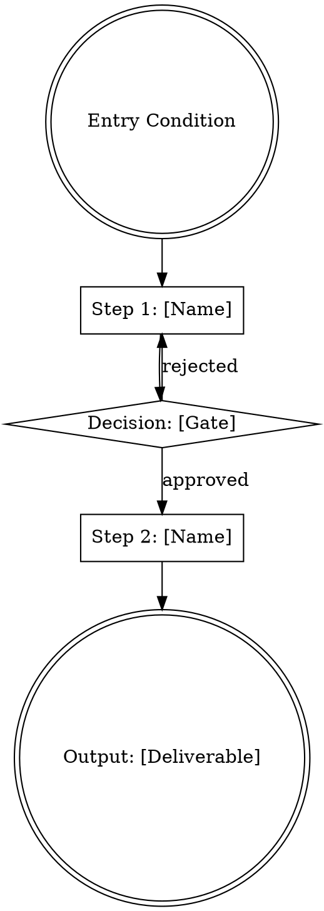
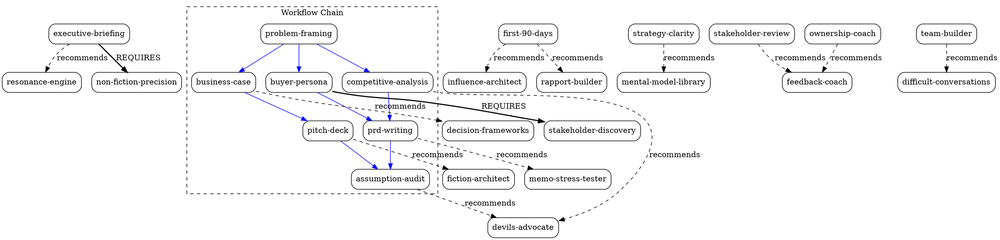

# Gemini Skill Architecture & Execution Playbook

> **What this is:** The complete blueprint for transforming 109 PDFs and curated web resources into 41 production-ready agent skills, organized into 6 families, governed by enforcement mechanisms adapted from battle-tested AI skill systems.
>
> **Who executes this:** Google Gemini (with PDF upload capability).
>
> **What Gemini produces:** 41 standalone skill files, each following the format specification in this document, ready for deployment as agent instructions.

---

## How to Use This Document

### For Gemini (the executor)

1. **Read this entire document first.** Do not begin extraction until you understand the full taxonomy, cross-references, and quality standards.
2. **Follow the Batch Processing Order** (§9.3). Skills build on each other — batch 1 must be complete before batch 2.
3. **For each skill:** Follow the Per-Skill Pipeline (§9.1) exactly. Upload the PDFs listed in the Resource Mapping (§7) for that skill.
4. **Use the Skill File Templates** (§8) as your structural skeleton. Do not deviate from the section order.
5. **Run the Quality Checklist** (§9.1, Step 6) before finalizing each skill. If any check fails, revise before outputting.

### For the human (the orchestrator)

1. **Before each Gemini session:** Upload this document + the specific PDFs for the target skill batch.
2. **Use the Session Template** (§9.4) as your prompt sequence.
3. **After each batch:** Run the Verification Procedures (§10) before moving to the next batch.
4. **Track progress** using the Batch Processing Order checklist (§9.3).

---

## Table of Contents

1. [Architecture Overview](#1-architecture-overview)
2. [Skill Family Directory](#2-skill-family-directory)
3. [Meta-Skill Architecture](#3-meta-skill-architecture)
4. [Workflow Chain Architecture](#4-workflow-chain-architecture)
5. [Cross-Skill Connection Map](#5-cross-skill-connection-map)
6. [Iron Laws & Enforcement Mechanisms](#6-iron-laws--enforcement-mechanisms)
7. [Complete Resource Mapping](#7-complete-resource-mapping)
8. [Skill File Format Specification](#8-skill-file-format-specification)
9. [Gemini Extraction Methodology](#9-gemini-extraction-methodology)
10. [Existing Drafts: Upgrade Path](#10-existing-drafts-upgrade-path)
11. [Verification Procedures](#11-verification-procedures)
12. [Appendix A: Complete PDF Inventory](#appendix-a-complete-pdf-inventory)
13. [Appendix B: Full-Rigor Skill Template](#appendix-b-full-rigor-skill-template)
14. [Appendix C: Standard-Rigor Skill Template](#appendix-c-standard-rigor-skill-template)
15. [Appendix D: Web Resource Registry](#appendix-d-web-resource-registry)
16. [Appendix E: Skill Dependency Graph](#appendix-e-skill-dependency-graph)
17. [Appendix F: Phase 1-4 Status & Next Steps](#appendix-f-phase-1-4-status--next-steps)

---

## 1. Architecture Overview

### 6 Families, 41 Skills

```
skills/
├── meta/              (6 skills — FULL superpowers rigor)
│   ├── getting-started         Session bootstrap + routing
│   ├── using-skills            Skill invocation discipline (1% rule)
│   ├── writing-skills          TDD for documentation / skill authoring
│   ├── prompt-optimizer        Patty 4-D methodology
│   ├── mental-model-library    Cross-domain reasoning reference
│   └── learning-accelerator    Meta-learning framework
│
├── workflow/           (12 skills — FULL superpowers rigor)
│   ├── problem-framing         Discovery gate
│   ├── stakeholder-discovery   Audience/stakeholder mapping
│   ├── market-context          Competitive landscape context
│   ├── competitive-analysis    Structured competitor teardown
│   ├── buyer-persona           JTBD-driven persona builder
│   ├── business-case           ROI / investment thesis
│   ├── prd-writing             Product requirements (PR/FAQ method)
│   ├── pitch-deck              Investor/internal pitch
│   ├── one-pager               Executive summary document
│   ├── executive-briefing      Board-level communication
│   ├── assumption-audit        Evidence gate
│   └── stakeholder-review      Structured feedback collection
│
├── executive/           (9 skills — STANDARD rigor)
│   ├── strategy-clarity        Strategic positioning
│   ├── devils-advocate         Adversarial stress testing
│   ├── operational-excellence  Execution systems + OKRs
│   ├── platform-strategist     Platform vs aggregator analysis
│   ├── ownership-coach         Leadership accountability
│   ├── first-90-days           New role transition playbook
│   ├── hiring-talent           Talent assessment
│   ├── team-builder            Culture + psychological safety
│   └── decision-frameworks     Structured decision methodology
│
├── narrative/           (4 skills — STANDARD rigor)
│   ├── fiction-architect       Plot structure + causality
│   ├── character-vulnerability Character depth testing
│   ├── world-building-logic    Internal consistency engine
│   └── dialogue-craft          Voice + subtext
│
├── rhetorician/         (5 skills — STANDARD rigor)
│   ├── non-fiction-precision   Structural clarity
│   ├── copy-editor             Line-level prose quality
│   ├── resonance-engine        Emotional + persuasive impact
│   ├── memo-stress-tester      Business writing stress test
│   └── scientific-advertising  Evidence-based persuasion
│
└── dealmaker/           (5 skills — STANDARD rigor)
    ├── negotiation-tactician   Tactical negotiation playbook
    ├── influence-architect     Power dynamics + persuasion
    ├── rapport-builder         Relationship + trust building
    ├── feedback-coach          Giving/receiving feedback
    └── difficult-conversations High-stakes interpersonal
```

### Rigor Levels

**Full rigor** (18 skills: all `_meta` + all `_workflow`):
These skills govern *process*. They must include enforcement mechanisms because LLMs will shortcut process skills unless forced not to. Full-rigor skills include: Iron Law, State Machine, Rationalization Table, Red Flags, Cross-Skill Invocations.

**Standard rigor** (23 skills: all domain families):
These skills provide *expertise*. They encode domain knowledge from the PDF library. Standard-rigor skills include: Guiding Principles, Workflow Steps, Frameworks & Models, Common Mistakes, Diagnostic Checklist, Sources.

### Skill Count Verification

| Family | Count | Rigor | Skills |
|--------|-------|-------|--------|
| `_meta` | 6 | Full | getting-started, using-skills, writing-skills, prompt-optimizer, mental-model-library, learning-accelerator |
| `_workflow` | 12 | Full | problem-framing, stakeholder-discovery, market-context, competitive-analysis, buyer-persona, business-case, prd-writing, pitch-deck, one-pager, executive-briefing, assumption-audit, stakeholder-review |
| `executive` | 9 | Standard | strategy-clarity, devils-advocate, operational-excellence, platform-strategist, ownership-coach, first-90-days, hiring-talent, team-builder, decision-frameworks |
| `narrative` | 4 | Standard | fiction-architect, character-vulnerability, world-building-logic, dialogue-craft |
| `rhetorician` | 5 | Standard | non-fiction-precision, copy-editor, resonance-engine, memo-stress-tester, scientific-advertising |
| `dealmaker` | 5 | Standard | negotiation-tactician, influence-architect, rapport-builder, feedback-coach, difficult-conversations |
| **Total** | **41** | | |

---

## 2. Skill Family Directory

### 2.1 Meta Family (`meta/`)

Skills that govern how the agent operates, learns, and improves. These are platform-level capabilities.

#### `getting-started`
- **Rigor:** Full
- **Trigger:** Beginning of any new session or conversation
- **Purpose:** Bootstrap the session — identify the user's domain, route to the correct skill family, and establish the workflow context
- **Iron Law:** `NO RESPONSE TO A TASK WITHOUT CHECKING FOR APPLICABLE SKILLS FIRST`
- **Key Pattern:** Adapted from `superpowers:using-superpowers` session bootstrap
- **Primary Sources:** (Meta-skill — no PDF sources; derived from superpowers architecture)

#### `using-skills`
- **Rigor:** Full
- **Trigger:** Any moment during a session where a skill might apply
- **Purpose:** Enforce skill invocation discipline — prevent the agent from rationalizing its way out of using a relevant skill
- **Iron Law:** `IF THERE IS EVEN A 1% CHANCE A SKILL APPLIES, INVOKE IT`
- **Key Pattern:** Rationalization table with "excuse → reality" mappings
- **Primary Sources:** (Meta-skill — no PDF sources; derived from superpowers architecture)

#### `writing-skills`
- **Rigor:** Full
- **Trigger:** Creating a new skill file or editing an existing one
- **Purpose:** TDD for documentation — define what the skill must do (failing test) before writing the skill body
- **Iron Law:** `NO SKILL WITHOUT A FAILING TEST FIRST`
- **Key Pattern:** Test-first authoring — define acceptance criteria before content
- **Primary Sources:** (Meta-skill — no PDF sources; derived from superpowers architecture)

#### `prompt-optimizer`
- **Rigor:** Full
- **Trigger:** When a draft prompt, instruction set, or skill description needs refinement
- **Purpose:** Apply the Patty 4-D methodology (Deconstruct, Diagnose, Develop, Deliver) to upgrade prompts
- **Iron Law:** `NO PROMPT SHIPS WITHOUT RUNNING THE 4-D AUDIT`
- **Upgrade From:** `Skill Patty Prompt Writer.md` (existing draft)
- **Primary PDFs:** (None — methodology-driven)
- **Web Sources:** OpenAI prompt engineering guide, Anthropic prompt documentation

#### `mental-model-library`
- **Rigor:** Full
- **Trigger:** When reasoning about a problem that would benefit from cross-domain mental models
- **Purpose:** Provide a structured library of mental models for analogical reasoning across domains
- **Iron Law:** `NO COMPLEX ANALYSIS WITHOUT CHECKING FOR APPLICABLE MENTAL MODELS`
- **Primary PDFs:** Great Mental Models v1 (Parrish), Great Mental Models v2 (Parrish), Poor Charlie's Almanack (Munger), Seeking Wisdom (Bevelin)
- **Secondary PDFs:** Antifragile (Taleb), The Lessons of History (Durant), Meditations (Aurelius), Models of My Life (Simon), The Knowledge Machine (Strevens), Seeing Like a State (Scott), The Unaccountability Machine (Davies), Why Don't We Learn from History (Hart), Pieces of the Action (Bush), Scientific Freedom (Braben), The Complete Story of Civilization (Durant)
- **Web Sources:** Farnam Street mental models blog

#### `learning-accelerator`
- **Rigor:** Full
- **Trigger:** When the user needs to learn a new domain rapidly or when building a study/practice plan
- **Purpose:** Apply meta-learning frameworks for accelerated skill acquisition and knowledge retention
- **Iron Law:** `NO LEARNING PLAN WITHOUT A RETRIEVAL AND SPACING STRATEGY`
- **Primary PDFs:** How to Take Smart Notes (Ahrens), Ultralearning (Young), A Mind For Numbers (Oakley), The Art of Learning (Waitzkin), Learn or Die (Hess)
- **Secondary PDFs:** Learning How to Learn (Oakley), The Inner Game of Tennis (Gallwey), The Art of Doing Science and Engineering (Hamming)
- **Web Sources:** Andy Matuschak spaced repetition notes

---

### 2.2 Workflow Family (`workflow/`)

Skills that enforce the Discovery → Analysis → Deliverable → Review chain. These are the process backbone.

#### `problem-framing`
- **Rigor:** Full
- **Trigger:** Beginning of any analytical or strategic task
- **Purpose:** Force explicit problem definition before any analysis begins — the discovery gate
- **Iron Law:** `NO ANALYSIS WITHOUT APPROVED PROBLEM FRAMING FIRST`
- **Key Pattern:** Adapted from `superpowers:brainstorming` design gate
- **Primary PDFs:** Personal MBA (Kaufman), Playing to Win (Lafley), The Design of Everyday Things (Norman)
- **Secondary PDFs:** User Friendly (Kuang), Designing Your Life (Burnett), Making Things Happen (Berkun)
- **Web Sources:** First Round Review design sprint articles

#### `stakeholder-discovery`
- **Rigor:** Full
- **Trigger:** When a project involves multiple audiences, decision-makers, or affected parties
- **Purpose:** Map all stakeholders, their motivations, power dynamics, and communication needs before proceeding
- **Iron Law:** `NO DELIVERABLE WITHOUT A VALIDATED STAKEHOLDER MAP`
- **Primary PDFs:** Scaling People (Johnson), High Output Management (Grove), Crucial Conversations (Grenny)
- **Secondary PDFs:** HBR Guide to Managing Up and Across, The Making of a Manager (Zhuo)
- **Web Sources:** SVPG stakeholder mapping articles

#### `market-context`
- **Rigor:** Full
- **Trigger:** When building strategy, positioning, or go-to-market plans that require understanding the competitive landscape
- **Purpose:** Establish the market forces, trends, and structural dynamics before detailed analysis
- **Iron Law:** `NO STRATEGIC RECOMMENDATION WITHOUT VALIDATED MARKET CONTEXT`
- **Primary PDFs:** Zero to One (Thiel), High Growth Handbook (Gil), Playing to Win (Lafley)
- **Secondary PDFs:** Boom (Hobart), The Revolt of the Public (Gurri), The Scaling Era (Patel), Working in Public (Eghbal), Nexus (Harari)
- **Web Sources:** Stratechery: Aggregation Theory, Smiling Curve, Great Unbundling

#### `competitive-analysis`
- **Rigor:** Full
- **Trigger:** When evaluating competitors, alternatives, or market positioning
- **Purpose:** Structured competitor teardown using frameworks from strategy literature
- **Iron Law:** `NO COMPETITIVE CLAIM WITHOUT EVIDENCE FROM AT LEAST TWO INDEPENDENT SOURCES`
- **Primary PDFs:** Playing to Win (Lafley), Zero to One (Thiel), Personal MBA (Kaufman)
- **Secondary PDFs:** Lessons from the Titans (Davis), Dear Chairman (Gramm)
- **Web Sources:** Stratechery: "What Christensen Got Wrong," "Shopify & Platforms"

#### `buyer-persona`
- **Rigor:** Full
- **Trigger:** When defining target users, customers, or audience segments
- **Purpose:** Build JTBD-driven personas grounded in real user context, not demographics
- **Iron Law:** `NO PERSONA WITHOUT A VALIDATED JOB-TO-BE-DONE`
- **Requires:** `stakeholder-discovery`
- **Primary PDFs:** Jobs to Be Done Playbook (Kalbach), Talking to Humans (Constable), Working Backwards (Bryar)
- **Secondary PDFs:** Anything You Want (Sivers), Get Together (Richardson)
- **Web Sources:** Lenny's Newsletter persona methodology

#### `business-case`
- **Rigor:** Full
- **Trigger:** When justifying investment, resource allocation, or strategic decisions with financial reasoning
- **Purpose:** Build a structured ROI / investment thesis with explicit assumptions
- **Iron Law:** `NO BUSINESS CASE WITHOUT EXPLICIT ASSUMPTIONS AND SENSITIVITY ANALYSIS`
- **Primary PDFs:** Personal MBA (Kaufman), High Growth Handbook (Gil), Measure What Matters (Doerr)
- **Secondary PDFs:** How to Invest (Rubenstein), Venture Deals (Feld), The Psychology of Money (Housel), Practical Portfolio Performance (Bacon)
- **Web Sources:** First Round Review business case templates

#### `prd-writing`
- **Rigor:** Full
- **Trigger:** When writing product requirements, specifications, or PR/FAQ documents
- **Purpose:** Apply the Working Backwards methodology (PR/FAQ) and Pyramid Principle to produce clear, actionable requirements
- **Iron Law:** `NO PRD WITHOUT A CUSTOMER-FACING PRESS RELEASE DRAFT FIRST`
- **Primary PDFs:** Working Backwards (Bryar), Pyramid Principle (Minto), High Output Management (Grove)
- **Secondary PDFs:** Making Things Happen (Berkun), The Mythical Man-Month (Brooks)
- **Web Sources:** Amazon PR/FAQ methodology articles

#### `pitch-deck`
- **Rigor:** Full
- **Trigger:** When creating investor presentations, internal pitch decks, or funding proposals
- **Purpose:** Structure a compelling narrative arc with evidence for investment or buy-in
- **Iron Law:** `NO PITCH WITHOUT A CLEAR "WHY NOW" AND "WHY US" ANSWER`
- **Recommends:** `fiction-architect` (for narrative arc)
- **Primary PDFs:** Zero to One (Thiel), High Growth Handbook (Gil), Scientific Advertising (Hopkins)
- **Secondary PDFs:** Venture Deals (Feld)
- **Web Sources:** Sequoia pitch deck template, YC application guide

#### `one-pager`
- **Rigor:** Full
- **Trigger:** When distilling complex strategy or analysis into a single-page executive summary
- **Purpose:** Apply Pyramid Principle to compress insight into a scannable one-page document
- **Iron Law:** `NO ONE-PAGER LONGER THAN ONE PAGE — EVERY WORD MUST EARN ITS PLACE`
- **Primary PDFs:** Pyramid Principle (Minto), Effective Executive (Drucker), Working Backwards (Bryar)
- **Web Sources:** Orwell "Politics and the English Language"

#### `executive-briefing`
- **Rigor:** Full
- **Trigger:** When communicating to board members, C-suite executives, or senior leadership
- **Purpose:** Structure board-level communication using BLUF, Pyramid, and executive attention patterns
- **Iron Law:** `NO EXECUTIVE COMMUNICATION WITHOUT BOTTOM-LINE-UP-FRONT`
- **Requires:** `non-fiction-precision`
- **Primary PDFs:** Effective Executive (Drucker), High Output Management (Grove), Pyramid Principle (Minto)
- **Secondary PDFs:** HBR Guide to Managing Up and Across
- **Web Sources:** HBR executive communication articles

#### `assumption-audit`
- **Rigor:** Full
- **Trigger:** Before signing off on any analysis, recommendation, or deliverable
- **Purpose:** Evidence gate — validate every key claim against data, precedent, or structured reasoning
- **Iron Law:** `NO SIGN-OFF WITHOUT VALIDATION EVIDENCE FOR EVERY KEY CLAIM`
- **Key Pattern:** Adapted from `superpowers:verification-before-completion`
- **Recommends:** `devils-advocate` (for stress testing)
- **Primary PDFs:** Thinking in Bets (Duke), How to Decide (Duke), Antifragile (Taleb), Seeking Wisdom (Bevelin)
- **Secondary PDFs:** Useful Not True (Sivers)
- **Web Sources:** Farnam Street decision-making articles

#### `stakeholder-review`
- **Rigor:** Full
- **Trigger:** When collecting structured feedback on deliverables before finalization
- **Purpose:** Run a structured feedback collection process that captures substantive critique, not just approval
- **Iron Law:** `NO FINAL VERSION WITHOUT DOCUMENTED STAKEHOLDER FEEDBACK AND RESOLUTION`
- **Primary PDFs:** Scaling People (Johnson), Crucial Conversations (Grenny), Thanks for the Feedback (Stone)
- **Web Sources:** First Round Review feedback articles

---

### 2.3 Executive Family (`executive/`)

Domain expertise for strategic leadership, organizational design, and decision-making.

#### `strategy-clarity`
- **Rigor:** Standard
- **Trigger:** When analyzing strategic positioning, defining competitive advantage, or evaluating business direction
- **Upgrade From:** `Clarity Strategic Communications & Product Messaging Coach.md` (existing draft)
- **Primary PDFs:** Playing to Win (Lafley), Zero to One (Thiel), Working Backwards (Bryar)
- **Secondary PDFs:** Lessons from the Titans (Davis), The New Makers of Modern Strategy (Brands), The Scaling Era (Patel), Seeing Like a State (Scott), The Unaccountability Machine (Davies), Why Don't We Learn from History (Hart)
- **Web Sources:** Stratechery: Aggregation Theory, Bill Gates Line, Tech's Two Philosophies

#### `devils-advocate`
- **Rigor:** Standard
- **Trigger:** When stress-testing a thesis, proposal, or strategic recommendation
- **Upgrade From:** `The Strategic Devil's Advocate.md` (existing draft)
- **Primary PDFs:** Thinking in Bets (Duke), Poor Charlie's Almanack (Munger), Antifragile (Taleb)
- **Secondary PDFs:** Seeking Wisdom (Bevelin), How to Decide (Duke)
- **Web Sources:** Paul Graham: "How to Think for Yourself," Farnam Street: "Inversion"

#### `operational-excellence`
- **Rigor:** Standard
- **Trigger:** When designing execution systems, OKR frameworks, or operational processes
- **Primary PDFs:** High Output Management (Grove), Measure What Matters (Doerr), Working Backwards (Bryar), An Elegant Puzzle (Larson)
- **Secondary PDFs:** The Mythical Man-Month (Brooks), Making Things Happen (Berkun), Lessons from the Titans (Davis), The Origins of Efficiency (Potter), Four Thousand Weeks (Burkeman)
- **Web Sources:** Stratechery: "The Amazon Tax"

#### `platform-strategist`
- **Rigor:** Standard
- **Trigger:** When analyzing platform business models, network effects, or aggregation dynamics
- **Primary PDFs:** Zero to One (Thiel), High Growth Handbook (Gil), Working Backwards (Bryar)
- **Secondary PDFs:** Working in Public (Eghbal), Dear Chairman (Gramm)
- **Web Sources:** Stratechery: Bill Gates Line, Shopify & Platforms, Amazon Tax

#### `ownership-coach`
- **Rigor:** Standard
- **Trigger:** When developing leadership accountability, ownership culture, or personal effectiveness
- **Primary PDFs:** Extreme Ownership (Willink), Turn the Ship Around (Marquet), Score Takes Care of Itself (Walsh), Hard Thing About Hard Things (Horowitz)
- **Secondary PDFs:** It's Your Ship (Abrashoff), What You Do Is Who You Are (Horowitz), Anything You Want (Sivers), Hell Yeah or No (Sivers)
- **Web Sources:** Paul Graham: "Maker's Schedule, Manager's Schedule"

#### `first-90-days`
- **Rigor:** Standard
- **Trigger:** When transitioning into a new role, team, or organization
- **Primary PDFs:** First 90 Days (Watkins), Scaling People (Johnson), High Output Management (Grove), Making of a Manager (Zhuo)
- **Secondary PDFs:** HBR Guide to Coaching Employees, HBR Guide to Managing Up and Across, Designing Your Life (Burnett)
- **Web Sources:** First Round Review new-leader articles

#### `hiring-talent`
- **Rigor:** Standard
- **Trigger:** When designing hiring processes, evaluating candidates, or building talent strategy
- **Primary PDFs:** Talent (Cowen), Work Rules (Bock), Scaling People (Johnson)
- **Secondary PDFs:** Trillion Dollar Coach (Schmidt), High Growth Handbook (Gil)
- **Web Sources:** Paul Graham: "How to Hire"

#### `team-builder`
- **Rigor:** Standard
- **Trigger:** When building team culture, psychological safety, or organizational effectiveness
- **Primary PDFs:** Fearless Organization (Edmondson), Culture Code (Coyle), Team of Teams (McChrystal), Creativity Inc (Catmull)
- **Secondary PDFs:** Trillion Dollar Coach (Schmidt), It's Your Ship (Abrashoff), What You Do Is Who You Are (Horowitz), Get Together (Richardson), The Mythical Man-Month (Brooks)
- **Web Sources:** Google re:Work team effectiveness research

#### `decision-frameworks`
- **Rigor:** Standard
- **Trigger:** When facing complex decisions under uncertainty, or when building decision-making processes
- **Primary PDFs:** Thinking in Bets (Duke), How to Decide (Duke), Great Mental Models v1 (Parrish), Great Mental Models v2 (Parrish), Poor Charlie's Almanack (Munger)
- **Secondary PDFs:** Meditations (Aurelius), Models of My Life (Simon), The Psychology of Money (Housel), Designing Your Life (Burnett), Four Thousand Weeks (Burkeman), How to Live (Sivers), Useful Not True (Sivers)
- **Web Sources:** Farnam Street decision-making series

---

### 2.4 Narrative Family (`narrative/`)

Domain expertise for fiction writing, storytelling structure, and narrative craft.

#### `fiction-architect`
- **Rigor:** Standard
- **Trigger:** When constructing plot structure, story arcs, or narrative frameworks
- **Upgrade From:** `Fiction Writing Frameworks Causality & Structure.md` (existing draft)
- **Primary PDFs:** Story (McKee), Science of Storytelling (Storr), Hero With a Thousand Faces (Campbell)
- **Secondary PDFs:** Bird by Bird (Lamott)
- **Web Sources:** Sanderson 2025 BYU lectures, Industrial Scripts ABT article

#### `character-vulnerability`
- **Rigor:** Standard
- **Trigger:** When developing character depth, motivation, or emotional complexity
- **Primary PDFs:** Science of Storytelling (Storr), Story (McKee), Bird by Bird (Lamott)
- **Web Sources:** Sanderson character lectures, Vonnegut story shapes

#### `world-building-logic`
- **Rigor:** Standard
- **Trigger:** When constructing fictional worlds, magic systems, or internally consistent settings
- **Primary PDFs:** How Buildings Learn (Brand), Science of Storytelling (Storr), Hero With a Thousand Faces (Campbell)
- **Web Sources:** Sanderson magic system lectures

#### `dialogue-craft`
- **Rigor:** Standard
- **Trigger:** When writing or refining dialogue, character voice, or subtext
- **Primary PDFs:** Story (McKee), Bird by Bird (Lamott), Draft No. 4 (McPhee)
- **Web Sources:** Sorkin dialogue principles

---

### 2.5 Rhetorician Family (`rhetorician/`)

Domain expertise for non-fiction writing, business communication, and persuasive prose.

#### `non-fiction-precision`
- **Rigor:** Standard
- **Trigger:** When structuring non-fiction writing for clarity, logical flow, and reader comprehension
- **Primary PDFs:** Pyramid Principle (Minto), Draft No. 4 (McPhee), Elements of Style (Strunk)
- **Web Sources:** Orwell "Politics and the English Language," Paul Graham: "Write Like You Talk"

#### `copy-editor`
- **Rigor:** Standard
- **Trigger:** When performing line-level editing for prose quality, concision, and readability
- **Primary PDFs:** Elements of Style (Strunk), Draft No. 4 (McPhee), Bird by Bird (Lamott)
- **Web Sources:** Hemingway App methodology

#### `resonance-engine`
- **Rigor:** Standard
- **Trigger:** When writing needs to create emotional impact, persuasive force, or memorable resonance
- **Primary PDFs:** Science of Storytelling (Storr), Story (McKee), Scientific Advertising (Hopkins)
- **Web Sources:** Paul Graham persuasive writing essays

#### `memo-stress-tester`
- **Rigor:** Standard
- **Trigger:** When evaluating business documents (memos, briefs, PRDs) for structural integrity and persuasive logic
- **Primary PDFs:** Pyramid Principle (Minto), Effective Executive (Drucker), Working Backwards (Bryar)
- **Web Sources:** Amazon 6-pager methodology, Completed Staff Work doctrine

#### `scientific-advertising`
- **Rigor:** Standard
- **Trigger:** When writing advertising copy, marketing materials, or evidence-based persuasive content
- **Primary PDFs:** Scientific Advertising (Hopkins), Personal MBA (Kaufman)
- **Web Sources:** Ogilvy advertising principles

---

### 2.6 Dealmaker Family (`dealmaker/`)

Domain expertise for negotiation, influence, relationship building, and high-stakes interpersonal situations.

#### `negotiation-tactician`
- **Rigor:** Standard
- **Trigger:** When preparing for or conducting negotiations (deals, contracts, salary, partnerships)
- **Primary PDFs:** Never Split the Difference (Voss), Getting to Yes (Fisher), Negotiation Genius (Malhotra), Bargaining for Advantage (Shell)
- **Secondary PDFs:** Money for Couples (Sethi), I Will Teach You to Be Rich (Sethi)
- **Web Sources:** Harvard PON blog

#### `influence-architect`
- **Rigor:** Standard
- **Trigger:** When navigating organizational politics, building coalitions, or exercising strategic influence
- **Primary PDFs:** Managing With Power (Pfeffer), Power (Pfeffer), 48 Laws of Power (Greene), The Power Broker (Caro)
- **Secondary PDFs:** Master of the Senate (Caro), Means of Ascent (Caro), The Passage of Power (Caro), The Path to Power (Caro), Working (Caro)
- **Web Sources:** Cialdini "Influence" principles

#### `rapport-builder`
- **Rigor:** Standard
- **Trigger:** When building relationships, establishing trust, or managing interpersonal dynamics
- **Primary PDFs:** Never Split the Difference (Voss), Culture Code (Coyle), Crucial Conversations (Grenny)
- **Secondary PDFs:** Get Together (Richardson)
- **Web Sources:** Harvard PON relationship articles

#### `feedback-coach`
- **Rigor:** Standard
- **Trigger:** When giving or receiving feedback, conducting performance reviews, or managing difficult feedback conversations
- **Primary PDFs:** Thanks for the Feedback (Stone), Radical Candor (Scott), Fearless Organization (Edmondson)
- **Secondary PDFs:** HBR Guide to Coaching Employees, Trillion Dollar Coach (Schmidt)
- **Web Sources:** Kim Scott Radical Candor articles

#### `difficult-conversations`
- **Rigor:** Standard
- **Trigger:** When navigating high-stakes, emotionally charged, or potentially confrontational interpersonal situations
- **Primary PDFs:** Crucial Conversations (Grenny), Thanks for the Feedback (Stone), Bargaining With the Devil (Mnookin)
- **Web Sources:** Harvard PON difficult conversations series

---

## 3. Meta-Skill Architecture

### 3.1 Pattern Lineage

These meta-skills are adapted from a production-tested AI skill system ("superpowers") that prevents LLMs from shortcutting workflows. The core insight: **LLMs will rationalize skipping any process that isn't enforced with explicit mechanisms.**

| Superpowers Pattern | Business Skill Adaptation | What Transfers |
|--------------------|---------------------------|----------------|
| `using-superpowers` (session bootstrap) | `getting-started` + `using-skills` | 1% rule, rationalization table, routing logic |
| `brainstorming` (design gate) | `problem-framing` (discovery gate) | Iron law blocking premature analysis, state machine, mandatory approval |
| `verification-before-completion` (evidence gate) | `assumption-audit` (evidence gate) | Evidence-before-assertions pattern, checklist enforcement |
| `writing-skills` (TDD for docs) | `writing-skills` (TDD for docs) | Test-first authoring, acceptance criteria before content |

### 3.2 The 1% Rule

This is the most important enforcement mechanism. It appears in `using-skills` and ripples through all other skills:

```
IF THERE IS EVEN A 1% CHANCE A SKILL APPLIES, INVOKE IT.
```

**Why this works:** LLMs are biased toward generating content immediately rather than consulting reference material. The 1% threshold makes "I didn't think it applied" an invalid excuse. The agent must *check* — and checking takes seconds, while missing a relevant skill wastes minutes of bad output.

### 3.3 Rationalization Defense

Every full-rigor skill includes a rationalization table. This is the pattern:

```markdown
| Thought | Reality |
|---------|---------|
| "[Excuse for skipping]" | [Why the excuse is wrong] |
| "[Another excuse]" | [Why it's wrong] |
| "[Seemingly reasonable shortcut]" | [Why it will fail] |
| "[Time pressure excuse]" | [Why skipping costs more time] |
```

Minimum 4 entries per table. The entries must be specific to the skill — generic entries like "I don't have time" are insufficient. Each entry must name the specific failure mode that results from the shortcut.

### 3.4 State Machine Pattern

Full-rigor skills include a Graphviz `digraph` that shows the mandatory state transitions. Terminal states use `doublecircle`. The purpose is to make the workflow *visual and unambiguous* — if the agent is in state X, only transitions Y and Z are valid.

Example structure:



### 3.5 Cross-Skill Invocation Markers

Skills reference each other using two markers:

- **`REQUIRED SUB-SKILL: skill-name`** — The agent MUST invoke this skill. The current skill cannot produce valid output without it. Example: `executive-briefing` REQUIRES `non-fiction-precision`.
- **`RECOMMENDED SUB-SKILL: skill-name`** — The agent SHOULD invoke this skill for enrichment but can proceed without it. Example: `pitch-deck` RECOMMENDS `fiction-architect`.

---

## 4. Workflow Chain Architecture

### 4.1 The Mandatory Sequence

All strategic and analytical work flows through four phases. No phase can be entered without the prior phase being approved.

```
DISCOVERY              →  ANALYSIS              →  DELIVERABLE           →  REVIEW
─────────                 ────────                 ───────────               ──────
problem-framing           competitive-analysis     prd-writing               assumption-audit
stakeholder-discovery     buyer-persona            pitch-deck                stakeholder-review
market-context            business-case            one-pager
                                                   executive-briefing
```

**Iron Law of the Chain:** `NO PHASE CAN BE ENTERED WITHOUT THE PRIOR PHASE BEING APPROVED.`

### 4.2 Phase Gates

#### Gate 1: Discovery → Analysis
- **Required completions:** `problem-framing` output approved by user
- **Required context:** `stakeholder-discovery` map validated, `market-context` established
- **Gate check:** "Is the problem clearly defined? Do we know who we're solving for? Do we understand the market forces?"

#### Gate 2: Analysis → Deliverable
- **Required completions:** At least one of `competitive-analysis`, `buyer-persona`, or `business-case` completed
- **Required context:** Analysis directly addresses the problem defined in Gate 1
- **Gate check:** "Do we have evidence-backed answers to the questions raised in discovery?"

#### Gate 3: Deliverable → Review
- **Required completions:** At least one deliverable (`prd-writing`, `pitch-deck`, `one-pager`, or `executive-briefing`) drafted
- **Required context:** Deliverable maps to analysis findings
- **Gate check:** "Does the deliverable make claims we can defend? Are all key assertions traced to analysis?"

#### Gate 4: Review (Exit)
- **Required completions:** `assumption-audit` passed, `stakeholder-review` documented
- **Gate check:** "Has every key claim been validated? Has structured feedback been collected and resolved?"

### 4.3 State Machine: Workflow Chain

```dot
digraph workflow_chain {
    rankdir=LR;

    "New Task" [shape=doublecircle];
    "DISCOVERY" [shape=box, style=filled, fillcolor=lightblue];
    "Gate 1" [shape=diamond];
    "ANALYSIS" [shape=box, style=filled, fillcolor=lightyellow];
    "Gate 2" [shape=diamond];
    "DELIVERABLE" [shape=box, style=filled, fillcolor=lightgreen];
    "Gate 3" [shape=diamond];
    "REVIEW" [shape=box, style=filled, fillcolor=lightsalmon];
    "Gate 4" [shape=diamond];
    "Complete" [shape=doublecircle];

    "New Task" -> "DISCOVERY";
    "DISCOVERY" -> "Gate 1";
    "Gate 1" -> "ANALYSIS" [label="approved"];
    "Gate 1" -> "DISCOVERY" [label="gaps found"];
    "ANALYSIS" -> "Gate 2";
    "Gate 2" -> "DELIVERABLE" [label="approved"];
    "Gate 2" -> "ANALYSIS" [label="insufficient"];
    "DELIVERABLE" -> "Gate 3";
    "Gate 3" -> "REVIEW" [label="ready"];
    "Gate 3" -> "DELIVERABLE" [label="revise"];
    "REVIEW" -> "Gate 4";
    "Gate 4" -> "Complete" [label="all claims validated"];
    "Gate 4" -> "DELIVERABLE" [label="issues found"];
}
```



### 4.4 When the Full Chain is NOT Required

The full chain applies to **strategic and analytical work** — new product proposals, market entry plans, investment theses, organizational strategy.

The chain is NOT required for:
- **Pure writing tasks** (e.g., "edit this memo") → Use rhetorician skills directly
- **Pure fiction tasks** (e.g., "write a scene") → Use narrative skills directly
- **Pure negotiation prep** (e.g., "prepare for salary negotiation") → Use dealmaker skills directly
- **Meta tasks** (e.g., "create a skill file") → Use meta skills directly

The `getting-started` skill routes the agent to determine whether the full chain applies.

---

## 5. Cross-Skill Connection Map

### 5.1 Required Connections (Mandatory)

These connections are enforced — the dependent skill cannot produce valid output without the prerequisite.

```
executive-briefing  ──REQUIRES──▶  non-fiction-precision
buyer-persona       ──REQUIRES──▶  stakeholder-discovery
```

### 5.2 Recommended Connections (Enrichment)

These connections improve output quality but are not mandatory.

```
pitch-deck          ──RECOMMENDS──▶  fiction-architect        (narrative arc)
assumption-audit    ──RECOMMENDS──▶  devils-advocate          (stress testing)
first-90-days       ──RECOMMENDS──▶  rapport-builder          (relationship building)
first-90-days       ──RECOMMENDS──▶  influence-architect      (political navigation)
prd-writing         ──RECOMMENDS──▶  memo-stress-tester       (document quality)
business-case       ──RECOMMENDS──▶  decision-frameworks      (structured reasoning)
strategy-clarity    ──RECOMMENDS──▶  mental-model-library     (cross-domain reasoning)
competitive-analysis──RECOMMENDS──▶  devils-advocate          (counter-arguments)
executive-briefing  ──RECOMMENDS──▶  resonance-engine         (persuasive impact)
stakeholder-review  ──RECOMMENDS──▶  feedback-coach           (feedback dynamics)
team-builder        ──RECOMMENDS──▶  difficult-conversations  (conflict resolution)
ownership-coach     ──RECOMMENDS──▶  feedback-coach           (accountability conversations)
```

### 5.3 Universal Availability

The following skills can be invoked by ANY other skill at any time:

- `mental-model-library` — Cross-domain reasoning for any analytical task
- `prompt-optimizer` — Refine any instruction or communication
- `devils-advocate` — Stress-test any thesis or recommendation
- `copy-editor` — Line-level quality improvement for any written output

---

## 6. Iron Laws & Enforcement Mechanisms

### 6.1 Complete Iron Law Registry

Every full-rigor skill has exactly one iron law. These are the non-negotiable rules:

| Skill | Iron Law |
|-------|----------|
| `getting-started` | NO RESPONSE TO A TASK WITHOUT CHECKING FOR APPLICABLE SKILLS FIRST |
| `using-skills` | IF THERE IS EVEN A 1% CHANCE A SKILL APPLIES, INVOKE IT |
| `writing-skills` | NO SKILL WITHOUT A FAILING TEST FIRST |
| `prompt-optimizer` | NO PROMPT SHIPS WITHOUT RUNNING THE 4-D AUDIT |
| `mental-model-library` | NO COMPLEX ANALYSIS WITHOUT CHECKING FOR APPLICABLE MENTAL MODELS |
| `learning-accelerator` | NO LEARNING PLAN WITHOUT A RETRIEVAL AND SPACING STRATEGY |
| `problem-framing` | NO ANALYSIS WITHOUT APPROVED PROBLEM FRAMING FIRST |
| `stakeholder-discovery` | NO DELIVERABLE WITHOUT A VALIDATED STAKEHOLDER MAP |
| `market-context` | NO STRATEGIC RECOMMENDATION WITHOUT VALIDATED MARKET CONTEXT |
| `competitive-analysis` | NO COMPETITIVE CLAIM WITHOUT EVIDENCE FROM AT LEAST TWO INDEPENDENT SOURCES |
| `buyer-persona` | NO PERSONA WITHOUT A VALIDATED JOB-TO-BE-DONE |
| `business-case` | NO BUSINESS CASE WITHOUT EXPLICIT ASSUMPTIONS AND SENSITIVITY ANALYSIS |
| `prd-writing` | NO PRD WITHOUT A CUSTOMER-FACING PRESS RELEASE DRAFT FIRST |
| `pitch-deck` | NO PITCH WITHOUT A CLEAR "WHY NOW" AND "WHY US" ANSWER |
| `one-pager` | NO ONE-PAGER LONGER THAN ONE PAGE — EVERY WORD MUST EARN ITS PLACE |
| `executive-briefing` | NO EXECUTIVE COMMUNICATION WITHOUT BOTTOM-LINE-UP-FRONT |
| `assumption-audit` | NO SIGN-OFF WITHOUT VALIDATION EVIDENCE FOR EVERY KEY CLAIM |
| `stakeholder-review` | NO FINAL VERSION WITHOUT DOCUMENTED STAKEHOLDER FEEDBACK AND RESOLUTION |

### 6.2 Enforcement Mechanism Checklist

Every full-rigor skill MUST include ALL of the following:

- [ ] **Iron Law** — `NO X WITHOUT Y FIRST` pattern (single sentence, all caps)
- [ ] **State Machine** — Graphviz `digraph` with `doublecircle` terminal states
- [ ] **Rationalization Table** — `| Thought | Reality |` with minimum 4 entries, specific to the skill
- [ ] **Red Flags** — List of self-check thought patterns that signal shortcutting
- [ ] **Cross-Skill Invocations** — `REQUIRED SUB-SKILL:` and/or `RECOMMENDED SUB-SKILL:` markers

### 6.3 Red Flag Patterns

These thought patterns — when an agent "thinks" them — are signals that the agent is about to shortcut a process. Each full-rigor skill should include skill-specific versions of these:

**Universal Red Flags (applicable to all skills):**

| Thought | What It Really Means |
|---------|---------------------|
| "This is straightforward, I can skip the framework" | You haven't identified what you don't know |
| "The user is in a hurry, I should just give them the answer" | Skipping process costs more time than following it |
| "I already know the answer to this" | Confirmation bias — the framework exists to challenge what you "know" |
| "This framework is overkill for this task" | Simple-looking tasks are where frameworks catch the most errors |
| "Let me just start writing and see where it goes" | Unstructured output wastes the user's review time |

---

## 7. Complete Resource Mapping

### 7.1 Workflow Skills → Sources

#### `problem-framing`
| Type | Source | Key Extraction Targets |
|------|--------|----------------------|
| Primary PDF | Personal MBA (Kaufman) | Mental model inventory, problem decomposition frameworks |
| Primary PDF | Playing to Win (Lafley) | Where-to-Play / How-to-Win cascade, strategic choice framework |
| Primary PDF | [Design of Everyday Things](./The Design of Everyday Things_ - Don Norman.md) (Norman) | Human-centered design principles, affordance analysis |
| Secondary PDF | [User Friendly](./User Friendly - Cliff Kuang.md) (Kuang) | Usability heuristics, user observation methodology |
| Secondary PDF | Designing Your Life (Burnett) | Reframing methodology, dysfunctional belief identification |
| Secondary PDF | [Making Things Happen](./Making Things Happen_ Mastering - Scott Berkun.md) (Berkun) | Project scoping, requirements gathering |
| Web | First Round Review design sprint articles | Sprint methodology, time-boxed discovery |

#### `stakeholder-discovery`
| Type | Source | Key Extraction Targets |
|------|--------|----------------------|
| Primary PDF | Scaling People (Johnson) | Stakeholder mapping frameworks, organizational context |
| Primary PDF | [High Output Management](./High Output Management - Andrew S. Grove.md) (Grove) | Managerial leverage, meeting structures, dual reporting |
| Primary PDF | [Crucial Conversations](./Crucial Conversations_ Tools fo - Joseph Grenny.md) (Grenny) | Safety creation, mutual purpose, dialogue skills |
| Secondary PDF | HBR Guide to Managing Up (HBR) | Upward management, executive alignment techniques |
| Secondary PDF | [Making of a Manager](./The Making of a Manager_ What t - Julie Zhuo.md) (Zhuo) | Manager archetypes, org context navigation |
| Web | SVPG stakeholder mapping articles | Product stakeholder identification |

#### `market-context`
| Type | Source | Key Extraction Targets |
|------|--------|----------------------|
| Primary PDF | Zero to One (Thiel) | Monopoly theory, 0→1 vs 1→n, contrarian questions |
| Primary PDF | [High Growth Handbook](./High Growth Handbook - Elad Gil.md) (Gil) | Market timing, scaling signals, market category creation |
| Primary PDF | Playing to Win (Lafley) | Industry structure analysis, where-to-play choices |
| Secondary PDF | Boom (Hobart) | Bubble dynamics, market cycle patterns |
| Secondary PDF | Revolt of the Public (Gurri) | Information environment shifts, institutional trust |
| Secondary PDF | The Scaling Era (Patel) | Technology scaling patterns, oral history of scale |
| Secondary PDF | Working in Public (Eghbal) | Open source economics, commons dynamics |
| Secondary PDF | Nexus (Harari) | Information network effects, technology-society interaction |
| Web | Stratechery: Aggregation Theory | Demand aggregation, supply commoditization |
| Web | Stratechery: Smiling Curve | Value chain analysis |
| Web | Stratechery: Great Unbundling | Bundle/unbundle dynamics |

#### `competitive-analysis`
| Type | Source | Key Extraction Targets |
|------|--------|----------------------|
| Primary PDF | Playing to Win (Lafley) | Competitive positioning, capability systems |
| Primary PDF | Zero to One (Thiel) | Competition-avoidance, monopoly characteristics |
| Primary PDF | Personal MBA (Kaufman) | Competitive forces, value creation/delivery/capture |
| Secondary PDF | [Lessons from the Titans](./Lessons from the Titans_ What C - Scott Davis.md) (Davis) | Industrial competitor patterns, moat analysis |
| Secondary PDF | Dear Chairman (Gramm) | Activist investor perspectives, corporate governance pressure |
| Web | Stratechery: "What Christensen Got Wrong" | Disruption theory critique |
| Web | Stratechery: "Shopify & Platforms" | Platform competitive dynamics |

#### `buyer-persona`
| Type | Source | Key Extraction Targets |
|------|--------|----------------------|
| Primary PDF | [Jobs to Be Done Playbook](./The Jobs to Be Done Playbook_ A - Jim Kalbach.md) (Kalbach) | JTBD methodology, job mapping, outcome-driven innovation |
| Primary PDF | Talking to Humans (Constable) | Customer interview methodology, insight extraction |
| Primary PDF | [Working Backwards](./Working Backwards - Colin Bryar.md) (Bryar) | Customer obsession, working-backwards methodology |
| Secondary PDF | [Anything You Want](./Anything You Want - Derek Sivers.md) (Sivers) | Customer-first philosophy, simplicity principles |
| Secondary PDF | Get Together (Richardson) | Community-driven user understanding |
| Web | Lenny's Newsletter persona methodology | Modern persona construction |

#### `business-case`
| Type | Source | Key Extraction Targets |
|------|--------|----------------------|
| Primary PDF | Personal MBA (Kaufman) | Value creation models, financial analysis frameworks |
| Primary PDF | [High Growth Handbook](./High Growth Handbook - Elad Gil.md) (Gil) | Growth metrics, fundraising, market sizing |
| Primary PDF | [Measure What Matters](./Measure What Matters_ How Googl - John Doerr.md) (Doerr) | OKR methodology, outcome measurement |
| Secondary PDF | How to Invest (Rubenstein) | Investment evaluation criteria, due diligence |
| Secondary PDF | Venture Deals (Feld) | Deal structure, term sheets, valuation |
| Secondary PDF | [Psychology of Money](./The Psychology of Money - Morgan Housel.md) (Housel) | Behavioral finance biases, long-term thinking |
| Secondary PDF | [Practical Portfolio Performance](./Practical Portfolio Performance - Carl R. Bacon.md) (Bacon) | Performance measurement, risk-adjusted returns |
| Web | First Round Review business case templates | Structured business case format |

#### `prd-writing`
| Type | Source | Key Extraction Targets |
|------|--------|----------------------|
| Primary PDF | [Working Backwards](./Working Backwards - Colin Bryar.md) (Bryar) | PR/FAQ methodology, narrative-first requirements |
| Primary PDF | Pyramid Principle (Minto) | MECE structuring, top-down communication |
| Primary PDF | [High Output Management](./High Output Management - Andrew S. Grove.md) (Grove) | Output-oriented thinking, planning methodology |
| Secondary PDF | [Making Things Happen](./Making Things Happen_ Mastering - Scott Berkun.md) (Berkun) | Specification writing, requirements management |
| Secondary PDF | Mythical Man-Month (Brooks) | Second-system effect, conceptual integrity |
| Web | Amazon PR/FAQ methodology articles | PR/FAQ template and examples |

#### `pitch-deck`
| Type | Source | Key Extraction Targets |
|------|--------|----------------------|
| Primary PDF | Zero to One (Thiel) | Contrarian narrative, "secret" framework |
| Primary PDF | [High Growth Handbook](./High Growth Handbook - Elad Gil.md) (Gil) | Pitch structure, investor psychology |
| Primary PDF | [Scientific Advertising](./Scientific Advertising - Claude C. Hopkins.md) (Hopkins) | Evidence-based claims, headline psychology |
| Secondary PDF | Venture Deals (Feld) | Investor expectations, deal dynamics |
| Web | Sequoia pitch deck template | Standard pitch structure |
| Web | YC application guide | Concision, clarity under constraint |

#### `one-pager`
| Type | Source | Key Extraction Targets |
|------|--------|----------------------|
| Primary PDF | Pyramid Principle (Minto) | SCQ framework, MECE logic, top-down structure |
| Primary PDF | Effective Executive (Drucker) | Concentration, time management, effective communication |
| Primary PDF | [Working Backwards](./Working Backwards - Colin Bryar.md) (Bryar) | Narrative discipline, customer focus |
| Web | Orwell "Politics and the English Language" | Clarity rules, cliché elimination |

#### `executive-briefing`
| Type | Source | Key Extraction Targets |
|------|--------|----------------------|
| Primary PDF | Effective Executive (Drucker) | Executive attention patterns, decision effectiveness |
| Primary PDF | [High Output Management](./High Output Management - Andrew S. Grove.md) (Grove) | Leverage, meeting types, report writing |
| Primary PDF | Pyramid Principle (Minto) | BLUF, pyramid logic, executive summary structure |
| Secondary PDF | HBR Guide to Managing Up (HBR) | Executive communication patterns |
| Web | HBR executive communication articles | Board presentation methodology |

#### `assumption-audit`
| Type | Source | Key Extraction Targets |
|------|--------|----------------------|
| Primary PDF | Thinking in Bets (Duke) | Resulting vs. process quality, calibration, decision journal |
| Primary PDF | [How to Decide](./How to Decide - Annie Duke.md) (Duke) | Decision matrix, pre-mortem, backcasting |
| Primary PDF | Antifragile (Taleb) | Fragility detection, barbell strategy, skin in the game |
| Primary PDF | Seeking Wisdom (Bevelin) | Cognitive bias catalog, checklist methodology |
| Secondary PDF | [Useful Not True](./Useful Not True - Derek Sivers.md) (Sivers) | Belief auditing, pragmatic truth |
| Web | Farnam Street decision-making articles | Applied decision frameworks |

#### `stakeholder-review`
| Type | Source | Key Extraction Targets |
|------|--------|----------------------|
| Primary PDF | Scaling People (Johnson) | Feedback frameworks, review structures |
| Primary PDF | [Crucial Conversations](./Crucial Conversations_ Tools fo - Joseph Grenny.md) (Grenny) | Feedback dialogue, safety creation |
| Primary PDF | [Thanks for the Feedback](./Thanks for the Feedback_ The Sc - Douglas Stone.md) (Stone) | Receiving feedback, feedback triggers |
| Web | First Round Review feedback articles | Structured feedback collection |

---

### 7.2 Executive Skills → Sources

#### `strategy-clarity`
| Type | Source | Key Extraction Targets |
|------|--------|----------------------|
| Primary PDF | Playing to Win (Lafley) | Strategy cascade, winning aspiration, where-to-play/how-to-win |
| Primary PDF | Zero to One (Thiel) | Definite optimism, vertical progress, contrarian truths |
| Primary PDF | [Working Backwards](./Working Backwards - Colin Bryar.md) (Bryar) | Leadership principles, customer obsession, mechanisms |
| Secondary PDF | [Lessons from the Titans](./Lessons from the Titans_ What C - Scott Davis.md) (Davis) | Industrial strategy patterns, operational advantage |
| Secondary PDF | [New Makers of Modern Strategy](./The New Makers of Modern Strate - Hal Brands;.md) (Brands) | Grand strategy, geopolitical strategy patterns |
| Secondary PDF | The Scaling Era (Patel) | Scaling strategy, technology era dynamics |
| Secondary PDF | Seeing Like a State (Scott) | Legibility, metis vs techne, planning failures |
| Secondary PDF | [Unaccountability Machine](./The Unaccountability Machine_ W - Dan Davies.md) (Davies) | Systems theory, accountability structures |
| Secondary PDF | [Why Don't We Learn from History](./Why Don't We Learn from History - B.H. Liddell Hart.md) (Hart) | Historical strategy failures, indirect approach |
| Web | Stratechery: Aggregation Theory | Digital strategy patterns |
| Web | Stratechery: Bill Gates Line | Platform vs aggregator distinction |
| Web | Stratechery: Tech's Two Philosophies | Strategic philosophy framework |

#### `devils-advocate`
| Type | Source | Key Extraction Targets |
|------|--------|----------------------|
| Primary PDF | Thinking in Bets (Duke) | Resulting, decision quality vs outcome quality |
| Primary PDF | [Poor Charlie's Almanack](./Poor Charlie's Almanack_ The Es - Charles T. Munger.md) (Munger) | Inversion, mental model checklist, psychology of misjudgment |
| Primary PDF | Antifragile (Taleb) | Fragility detection, negative knowledge, lindy effect |
| Secondary PDF | Seeking Wisdom (Bevelin) | Cognitive biases, checklist against foolishness |
| Secondary PDF | [How to Decide](./How to Decide - Annie Duke.md) (Duke) | Pre-mortem methodology, knowledge tracking |
| Web | Paul Graham: "How to Think for Yourself" | Independent thinking methodology |
| Web | Farnam Street: "Inversion" | Inversion as thinking tool |

#### `operational-excellence`
| Type | Source | Key Extraction Targets |
|------|--------|----------------------|
| Primary PDF | [High Output Management](./High Output Management - Andrew S. Grove.md) (Grove) | Output measurement, leverage, process design |
| Primary PDF | [Measure What Matters](./Measure What Matters_ How Googl - John Doerr.md) (Doerr) | OKR methodology, stretch goals, cadence |
| Primary PDF | [Working Backwards](./Working Backwards - Colin Bryar.md) (Bryar) | Mechanisms, flywheel thinking, bar raiser |
| Primary PDF | An Elegant Puzzle (Larson) | Systems thinking for engineering orgs, sizing teams |
| Secondary PDF | Mythical Man-Month (Brooks) | Brooks's Law, surgical team, conceptual integrity |
| Secondary PDF | [Making Things Happen](./Making Things Happen_ Mastering - Scott Berkun.md) (Berkun) | Project management, execution discipline |
| Secondary PDF | [Lessons from the Titans](./Lessons from the Titans_ What C - Scott Davis.md) (Davis) | Operational patterns at scale |
| Secondary PDF | [Origins of Efficiency](./The Origins of Efficiency - Brian Potter.md) (Potter) | Historical efficiency patterns, process improvement |
| Secondary PDF | Four Thousand Weeks (Burkeman) | Time constraint acceptance, prioritization |
| Web | Stratechery: "The Amazon Tax" | Internal service externalization |

#### `platform-strategist`
| Type | Source | Key Extraction Targets |
|------|--------|----------------------|
| Primary PDF | Zero to One (Thiel) | Network effects, power law, last mover advantage |
| Primary PDF | [High Growth Handbook](./High Growth Handbook - Elad Gil.md) (Gil) | Platform scaling, marketplace dynamics |
| Primary PDF | [Working Backwards](./Working Backwards - Colin Bryar.md) (Bryar) | AWS origin story, platform-as-service |
| Secondary PDF | Working in Public (Eghbal) | Open source as platform, commons dynamics |
| Secondary PDF | Dear Chairman (Gramm) | Platform governance, shareholder dynamics |
| Web | Stratechery: Bill Gates Line | Platform vs aggregator framework |
| Web | Stratechery: Shopify & Platforms | Platform empowerment model |
| Web | Stratechery: Amazon Tax | Platform-as-tax model |

#### `ownership-coach`
| Type | Source | Key Extraction Targets |
|------|--------|----------------------|
| Primary PDF | Extreme Ownership (Willink) | Total ownership principle, decentralized command |
| Primary PDF | Turn the Ship Around (Marquet) | Leader-leader model, intent-based leadership |
| Primary PDF | [Score Takes Care of Itself](./The Score Takes Care of Itself - Bill Walsh.md) (Walsh) | Standard of performance, process focus |
| Primary PDF | [Hard Thing About Hard Things](./The Hard Thing About Hard Thing - Ben Horowitz.md) (Horowitz) | Wartime/peacetime CEO, struggle, courage |
| Secondary PDF | It's Your Ship (Abrashoff) | Grassroots ownership, crew empowerment |
| Secondary PDF | [What You Do Is Who You Are](./What You Do Is Who You Are - Ben Horowitz.md) (Horowitz) | Culture through action, virtue signaling detection |
| Secondary PDF | [Anything You Want](./Anything You Want - Derek Sivers.md) (Sivers) | Simplicity, founder ownership, saying no |
| Secondary PDF | [Hell Yeah or No](./Hell Yeah or No - Derek Sivers.md) (Sivers) | Decision clarity, commitment threshold |
| Web | Paul Graham: "Maker's Schedule, Manager's Schedule" | Time ownership patterns |

#### `first-90-days`
| Type | Source | Key Extraction Targets |
|------|--------|----------------------|
| Primary PDF | First 90 Days (Watkins) | STARS model, early wins, coalition building |
| Primary PDF | Scaling People (Johnson) | Organizational context, team assessment |
| Primary PDF | [High Output Management](./High Output Management - Andrew S. Grove.md) (Grove) | New manager orientation, task-relevant maturity |
| Primary PDF | [Making of a Manager](./The Making of a Manager_ What t - Julie Zhuo.md) (Zhuo) | New manager transitions, self-assessment |
| Secondary PDF | HBR Guide to Coaching Employees | Coaching in new-role context |
| Secondary PDF | HBR Guide to Managing Up (HBR) | Upward relationship building |
| Secondary PDF | Designing Your Life (Burnett) | Role-life design, reframing |
| Web | First Round Review new-leader articles | Transition best practices |

#### `hiring-talent`
| Type | Source | Key Extraction Targets |
|------|--------|----------------------|
| Primary PDF | Talent (Cowen) | Talent identification heuristics, interview methodology |
| Primary PDF | Work Rules (Bock) | Structured interviews, hiring committee, data-driven hiring |
| Primary PDF | Scaling People (Johnson) | Hiring process design, candidate assessment |
| Secondary PDF | [Trillion Dollar Coach](./Trillion Dollar Coach - Eric Schmidt.md) (Schmidt) | Coaching-oriented hiring, team-first selection |
| Secondary PDF | [High Growth Handbook](./High Growth Handbook - Elad Gil.md) (Gil) | Scaling hiring, exec recruiting |
| Web | Paul Graham: "How to Hire" | Startup hiring principles |

#### `team-builder`
| Type | Source | Key Extraction Targets |
|------|--------|----------------------|
| Primary PDF | Fearless Organization (Edmondson) | Psychological safety framework, learning zones |
| Primary PDF | Culture Code (Coyle) | Safety signals, vulnerability loops, purpose narratives |
| Primary PDF | Team of Teams (McChrystal) | Shared consciousness, empowered execution |
| Primary PDF | Creativity Inc (Catmull) | Candor mechanisms, Braintrust, failure as learning |
| Secondary PDF | [Trillion Dollar Coach](./Trillion Dollar Coach - Eric Schmidt.md) (Schmidt) | Team coaching, meeting rituals |
| Secondary PDF | It's Your Ship (Abrashoff) | Crew engagement, grassroots culture |
| Secondary PDF | [What You Do Is Who You Are](./What You Do Is Who You Are - Ben Horowitz.md) (Horowitz) | Culture creation through action |
| Secondary PDF | Get Together (Richardson) | Community building, belonging |
| Secondary PDF | Mythical Man-Month (Brooks) | Team sizing, communication overhead |
| Web | Google re:Work team effectiveness | Project Aristotle findings |

#### `decision-frameworks`
| Type | Source | Key Extraction Targets |
|------|--------|----------------------|
| Primary PDF | Thinking in Bets (Duke) | Resulting, decision groups, calibration |
| Primary PDF | [How to Decide](./How to Decide - Annie Duke.md) (Duke) | Decision matrix, happiness test, pre-mortem |
| Primary PDF | Great Mental Models v1 (Parrish) | Map/territory, circle of competence, first principles |
| Primary PDF | Great Mental Models v2 (Parrish) | Physics/biology/chemistry mental models |
| Primary PDF | [Poor Charlie's Almanack](./Poor Charlie's Almanack_ The Es - Charles T. Munger.md) (Munger) | Latticework of models, psychology of misjudgment |
| Secondary PDF | Meditations (Aurelius) | Stoic decision principles, impermanence |
| Secondary PDF | [Models of My Life](./Models of My Life - Herbert A. Simon.md) (Simon) | Bounded rationality, satisficing |
| Secondary PDF | [Psychology of Money](./The Psychology of Money - Morgan Housel.md) (Housel) | Behavioral finance, time horizon |
| Secondary PDF | Designing Your Life (Burnett) | Prototype thinking, reframing |
| Secondary PDF | Four Thousand Weeks (Burkeman) | Finite time, constraint acceptance |
| Secondary PDF | How to Live (Sivers) | Contrasting life philosophies |
| Secondary PDF | [Useful Not True](./Useful Not True - Derek Sivers.md) (Sivers) | Belief as tool, pragmatic epistemology |
| Web | Farnam Street decision-making series | Applied mental models |

---

### 7.3 Narrative Skills → Sources

#### `fiction-architect`
| Type | Source | Key Extraction Targets |
|------|--------|----------------------|
| Primary PDF | Story (McKee) | Story structure, scene design, controlling idea |
| Primary PDF | [Science of Storytelling](./The Science of Storytelling_ Wh - Will Storr.md) (Storr) | Psychological story mechanics, sacred flaw |
| Primary PDF | [Hero With a Thousand Faces](./The Hero With a Thousand Faces - Joseph Campbell.md) (Campbell) | Monomyth, hero's journey stages |
| Secondary PDF | [Bird by Bird](./Bird by Bird - Anne Lamott.md) (Lamott) | Shitty first drafts, one-inch picture frames |
| Web | Sanderson 2025 BYU lectures | Promise/Progress/Payoff |
| Web | Industrial Scripts ABT article | And/But/Therefore framework |

#### `character-vulnerability`
| Type | Source | Key Extraction Targets |
|------|--------|----------------------|
| Primary PDF | [Science of Storytelling](./The Science of Storytelling_ Wh - Will Storr.md) (Storr) | Sacred flaw, theory of mind, status dynamics |
| Primary PDF | Story (McKee) | Character arc, gap between expectation and result |
| Primary PDF | [Bird by Bird](./Bird by Bird - Anne Lamott.md) (Lamott) | Character voice, emotional truth |
| Web | Sanderson character lectures | Character motivation systems |
| Web | Vonnegut story shapes | Emotional arc patterns |

#### `world-building-logic`
| Type | Source | Key Extraction Targets |
|------|--------|----------------------|
| Primary PDF | How Buildings Learn (Brand) | Pace layers, adaptation, shearing layers |
| Primary PDF | [Science of Storytelling](./The Science of Storytelling_ Wh - Will Storr.md) (Storr) | World as character, environmental storytelling |
| Primary PDF | [Hero With a Thousand Faces](./The Hero With a Thousand Faces - Joseph Campbell.md) (Campbell) | Mythic geography, threshold crossings |
| Web | Sanderson magic system lectures | Hard/soft magic systems, rules of magic |

#### `dialogue-craft`
| Type | Source | Key Extraction Targets |
|------|--------|----------------------|
| Primary PDF | Story (McKee) | Dialogue as action, subtext, exposition control |
| Primary PDF | [Bird by Bird](./Bird by Bird - Anne Lamott.md) (Lamott) | Voice, listening to characters, radio KFKD |
| Primary PDF | Draft No. 4 (McPhee) | Dialogue in non-fiction, letting subjects speak |
| Web | Sorkin dialogue principles | Walk-and-talk, argument structure, wit |

---

### 7.4 Rhetorician Skills → Sources

#### `non-fiction-precision`
| Type | Source | Key Extraction Targets |
|------|--------|----------------------|
| Primary PDF | Pyramid Principle (Minto) | SCQ, MECE, top-down structure, grouping logic |
| Primary PDF | Draft No. 4 (McPhee) | Structure discovery, lead writing, revision |
| Primary PDF | [Elements of Style](./The Elements of Style - William Strunk.md) (Strunk) | Omit needless words, active voice, parallel construction |
| Web | Orwell "Politics and the English Language" | 6 rules for clarity |
| Web | Paul Graham: "Write Like You Talk" | Conversational clarity |

#### `copy-editor`
| Type | Source | Key Extraction Targets |
|------|--------|----------------------|
| Primary PDF | [Elements of Style](./The Elements of Style - William Strunk.md) (Strunk) | Grammar rules, composition principles, word choice |
| Primary PDF | Draft No. 4 (McPhee) | Revision methodology, structural editing |
| Primary PDF | [Bird by Bird](./Bird by Bird - Anne Lamott.md) (Lamott) | Voice preservation, revision as discovery |
| Web | Hemingway App methodology | Readability metrics, sentence complexity |

#### `resonance-engine`
| Type | Source | Key Extraction Targets |
|------|--------|----------------------|
| Primary PDF | [Science of Storytelling](./The Science of Storytelling_ Wh - Will Storr.md) (Storr) | Curiosity gap, status games, sacred flaw |
| Primary PDF | Story (McKee) | Emotional turning points, inciting incident |
| Primary PDF | [Scientific Advertising](./Scientific Advertising - Claude C. Hopkins.md) (Hopkins) | Testing, headlines, specificity |
| Web | Paul Graham persuasive writing essays | Conviction, taste, persuasion |

#### `memo-stress-tester`
| Type | Source | Key Extraction Targets |
|------|--------|----------------------|
| Primary PDF | Pyramid Principle (Minto) | Logic testing, MECE validation, grouping errors |
| Primary PDF | Effective Executive (Drucker) | Effective communication patterns, decision reports |
| Primary PDF | [Working Backwards](./Working Backwards - Colin Bryar.md) (Bryar) | 6-pager methodology, narrative memo structure |
| Web | Amazon 6-pager methodology | Narrative memo format |
| Web | Completed Staff Work doctrine | Staff work completeness standard |

#### `scientific-advertising`
| Type | Source | Key Extraction Targets |
|------|--------|----------------------|
| Primary PDF | [Scientific Advertising](./Scientific Advertising - Claude C. Hopkins.md) (Hopkins) | Testing methodology, headline principles, reason-why copy |
| Primary PDF | Personal MBA (Kaufman) | Value proposition, attention, conversion |
| Web | Ogilvy advertising principles | Brand voice, long-copy methodology |

---

### 7.5 Dealmaker Skills → Sources

#### `negotiation-tactician`
| Type | Source | Key Extraction Targets |
|------|--------|----------------------|
| Primary PDF | [Never Split the Difference](./Never Split the Difference - Chris Voss.md) (Voss) | Tactical empathy, calibrated questions, mirroring, labeling |
| Primary PDF | Getting to Yes (Fisher) | BATNA, principled negotiation, interests vs positions |
| Primary PDF | Negotiation Genius (Malhotra) | Investigative negotiation, value creation, deal structure |
| Primary PDF | [Bargaining for Advantage](./Bargaining for Advantage_ Negot - G. Richard Shell.md) (Shell) | Information-based bargaining, leverage, RSVP model |
| Secondary PDF | [Money for Couples](./Money for Couples - Ramit Sethi.md) (Sethi) | Financial negotiation within relationships |
| Secondary PDF | [I Will Teach You to Be Rich](./I Will Teach You to Be Rich, Se - Ramit Sethi.md) (Sethi) | Salary/fee negotiation scripts |
| Web | Harvard PON blog | Negotiation case studies |

#### `influence-architect`
| Type | Source | Key Extraction Targets |
|------|--------|----------------------|
| Primary PDF | Managing With Power (Pfeffer) | Structural power, resource dependence, coalition building |
| Primary PDF | Power (Pfeffer) | Power acquisition, reputation management, political dynamics |
| Primary PDF | [48 Laws of Power](./The 48 Laws of Power - Robert Greene.md) (Greene) | Power principles, strategic positioning, timing |
| Primary PDF | Power Broker (Caro) | Infrastructure of power, patronage, long-game strategy |
| Secondary PDF | Master of the Senate (Caro) | Legislative power dynamics, procedural mastery |
| Secondary PDF | Means of Ascent (Caro) | Campaigning, public persuasion, media manipulation |
| Secondary PDF | Passage of Power (Caro) | Power transition, institutional leverage |
| Secondary PDF | Path to Power (Caro) | Power acquisition from nothing, ambition patterns |
| Secondary PDF | Working (Caro) | Biographical research as power analysis |
| Web | Cialdini "Influence" principles | Reciprocity, social proof, authority, liking, scarcity, consistency |

#### `rapport-builder`
| Type | Source | Key Extraction Targets |
|------|--------|----------------------|
| Primary PDF | [Never Split the Difference](./Never Split the Difference - Chris Voss.md) (Voss) | Mirroring, labeling, tactical empathy, accusation audit |
| Primary PDF | Culture Code (Coyle) | Belonging cues, vulnerability loops, safety signals |
| Primary PDF | [Crucial Conversations](./Crucial Conversations_ Tools fo - Joseph Grenny.md) (Grenny) | Mutual purpose, mutual respect, safety restoration |
| Secondary PDF | Get Together (Richardson) | Community building, shared identity |
| Web | Harvard PON relationship articles | Trust-building frameworks |

#### `feedback-coach`
| Type | Source | Key Extraction Targets |
|------|--------|----------------------|
| Primary PDF | [Thanks for the Feedback](./Thanks for the Feedback_ The Sc - Douglas Stone.md) (Stone) | Three feedback types, feedback triggers, pull feedback |
| Primary PDF | Radical Candor (Scott) | Care personally + challenge directly, feedback quadrants |
| Primary PDF | Fearless Organization (Edmondson) | Psychological safety for feedback |
| Secondary PDF | HBR Guide to Coaching Employees | Coaching conversations, development feedback |
| Secondary PDF | [Trillion Dollar Coach](./Trillion Dollar Coach - Eric Schmidt.md) (Schmidt) | Direct feedback delivery, coaching frameworks |
| Web | Kim Scott Radical Candor articles | Applied radical candor |

#### `difficult-conversations`
| Type | Source | Key Extraction Targets |
|------|--------|----------------------|
| Primary PDF | [Crucial Conversations](./Crucial Conversations_ Tools fo - Joseph Grenny.md) (Grenny) | STATE model, safety restoration, shared meaning |
| Primary PDF | [Thanks for the Feedback](./Thanks for the Feedback_ The Sc - Douglas Stone.md) (Stone) | Feedback triggers, identity threat, switchtracking |
| Primary PDF | [Bargaining With the Devil](./Bargaining With the Devil_ When - Robert Mnookin.md) (Mnookin) | When to engage vs walk away, negotiation in conflict |
| Web | Harvard PON difficult conversations series | Conflict resolution frameworks |

---

### 7.6 Meta Skills → Sources

#### `prompt-optimizer`
| Type | Source | Key Extraction Targets |
|------|--------|----------------------|
| Existing Draft | Skill Patty Prompt Writer.md | 4-D methodology, platform specifics, operating modes |
| Web | OpenAI prompt engineering guide | System prompts, few-shot, chain-of-thought |
| Web | Anthropic prompt documentation | XML tags, long-form reasoning, tool use |

#### `mental-model-library`
| Type | Source | Key Extraction Targets |
|------|--------|----------------------|
| Primary PDF | Great Mental Models v1 (Parrish) | Map/territory, circle of competence, first principles, thought experiment, second-order thinking, probabilistic thinking, inversion, Occam's razor, Hanlon's razor |
| Primary PDF | Great Mental Models v2 (Parrish) | Relativity, reciprocity, thermodynamics models, inertia, friction, leverage, velocity |
| Primary PDF | [Poor Charlie's Almanack](./Poor Charlie's Almanack_ The Es - Charles T. Munger.md) (Munger) | Latticework, psychology of misjudgment (25 biases), multi-disciplinary approach |
| Primary PDF | Seeking Wisdom (Bevelin) | Cognitive bias catalog, systems thinking, checklists |
| Secondary PDF | Antifragile (Taleb) | Fragility/robustness/antifragility, barbell, via negativa, skin in the game |
| Secondary PDF | [Lessons of History](./The Lessons of History - Will Durant.md) (Durant) | Historical patterns, civilization dynamics |
| Secondary PDF | Meditations (Aurelius) | Stoic mental models, impermanence, control dichotomy |
| Secondary PDF | [Models of My Life](./Models of My Life - Herbert A. Simon.md) (Simon) | Bounded rationality, satisficing, artificial sciences |
| Secondary PDF | Knowledge Machine (Strevens) | Scientific method as mental model, iron rule of explanation |
| Secondary PDF | Seeing Like a State (Scott) | Legibility, metis, high-modernist failure modes |
| Secondary PDF | [Unaccountability Machine](./The Unaccountability Machine_ W - Dan Davies.md) (Davies) | Accountability sinks, systems theory |
| Secondary PDF | [Why Don't We Learn from History](./Why Don't We Learn from History - B.H. Liddell Hart.md) (Hart) | Historical blind spots, indirect approach |
| Secondary PDF | [Pieces of the Action](./Pieces of the Action - Vannevar Bush.md) (Bush) | Science-government interface, institutional design |
| Secondary PDF | Scientific Freedom (Braben) | Innovation constraints, transformative research |
| Secondary PDF | [Complete Story of Civilization](./The Complete Story of Civilizat - Will Durant.md) (Durant) | Civilizational mental models |
| Web | Farnam Street mental models blog | Applied mental models |

#### `learning-accelerator`
| Type | Source | Key Extraction Targets |
|------|--------|----------------------|
| Primary PDF | [How to Take Smart Notes](./How to Take Smart Notes_ One Si - Sonke Ahrens.md) (Ahrens) | Zettelkasten, slip-box, permanent notes, literature notes |
| Primary PDF | [Ultralearning](./Ultralearning - Scott H. Young.md) (Young) | Meta-learning, focus, directness, retrieval, experimentation |
| Primary PDF | [A Mind For Numbers](./A Mind For Numbers - Barbara Oakley.md) (Oakley) | Diffuse/focused thinking, chunking, interleaving |
| Primary PDF | Art of Learning (Waitzkin) | Incremental theory, making smaller circles, investment in loss |
| Primary PDF | Learn or Die (Hess) | Learning organization, critical thinking, emotional intelligence |
| Secondary PDF | [Learning How to Learn](./Learning How to Learn - Barbara Oakley.md) (Oakley) | Spaced repetition, memory palace, procrastination |
| Secondary PDF | [Inner Game of Tennis](./The Inner Game of Tennis - W. Timothy Gallwey.md) (Gallwey) | Self 1 vs Self 2, awareness, trust |
| Secondary PDF | [Art of Doing Science and Engineering](./The Art of Doing Science and En - Richard Hamming.md) (Hamming) | Learning to learn, research methodology |
| Web | Andy Matuschak spaced repetition notes | Spaced repetition system design |

---

### 7.7 Supplementary Resources (Not Skills)

These existing markdown files are **not skills** — they are reference documents consumed during skill extraction:

| File | Consumed By | What to Extract |
|------|-------------|----------------|
| `Essential Stratechery Articles.md` | `strategy-clarity`, `platform-strategist`, `market-context`, `competitive-analysis` | Article summaries as enrichment principles |
| `Great business memos google notebook.md` | `prd-writing`, `memo-stress-tester`, `operational-excellence`, `strategy-clarity` | Memo principles (Total Ownership, Completed Staff Work, PR/FAQ, JTBD) |

---

### 7.8 PDFs Not Referenced by Any Skill — Catch-All Mapping

The following PDFs require explicit mapping to ensure 100% coverage. These are assigned as secondary sources:

| PDF | Assigned To | Justification |
|-----|-------------|---------------|
| 21 Lessons for the 21st Century (Harari) | `mental-model-library`, `market-context` | Technology-society mental models |
| Homo Deus (Harari) | `mental-model-library`, `market-context` | Future trend analysis, dataism |
| Sapiens (Harari) | `mental-model-library` | Civilizational mental models, shared myths |

**Verification:** All 109 PDFs in the library are now mapped to at least one skill. See Appendix A for the complete cross-reference.

---

## 8. Skill File Format Specification

### 8.1 Frontmatter

Every skill file begins with YAML frontmatter:

```yaml
---
name: skill-name-with-hyphens
type: meta | workflow | domain
family: meta | workflow | executive | narrative | rhetorician | dealmaker
rigor: full | standard
description: "Use when [triggering condition and symptoms only]"
keywords: "keyword1, keyword2, keyword3, keyword4, keyword5"
compatibility: "Claude Code and compatible agent products"
requires: ["prerequisite-skill-names"]
enhances: ["skills-this-enriches"]
sources_pdf: ["Book Title (Author)"]
sources_web: ["URL or resource name"]
---
```

**New fields (as of 2026-02-19):**
- `keywords:` — Discovery keywords for Claude Search Optimization (6-10 comma-separated terms). Include error messages, symptoms, tools, and domain-specific vocabulary.
- `compatibility:` — Platform compatibility statement. Standard value: "Claude Code and compatible agent products"

### 8.2 Critical Rule: Description Field

**The `description` field states WHEN to use the skill, NEVER what the skill does.**

A description that summarizes the workflow becomes a shortcut the LLM takes instead of reading the body. This is the single most important formatting rule.

**Format:** Start with "Use when..." and include specific triggering conditions, symptoms, and error messages. Never describe the skill's workflow or output.

**CORRECT:**
```yaml
description: "Use when stress-testing proposals, identifying risks, or validating strategic recommendations."
```

**WRONG:**
```yaml
description: "A comprehensive adversarial analysis framework that identifies weaknesses in arguments"
```

The wrong version tells the LLM "I'm an adversarial analysis framework" — and the LLM will generate adversarial analysis *from its training data* instead of reading the skill's specific methodology.

**Also WRONG (describes workflow):**
```yaml
description: "Use to identify assumptions, challenge arguments, and stress-test proposals using adversarial techniques."
```

This describes *what the skill does*, not *when to use it*. Descriptions should enable discovery, not summarize process.

### 8.3 Body Structure: Full Rigor

Section order is mandatory. Do not skip sections or reorder.

```markdown
## Overview
[2-3 sentences: what this skill does and why the enforcement mechanisms exist]

## Iron Law
`NO X WITHOUT Y FIRST`
[1-2 sentences explaining what goes wrong when this law is violated]

## State Machine
[Graphviz digraph with doublecircle terminal states]

## When to Use This Skill
- [Bullet list of triggering conditions — be specific]
- [Include edge cases that are easy to miss]

## When NOT to Use This Skill
- [Bullet list of conditions where this skill is wrong]

## Core Process
### Step 1: [Name]
[Detailed instructions with imperative verbs]
### Step 2: [Name]
...

## Cross-Skill Invocations
REQUIRED SUB-SKILL: [skill-name] — [when and why]
RECOMMENDED SUB-SKILL: [skill-name] — [when and why]

## Rationalization Table
| Thought | Reality |
|---------|---------|
| "[Excuse 1]" | [Why it's wrong + specific failure mode] |
| "[Excuse 2]" | [Why it's wrong + specific failure mode] |
| "[Excuse 3]" | [Why it's wrong + specific failure mode] |
| "[Excuse 4]" | [Why it's wrong + specific failure mode] |

## Red Flags
[Self-check thought patterns that signal shortcutting — specific to this skill]

## Diagnostic Checklist
- [ ] [Verification question 1]
- [ ] [Verification question 2]
...

## Sources
- [Author, Title — specific chapter/section for each principle cited in Core Process]
```

### 8.4 Body Structure: Standard Rigor

Section order is mandatory. Do not skip sections or reorder.

```markdown
## Overview
[2-3 sentences: what this skill does and why it exists]

## Guiding Principles
### Principle 1: [Name] (Source: Author, Title)
[Imperative rule + explanation]
### Principle 2: [Name] (Source: Author, Title)
...
[5-10 principles, each with a source citation]

## When to Use This Skill
- [Bullet list of triggering conditions]

## When NOT to Use This Skill
- [Bullet list of wrong contexts]

## Core Process
### Step 1: [Name]
[Detailed instructions]
### Step 2: [Name]
...

## Frameworks & Models
### [Framework Name] (Source: Author, Title)
1. [Step 1]
2. [Step 2]
...
[Named frameworks with numbered steps, each sourced]

## Cross-Skill Invocations
REQUIRED SUB-SKILL: [skill-name] — [when and why]
RECOMMENDED SUB-SKILL: [skill-name] — [when and why]

## Common Mistakes
1. **[Mistake name]:** [What goes wrong and why] (Source: Author, Title)
2. ...
[3-5 common mistakes, each sourced from PDF anti-patterns]

## Diagnostic Checklist
- [ ] [Verification question 1]
- [ ] [Verification question 2]
...

## Sources
- [Author, Title — specific chapter/section for each principle]
```

### 8.5 Source Citation Rules

1. **Every principle must cite its source:** `(Source: Author, Title)` inline or `(Source: Author, Title, Ch. X)` if chapter-specific
2. **When sources conflict, present both:** "Author A argues X (Source), while Author B argues Y (Source). Use X when [condition], use Y when [condition]."
3. **Web sources use the resource name:** `(Source: Stratechery, "Aggregation Theory")`
4. **No generic advice without grounding:** If a principle cannot be traced to a specific source, it does not belong in the skill

---

## 9. Gemini Extraction Methodology

### 9.1 Per-Skill Pipeline

For each skill, Gemini follows this exact sequence. Do not skip steps.

**Step 1: Load Context**
- Read this architecture document
- Locate the skill entry in §2 (Skill Family Directory) — confirm rigor level, required sections, source assignments
- Read any existing markdown draft listed in §10 (Upgrade Path)

**Step 2: Primary PDF Extraction**
For each primary PDF assigned to this skill:
- Extract 5-10 actionable principles as imperative rules
- Include chapter/section citations where possible
- Extract named frameworks/methodologies with numbered steps
- Extract anti-patterns the author explicitly warns against
- Extract diagnostic questions suitable for quality evaluation
- Extract 3-5 direct quotable lines (for richness, not padding)

**Step 3: Secondary PDF Extraction**
For each secondary PDF assigned to this skill:
- Extract ONLY 2-3 principles that ADD to (not duplicate) primary principles
- Extract frameworks NOT covered by primary sources
- Extract contrarian perspectives that challenge primary sources
- If a secondary source merely agrees with a primary, note the agreement but don't duplicate

**Step 4: Web Integration**
For each web resource assigned to this skill:
- Fetch the resource (or use knowledge if URL is inaccessible)
- Extract 1-2 complementary principles or frameworks
- Note how web resource extends or contextualizes PDF-derived principles

**Step 5: Synthesis**
Assemble the skill file using the appropriate template (§8.3 for full rigor, §8.4 for standard):
- **Deduplicate** principles across sources — keep the strongest formulation, cite all agreeing sources
- **When sources conflict:** Present both views and state when each applies
- **Every principle cites its source** inline: `(Source: Author, Title)`
- **Cross-references** use exact skill names from the taxonomy in §1
- **Frameworks** have numbered steps — no vague descriptions
- **For full-rigor skills:** Build the state machine, rationalization table, and red flags from the extraction patterns

**Step 6: Quality Checklist**
Before outputting, verify every item:

- [ ] **Description states WHEN, not WHAT** — re-read the description field; does it tell you when to activate or what the skill does?
- [ ] **All principles are actionable** — every principle uses an imperative verb (do X, avoid Y, test Z)
- [ ] **Every principle has a source citation** — no uncited generic advice
- [ ] **Every framework has numbered steps** — no vague process descriptions
- [ ] **Cross-references use exact skill names** from the §1 taxonomy
- [ ] **Rationalization table present** (if full rigor) with minimum 4 entries
- [ ] **State machine present** (if full rigor) with `doublecircle` terminal states
- [ ] **Iron law present** (if full rigor) in `NO X WITHOUT Y` format
- [ ] **No generic filler** — every sentence adds specific, source-grounded value
- [ ] **Diagnostic checklist has 5+ items** — specific, testable questions
- [ ] **Common mistakes section** (if standard rigor) has 3+ sourced entries

### 9.2 Extraction Quality Standards

**What makes a good principle:**
```
GOOD: "Start every document with the conclusion, not the background.
       The reader's most valuable resource is attention — earn it in the
       first sentence. (Source: Minto, Pyramid Principle, Ch. 1)"

BAD:  "Write clearly and concisely."
```

**What makes a good framework:**
```
GOOD: "### PR/FAQ Method (Source: Bryar, Working Backwards, Ch. 4)
       1. Write the press release first (1 page, customer-facing language)
       2. Draft internal FAQ (5-10 questions stakeholders will ask)
       3. Draft external FAQ (5-10 questions customers will ask)
       4. Review: Does the press release excite you as a customer?
       5. Iterate until the press release is genuinely compelling"

BAD:  "Use the PR/FAQ method to validate product ideas before building."
```

**What makes a good anti-pattern:**
```
GOOD: "**The Feature List Trap:** Listing product features instead of
       customer outcomes. 'We have AI-powered analytics' tells the
       customer nothing. 'Find revenue leaks in 30 seconds' tells them
       everything. (Source: Kaufman, Personal MBA, Ch. 3)"

BAD:  "Don't focus too much on features."
```

### 9.3 Batch Processing Order

Skills are processed in dependency order. Complete each batch before starting the next.

```
Batch 1 — Bootstrap (3 skills):
  ☐ writing-skills
  ☐ getting-started
  ☐ using-skills

Batch 2 — Workflow Gates (2 skills):
  ☐ problem-framing
  ☐ assumption-audit

Batch 3 — Workflow Core (6 skills):
  ☐ stakeholder-discovery
  ☐ stakeholder-review
  ☐ prd-writing
  ☐ one-pager
  ☐ executive-briefing
  ☐ pitch-deck

Batch 4 — Analysis (4 skills):
  ☐ competitive-analysis
  ☐ buyer-persona
  ☐ business-case
  ☐ market-context

Batch 5 — Executive (9 skills):
  ☐ strategy-clarity
  ☐ devils-advocate
  ☐ operational-excellence
  ☐ decision-frameworks
  ☐ ownership-coach
  ☐ platform-strategist
  ☐ first-90-days
  ☐ hiring-talent
  ☐ team-builder

Batch 6 — Writing (5 skills):
  ☐ non-fiction-precision
  ☐ copy-editor
  ☐ memo-stress-tester
  ☐ resonance-engine
  ☐ scientific-advertising

Batch 7 — Narrative (4 skills):
  ☐ fiction-architect
  ☐ character-vulnerability
  ☐ world-building-logic
  ☐ dialogue-craft

Batch 8 — Dealmaker (5 skills):
  ☐ negotiation-tactician
  ☐ influence-architect
  ☐ rapport-builder
  ☐ feedback-coach
  ☐ difficult-conversations

Batch 9 — Meta Reference (3 skills):
  ☐ prompt-optimizer
  ☐ mental-model-library
  ☐ learning-accelerator
```

### 9.4 Gemini Session Template

Each Gemini session should upload:
1. **This architecture document** (for taxonomy, cross-refs, templates)
2. **The specific PDFs** for the skill being created (check §7 for the list)
3. **Any existing markdown draft** that relates (check §10 for upgrade path)

Use this prompt sequence:

**Prompt 1 — Context confirmation:**
```
Read the architecture document (GEMINI.md). Locate the entry for [skill-name]
in §2 (Skill Family Directory). Confirm:
- Rigor level (full or standard)
- Required sections for that rigor level (§8.3 or §8.4)
- All assigned source PDFs and web resources (§7)
- Any existing draft to upgrade (§10)
- Cross-skill connections (§5)

List what you found. Do not begin extraction yet.
```

**Prompt 2 — Primary extraction (repeat per PDF):**
```
Read [Primary PDF Title]. Extract for the [skill-name] skill:
- 5-10 actionable principles as imperative rules (with chapter citations)
- Named frameworks/methodologies with numbered steps
- Anti-patterns the author warns against
- Diagnostic questions for quality evaluation
- 3-5 direct quotable lines

Format as a structured extraction document. Do not synthesize yet.
```

**Prompt 3 — Secondary extraction (repeat per PDF):**
```
Read [Secondary PDF Title]. Extract ONLY:
- 2-3 principles that ADD to (not duplicate) the primary extractions
- Frameworks not already covered
- Contrarian perspectives that challenge primary sources

Note any agreements with primary sources but do not duplicate.
```

**Prompt 4 — Synthesis:**
```
Synthesize all extractions into the skill file following the
[full/standard] rigor template from §8.3/§8.4 of the architecture document.

Rules:
- Deduplicate across sources (keep strongest formulation)
- When sources conflict, present both and state when each applies
- Every principle cites its source inline
- Cross-references use exact skill names from the taxonomy
- [If full rigor]: Include iron law, state machine, rationalization
  table (4+ entries), and red flags
- [If standard rigor]: Include guiding principles, frameworks,
  common mistakes, and diagnostic checklist
```

**Prompt 5 — Quality check:**
```
Run the quality checklist from §9.1 Step 6 against the skill file
you just created. For each item, state PASS or FAIL with explanation.
Fix any failures before outputting the final version.
```

**Prompt 6 — Final output:**
```
Output the final skill file with frontmatter. This is the production version.
```

---

## 10. Existing Drafts: Upgrade Path

### 10.1 Drafts That Become Skills

| Current File | Target Skill | What Changes |
|-------------|-------------|-------------|
| `Skill Patty Prompt Writer.md` | `prompt-optimizer` | Add YAML frontmatter, add cross-skill references, add diagnostic checklist, integrate platform-awareness section, add iron law and enforcement mechanisms (full rigor), expand 4-D methodology with source-grounded principles |
| `Clarity Strategic Communications & Product Messaging Coach.md` | `strategy-clarity` | Expand from 4 frameworks (Minto/JTBD/AIDA/BLUF) to include Playing to Win cascade + Stratechery principles, add frontmatter, restructure as standard-rigor skill, add common mistakes and diagnostic checklist |
| `The Strategic Devil's Advocate.md` | `devils-advocate` | Add Duke/Munger/Taleb principles beyond the existing 5-section critique structure, add frontmatter, restructure as standard-rigor skill with guiding principles and frameworks, add common mistakes |
| `Fiction Writing Frameworks Causality & Structure.md` | `fiction-architect` | Add McKee/Storr/Campbell principles alongside Parker/Sanderson, add frontmatter, expand from 2 frameworks to full standard-rigor skill with character-causality testing, add common mistakes |

### 10.2 Drafts That Become Reference Inputs

| Current File | Consumed By Skills | How to Use |
|-------------|-------------------|-----------|
| `Essential Stratechery Articles.md` | `strategy-clarity`, `platform-strategist`, `market-context`, `competitive-analysis` | Not a skill. Extract article concepts as web-source principles during skill creation. Each article's "Key Concept" column becomes 1-2 principles. |
| `Great business memos google notebook.md` | `prd-writing`, `memo-stress-tester`, `operational-excellence`, `strategy-clarity` | Not a skill. Extract the 4 section competencies (Role Definition, Strategic Thinking, Product Execution, Communication Standards) as principles during skill creation. Map each insight to the most relevant skill. |

### 10.3 Upgrade Methodology

When upgrading an existing draft:

1. **Read the existing draft** — identify what's already good (keep it)
2. **Map existing content to the target template** — which sections are covered? Which are missing?
3. **Extract from assigned PDFs** — fill the gaps with source-grounded principles
4. **Restructure** — reorder into the mandatory section format
5. **Add frontmatter** — type, family, rigor, description (WHEN not WHAT), sources
6. **Add cross-skill references** — check §5 for connections
7. **Quality check** — run §9.1 Step 6

---

## 11. Verification Procedures

### 11.1 After Each Batch

Run these checks after completing each batch of skills:

**Completeness:**
- [ ] Every skill in the batch has a file with correct frontmatter
- [ ] Every required section (per rigor level) is present and non-empty
- [ ] Every principle has a source citation
- [ ] Every framework has numbered steps

**Consistency:**
- [ ] `name` in frontmatter matches the filename
- [ ] `family` in frontmatter matches the directory
- [ ] `rigor` in frontmatter matches the architecture doc
- [ ] `requires` references only exist skill names
- [ ] `enhances` references only exist skill names

**Quality:**
- [ ] Description field states WHEN, not WHAT
- [ ] No generic uncited advice
- [ ] Rationalization table entries are skill-specific (not generic)
- [ ] State machine has doublecircle terminal states

### 11.2 After All Batches Complete

**Full taxonomy verification:**
- [ ] All 41 skills exist with valid files
- [ ] Skill count per family matches: meta(6), workflow(12), executive(9), narrative(4), rhetorician(5), dealmaker(5)
- [ ] All 18 iron laws are present and unique
- [ ] All cross-references (requires/enhances) are bidirectionally consistent

**PDF coverage verification:**
- [ ] Every PDF in the library (109 total) is listed in at least one skill's sources
- [ ] Cross-reference against Appendix A

**Workflow chain verification:**
- [ ] Trace: problem-framing → competitive-analysis → prd-writing → assumption-audit (complete chain)
- [ ] Trace: problem-framing → buyer-persona → pitch-deck → stakeholder-review (complete chain)
- [ ] All phase gate descriptions are actionable
- [ ] State machine has no dead-end states

**Sample walkthrough:**
Pick `negotiation-tactician` and trace the full pipeline:
1. Locate in §2 — confirm standard rigor, dealmaker family
2. Check §7 — confirm 4 primary PDFs + 2 secondary + 1 web source
3. Walk through §9.1 — can each step be executed with only the information in this document?
4. Check §8.4 — does the template produce a coherent skill file?
5. Check §5 — are cross-references to other skills valid?

---

## Appendix A: Complete PDF Inventory

Every PDF in the library with its skill assignments. **No PDF should appear with zero assignments.**

| # | PDF | Primary For | Secondary For |
|---|-----|------------|---------------|
| 1 | 21 Lessons for the 21st Century (Harari) | — | mental-model-library, market-context |
| 2 | A Mind For Numbers (Oakley) | learning-accelerator | — |
| 3 | An Elegant Puzzle (Larson) | operational-excellence | — |
| 4 | Antifragile (Taleb) | assumption-audit | mental-model-library, devils-advocate |
| 5 | Anything You Want (Sivers) | — | buyer-persona, ownership-coach |
| 6 | Bargaining for Advantage (Shell) | negotiation-tactician | — |
| 7 | Bargaining With the Devil (Mnookin) | difficult-conversations | — |
| 8 | Bird by Bird (Lamott) | character-vulnerability, dialogue-craft, copy-editor | fiction-architect |
| 9 | Boom (Hobart) | — | market-context |
| 10 | Creativity, Inc. (Catmull) | team-builder | — |
| 11 | Crucial Conversations (Grenny) | stakeholder-discovery, rapport-builder, stakeholder-review, difficult-conversations | — |
| 12 | Dear Chairman (Gramm) | — | competitive-analysis, platform-strategist |
| 13 | Designing Your Life (Burnett) | — | problem-framing, first-90-days, decision-frameworks |
| 14 | Draft No. 4 (McPhee) | non-fiction-precision, dialogue-craft | copy-editor |
| 15 | Extreme Ownership (Willink) | ownership-coach | — |
| 16 | Four Thousand Weeks (Burkeman) | — | operational-excellence, decision-frameworks |
| 17 | Get Together (Richardson) | — | buyer-persona, rapport-builder, team-builder |
| 18 | Getting to Yes (Fisher) | negotiation-tactician | — |
| 19 | HBR Guide to Coaching Employees (HBR) | — | first-90-days, feedback-coach |
| 20 | HBR Guide to Managing Up and Across (HBR) | — | stakeholder-discovery, executive-briefing, first-90-days |
| 21 | Hell Yeah or No (Sivers) | — | ownership-coach |
| 22 | High Growth Handbook (Gil) | market-context, business-case, pitch-deck | platform-strategist, hiring-talent |
| 23 | High Output Management (Grove) | stakeholder-discovery, operational-excellence, executive-briefing, first-90-days | prd-writing |
| 24 | Homo Deus (Harari) | — | mental-model-library, market-context |
| 25 | How Buildings Learn (Brand) | world-building-logic | — |
| 26 | How to Decide (Duke) | assumption-audit, decision-frameworks | devils-advocate |
| 27 | How to Invest (Rubenstein) | — | business-case |
| 28 | How to Live (Sivers) | — | decision-frameworks |
| 29 | How to Take Smart Notes (Ahrens) | learning-accelerator | — |
| 30 | I Will Teach You to Be Rich (Sethi) | — | negotiation-tactician |
| 31 | It's Your Ship (Abrashoff) | — | ownership-coach, team-builder |
| 32 | Learn or Die (Hess) | learning-accelerator | — |
| 33 | Learning How to Learn (Oakley) | — | learning-accelerator |
| 34 | Lessons from the Titans (Davis) | — | competitive-analysis, operational-excellence, strategy-clarity |
| 35 | Making Things Happen (Berkun) | — | problem-framing, prd-writing, operational-excellence |
| 36 | Managing With Power (Pfeffer) | influence-architect | — |
| 37 | Master of the Senate (Caro) | — | influence-architect |
| 38 | Means of Ascent (Caro) | — | influence-architect |
| 39 | Measure What Matters (Doerr) | business-case, operational-excellence | — |
| 40 | Meditations (Aurelius) | — | mental-model-library, decision-frameworks |
| 41 | Models of My Life (Simon) | — | mental-model-library, decision-frameworks |
| 42 | Money for Couples (Sethi) | — | negotiation-tactician |
| 43 | Negotiation Genius (Malhotra) | negotiation-tactician | — |
| 44 | Never Split the Difference (Voss) | negotiation-tactician, rapport-builder | — |
| 45 | Nexus (Harari) | — | market-context |
| 46 | Pieces of the Action (Bush) | — | mental-model-library |
| 47 | Playing to Win (Lafley) | problem-framing, competitive-analysis, strategy-clarity | market-context |
| 48 | Poor Charlie's Almanack (Munger) | devils-advocate, decision-frameworks | mental-model-library |
| 49 | Power (Pfeffer) | influence-architect | — |
| 50 | Practical Portfolio Performance (Bacon) | — | business-case |
| 51 | Radical Candor (Scott) | feedback-coach | — |
| 52 | Sapiens (Harari) | — | mental-model-library |
| 53 | Scaling People (Johnson) | stakeholder-discovery, stakeholder-review, first-90-days, hiring-talent | — |
| 54 | Scientific Advertising (Hopkins) | resonance-engine, scientific-advertising, pitch-deck | — |
| 55 | Scientific Freedom (Braben) | — | mental-model-library |
| 56 | Seeing Like a State (Scott) | — | mental-model-library, strategy-clarity |
| 57 | Seeking Wisdom (Bevelin) | assumption-audit, mental-model-library | devils-advocate |
| 58 | Story (McKee) | fiction-architect, character-vulnerability, resonance-engine, dialogue-craft | — |
| 59 | Talent (Cowen) | hiring-talent | — |
| 60 | Talking to Humans (Constable) | buyer-persona | — |
| 61 | Team of Teams (McChrystal) | team-builder | — |
| 62 | Thanks for the Feedback (Stone) | stakeholder-review, feedback-coach, difficult-conversations | — |
| 63 | The 48 Laws of Power (Greene) | influence-architect | — |
| 64 | The Art of Doing Science and Engineering (Hamming) | — | learning-accelerator |
| 65 | The Art of Learning (Waitzkin) | learning-accelerator | — |
| 66 | The Complete Story of Civilization (Durant) | — | mental-model-library |
| 67 | The Culture Code (Coyle) | team-builder, rapport-builder | — |
| 68 | The Design of Everyday Things (Norman) | problem-framing | — |
| 69 | The Effective Executive (Drucker) | one-pager, executive-briefing, memo-stress-tester | — |
| 70 | The Elements of Style (Strunk) | non-fiction-precision, copy-editor | — |
| 71 | The Fearless Organization (Edmondson) | team-builder, feedback-coach | — |
| 72 | The First 90 Days (Watkins) | first-90-days | — |
| 73 | The Great Mental Models v1 (Parrish) | mental-model-library, decision-frameworks | — |
| 74 | The Great Mental Models v2 (Parrish) | mental-model-library, decision-frameworks | — |
| 75 | The Hard Thing About Hard Things (Horowitz) | ownership-coach | — |
| 76 | The Hero With a Thousand Faces (Campbell) | fiction-architect, world-building-logic | — |
| 77 | The Inner Game of Tennis (Gallwey) | — | learning-accelerator |
| 78 | The Jobs to Be Done Playbook (Kalbach) | buyer-persona | — |
| 79 | The Knowledge Machine (Strevens) | — | mental-model-library |
| 80 | The Lessons of History (Durant) | — | mental-model-library |
| 81 | The Making of a Manager (Zhuo) | first-90-days | stakeholder-discovery |
| 82 | The Mythical Man-Month (Brooks) | — | prd-writing, operational-excellence, team-builder |
| 83 | The New Makers of Modern Strategy (Brands) | — | strategy-clarity |
| 84 | The Origins of Efficiency (Potter) | — | operational-excellence |
| 85 | The Passage of Power (Caro) | — | influence-architect |
| 86 | The Path to Power (Caro) | — | influence-architect |
| 87 | The Personal MBA (Kaufman) | problem-framing, competitive-analysis, business-case, scientific-advertising | — |
| 88 | The Power Broker (Caro) | influence-architect | — |
| 89 | The Psychology of Money (Housel) | — | business-case, decision-frameworks |
| 90 | The Pyramid Principle (Minto) | non-fiction-precision, prd-writing, one-pager, executive-briefing, memo-stress-tester | — |
| 91 | The Revolt of the Public (Gurri) | — | market-context |
| 92 | The Scaling Era (Patel) | — | market-context, strategy-clarity |
| 93 | The Science of Storytelling (Storr) | fiction-architect, character-vulnerability, world-building-logic, resonance-engine | — |
| 94 | The Score Takes Care of Itself (Walsh) | ownership-coach | — |
| 95 | The Unaccountability Machine (Davies) | — | mental-model-library, strategy-clarity |
| 96 | Thinking in Bets (Duke) | assumption-audit, devils-advocate, decision-frameworks | — |
| 97 | Trillion Dollar Coach (Schmidt) | — | hiring-talent, team-builder, feedback-coach |
| 98 | Turn the Ship Around (Marquet) | ownership-coach | — |
| 99 | Ultralearning (Young) | learning-accelerator | — |
| 100 | Useful Not True (Sivers) | — | assumption-audit, decision-frameworks |
| 101 | User Friendly (Kuang) | — | problem-framing |
| 102 | Venture Deals (Feld) | — | business-case, pitch-deck |
| 103 | What You Do Is Who You Are (Horowitz) | — | ownership-coach, team-builder |
| 104 | Why Don't We Learn from History (Hart) | — | mental-model-library, strategy-clarity |
| 105 | Work Rules! (Bock) | hiring-talent | — |
| 106 | Working (Caro) | — | influence-architect |
| 107 | Working Backwards (Bryar) | buyer-persona, prd-writing, one-pager, operational-excellence, strategy-clarity, memo-stress-tester | — |
| 108 | Working in Public (Eghbal) | — | market-context, platform-strategist |
| 109 | Zero to One (Thiel) | market-context, competitive-analysis, strategy-clarity, platform-strategist, pitch-deck | — |

---

## Appendix B: Full-Rigor Skill Template

Copy this template when creating a full-rigor skill (meta or workflow family).

```markdown
---
name: [skill-name]
type: [meta | workflow]
family: [meta | workflow]
rigor: full
description: "Activate when [triggering condition]"
requires: []
enhances: []
sources_pdf: []
sources_web: []
---

## Overview

[2-3 sentences: what this skill does and why enforcement exists]

## Iron Law

`NO [ACTION] WITHOUT [PREREQUISITE] FIRST`

[1-2 sentences: what goes wrong when violated]

## State Machine

```dot
digraph [skill_name]_flow {
    "Start" [shape=doublecircle];
    "Step 1" [shape=box];
    "Gate" [shape=diamond];
    "Step 2" [shape=box];
    "Done" [shape=doublecircle];

    "Start" -> "Step 1";
    "Step 1" -> "Gate";
    "Gate" -> "Step 2" [label="pass"];
    "Gate" -> "Step 1" [label="fail"];
    "Step 2" -> "Done";
}
```

## When to Use This Skill

- [Triggering condition 1]
- [Triggering condition 2]
- [Edge case that's easy to miss]

## When NOT to Use This Skill

- [Wrong context 1]
- [Wrong context 2]

## Core Process

### Step 1: [Name]
[Detailed instructions with imperative verbs]

### Step 2: [Name]
[Detailed instructions]

### Step 3: [Name]
[Detailed instructions]

## Cross-Skill Invocations

REQUIRED SUB-SKILL: [skill-name] — [when and why]
RECOMMENDED SUB-SKILL: [skill-name] — [when and why]

## Rationalization Table

| Thought | Reality |
|---------|---------|
| "[Excuse 1]" | [Why wrong + failure mode] |
| "[Excuse 2]" | [Why wrong + failure mode] |
| "[Excuse 3]" | [Why wrong + failure mode] |
| "[Excuse 4]" | [Why wrong + failure mode] |

## Red Flags

These thoughts mean STOP — you are about to shortcut:

- "[Thought pattern 1]" → [What it really means]
- "[Thought pattern 2]" → [What it really means]
- "[Thought pattern 3]" → [What it really means]

## Diagnostic Checklist

- [ ] [Verification question 1]
- [ ] [Verification question 2]
- [ ] [Verification question 3]
- [ ] [Verification question 4]
- [ ] [Verification question 5]

## Sources

- Author, Title, Ch. X — [what was extracted]
- Author, Title, Ch. Y — [what was extracted]
```

---

## Appendix C: Standard-Rigor Skill Template

Copy this template when creating a standard-rigor skill (domain families).

```markdown
---
name: [skill-name]
type: domain
family: [executive | narrative | rhetorician | dealmaker]
rigor: standard
description: "Activate when [triggering condition]"
requires: []
enhances: []
sources_pdf: []
sources_web: []
---

## Overview

[2-3 sentences: what this skill does and why it exists]

## Guiding Principles

### Principle 1: [Name] (Source: Author, Title)
[Imperative rule + explanation]

### Principle 2: [Name] (Source: Author, Title)
[Imperative rule + explanation]

### Principle 3: [Name] (Source: Author, Title)
[Imperative rule + explanation]

[Continue for 5-10 principles]

## When to Use This Skill

- [Triggering condition 1]
- [Triggering condition 2]

## When NOT to Use This Skill

- [Wrong context 1]
- [Wrong context 2]

## Core Process

### Step 1: [Name]
[Detailed instructions]

### Step 2: [Name]
[Detailed instructions]

### Step 3: [Name]
[Detailed instructions]

## Frameworks & Models

### [Framework Name] (Source: Author, Title)
1. [Step 1]
2. [Step 2]
3. [Step 3]

### [Framework Name] (Source: Author, Title)
1. [Step 1]
2. [Step 2]
3. [Step 3]

## Cross-Skill Invocations

REQUIRED SUB-SKILL: [skill-name] — [when and why]
RECOMMENDED SUB-SKILL: [skill-name] — [when and why]

## Common Mistakes

1. **[Mistake name]:** [What goes wrong and why] (Source: Author, Title)
2. **[Mistake name]:** [What goes wrong and why] (Source: Author, Title)
3. **[Mistake name]:** [What goes wrong and why] (Source: Author, Title)

## Diagnostic Checklist

- [ ] [Verification question 1]
- [ ] [Verification question 2]
- [ ] [Verification question 3]
- [ ] [Verification question 4]
- [ ] [Verification question 5]

## Sources

- Author, Title, Ch. X — [what was extracted]
- Author, Title, Ch. Y — [what was extracted]
```

---

## Appendix D: Web Resource Registry

Curated web resources referenced across skills. Fetch these during extraction.

### Stratechery (Ben Thompson)
| Article | URL | Used By |
|---------|-----|---------|
| Aggregation Theory | https://stratechery.com/aggregation-theory/ | strategy-clarity, market-context |
| The Bill Gates Line | https://stratechery.com/2018/the-bill-gates-line/ | strategy-clarity, platform-strategist |
| The Smiling Curve | https://stratechery.com/2014/the-smiling-curve/ | market-context |
| The Great Unbundling | https://stratechery.com/2017/the-great-unbundling/ | market-context |
| What Clayton Christensen Got Wrong | https://stratechery.com/2013/clayton-christensen-got-wrong/ | competitive-analysis |
| The Amazon Tax | https://stratechery.com/2016/the-amazon-tax/ | operational-excellence, platform-strategist |
| Shopify and the Power of Platforms | https://stratechery.com/2019/shopify-and-the-power-of-platforms/ | competitive-analysis, platform-strategist |
| Tech's Two Philosophies | https://stratechery.com/2018/techs-two-philosophies/ | strategy-clarity |

### Paul Graham Essays
| Essay | URL Pattern | Used By |
|-------|-------------|---------|
| How to Think for Yourself | paulgraham.com | devils-advocate |
| Maker's Schedule, Manager's Schedule | paulgraham.com | ownership-coach |
| How to Hire | paulgraham.com | hiring-talent |
| Write Like You Talk | paulgraham.com | non-fiction-precision |
| Persuasive writing essays | paulgraham.com | resonance-engine |

### Farnam Street (Shane Parrish)
| Resource | Used By |
|----------|---------|
| Mental models blog series | mental-model-library |
| Decision-making articles | assumption-audit, decision-frameworks |
| Inversion article | devils-advocate |

### Harvard Program on Negotiation (PON)
| Resource | Used By |
|----------|---------|
| Negotiation blog/case studies | negotiation-tactician |
| Relationship-building articles | rapport-builder |
| Difficult conversations series | difficult-conversations |

### First Round Review
| Resource | Used By |
|----------|---------|
| Design sprint articles | problem-framing |
| Business case templates | business-case |
| Feedback articles | stakeholder-review |
| New-leader articles | first-90-days |

### Other Web Resources
| Resource | Used By |
|----------|---------|
| Amazon PR/FAQ methodology articles | prd-writing |
| Completed Staff Work doctrine | memo-stress-tester |
| Sequoia pitch deck template | pitch-deck |
| YC application guide | pitch-deck |
| Orwell "Politics and the English Language" | one-pager, non-fiction-precision |
| Hemingway App methodology | copy-editor |
| Ogilvy advertising principles | scientific-advertising |
| Cialdini "Influence" principles | influence-architect |
| Kim Scott Radical Candor articles | feedback-coach |
| Google re:Work team effectiveness | team-builder |
| Andy Matuschak spaced repetition notes | learning-accelerator |
| OpenAI prompt engineering guide | prompt-optimizer |
| Anthropic prompt documentation | prompt-optimizer |
| Lenny's Newsletter persona methodology | buyer-persona |
| SVPG stakeholder articles | stakeholder-discovery |
| Sanderson 2025 BYU lectures | fiction-architect |
| Sanderson character lectures | character-vulnerability |
| Sanderson magic system lectures | world-building-logic |
| Vonnegut story shapes | character-vulnerability |
| Industrial Scripts ABT article | fiction-architect |
| Sorkin dialogue principles | dialogue-craft |
| HBR executive communication articles | executive-briefing |

---

## Appendix E: Skill Dependency Graph

This graph shows all required and recommended connections. Use it to verify cross-reference integrity.



---

## Appendix F: Phase 1-4 Status & Next Steps (As of 2026-02-19)

### Phase 1: Structural Fixes ✅ COMPLETE

**Objective:** Update all 32 existing skills to new frontmatter standards and enhance discoverability.

**Completed tasks:**

1. ✅ **Frontmatter Standardization (All 32 skills)**
   - Added `keywords:` field with 6-10 discovery keywords per skill
   - Added `compatibility:` field with value "Claude Code and compatible agent products"
   - Applied to all 6 families: _meta (3), _workflow (10), executive (9), narrative (4), rhetorician (5), dealmaker (1)

2. ✅ **Fixed Typo**
   - `skills/executive/decision-frameworks.md` line 105: "Have we decoupling" → "Have we decoupled"

3. ✅ **Inlined Skill Taxonomy**
   - Updated `skills/meta/getting-started.md` with complete 6-family/41-skill taxonomy inline
   - Added reference table showing all planned skills (including 9 pending completion)
   - Agents using getting-started in isolation now have full taxonomy context without external dependencies

4. ✅ **Enhanced Descriptions for CSO (Claude Search Optimization)**
   - All 32 descriptions updated: "Activate when..." → "Use when..."
   - Per writing-skills guide: descriptions now focus on *triggering conditions* only, not workflow summaries
   - Examples:
     - `problem-framing`: "Use when beginning analytical or strategic tasks, facing undefined problems, or facing analysis paralysis..."
     - `getting-started`: "Use when bootstrapping a new session, starting a project, or uncertain how to approach a task..."

**Result:** All 32 existing skills now have consistent, optimized structure ready for agent discovery and invocation.

---

### Phase 2: Complete Missing Skills (9 Skills)

**Objective:** Create the remaining 9 skills not yet drafted.

**Pending skills (To be completed by Gemini extraction):**

**_meta family (3 skills):**
- `prompt-optimizer` — Patty 4-D structured prompt refinement methodology
- `mental-model-library` — Cross-domain reasoning reference
- `learning-accelerator` — Meta-learning framework

**_workflow family (2 skills):**
- `buyer-persona` — JTBD-driven persona builder
- `business-case` — ROI & investment thesis

**dealmaker family (4 skills):**
- `influence-architect` — Persuasion & power dynamics
- `rapport-builder` — Relationship & trust building
- `feedback-coach` — Giving & receiving feedback
- `difficult-conversations` — High-stakes dialogue

**Process for Phase 2:**
1. Follow §9.1 Per-Skill Pipeline exactly (Batch processing order in §9.3)
2. Use Resource Mapping (§7) to identify PDF sources for each skill
3. Follow FULL RIGOR template (§8.3) for all _meta and _workflow skills
4. Follow STANDARD RIGOR template (§8.4) for dealmaker skills
5. Include new frontmatter fields from §8.1: `keywords:` and `compatibility:`
6. Use description format from §8.2: "Use when [conditions]"
7. Run Quality Checklist (§9.1, Step 6) before finalizing

**Note:** Some pending skills are referenced by existing skills via `requires:` or `enhances:` fields. These cross-references should be verified once all 41 skills are complete.

---

### Phase 3: Repository Restructuring

**Objective:** Organize skills per agentskills.io specification and establish supporting documentation.

**Tasks:**

1. **Rename directory families** (remove underscores from _meta and _workflow)
   - `skills/meta/` → `skills/meta/`
   - `skills/workflow/` → `skills/workflow/`
   - Update all skill references in GEMINI.md and getting-started.md accordingly

2. **Create per-family README.md files**
   - Each family directory gets a README describing the family's purpose, skill list, and typical usage patterns
   - Example structure for `skills/meta/README.md`: Meta Skills — Process & Platform Enforcement

3. **Create SOURCES.md registry** (at repository root)
   - Maps all 109 PDFs → skills → specific chapters/sections extracted
   - Purpose: Maintain provenance record and prevent duplicate extraction
   - Format: Table with columns: PDF Name, Author, Skills Using It, Chapters Extracted, Extraction Notes

4. **Archive outdated draft files** (if any)
   - Create `_archive/` directory at skills root
   - Move old draft versions or incomplete iterations to archive
   - Maintain version history without cluttering active directory

5. **Migrate to agentskills.io directory structure** (OPTIONAL for Phase 3, REQUIRED before deployment)
   - Current: `skills/{family}/{skill-name}.md`
   - Target: `skills/{family}/{skill-name}/SKILL.md` + optional `scripts/`, `references/`, `assets/` subdirectories
   - Decision: Migrate now (Phase 3) or after all 41 skills complete (Phase 4)?
   - *Recommendation:* Defer until Phase 4 completion to avoid rework if skill content changes

---

### Phase 4: Quality Editing & Examples Pass

**Objective:** Enhance domain skills with worked examples and verify enforcement in meta/workflow skills.

**Tasks:**

1. **Add worked examples to complex skills**
   - Skills that benefit most: problem-framing, prd-writing, pitch-deck, business-case
   - Format: Real-world scenarios (anonymized) showing skill application
   - Not required for: routine execution skills (copy-editor, memo-stress-tester)

2. **Verify Rationalization Table ↔ Red Flags separation** (Full-rigor skills only)
   - _meta: 3 skills — getting-started, using-skills, writing-skills
   - _workflow: 10 skills
   - Total: 13 skills to review
   - Check: Rationalization Table captures *excuses the LLM makes*, Red Flags capture *self-check thought patterns*
   - Ensure no overlap or redundancy

3. **Accuracy verification pass**
   - Review all inline citations for correctness
   - Verify all chapter/section references can be found in source PDFs
   - Check for out-of-context quotes or misattributed principles

4. **Internal consistency check**
   - Verify cross-references (requires, enhances) match the actual skill dependency graph in Appendix E
   - Ensure skill names are consistent across all references
   - Check for broken internal links

5. **Prune redundant sourcing** (Optional — future phase)
   - Current state: `sources_pdf` and `sources_web` frontmatter fields + `## Sources` body section
   - Decision made in Phase 1: Keep sources in skill files until SOURCES.md registry is built
   - Future work: Move comprehensive bibliography to SOURCES.md, keep only essential inline citations in skills

---

## Appendix F: Project Completion Report (As of 2026-02-20)

### Phase 1: Structural Fixes ✅ COMPLETE
- ✅ All 32 existing skills updated to new frontmatter standards.
- ✅ Discovery keywords added for Claude Search Optimization.
- ✅ Taxonomy inlined into `getting-started.md`.

### Phase 2: Complete Missing Skills (9 Skills) ✅ COMPLETE
- ✅ Created `prompt-optimizer` (Meta family).
- ✅ Created `mental-model-library` (Meta family).
- ✅ Created `learning-accelerator` (Meta family).
- ✅ Created `buyer-persona` (Workflow family).
- ✅ Created `business-case` (Workflow family).
- ✅ Created `influence-architect` (Dealmaker family).
- ✅ Created `rapport-builder` (Dealmaker family).
- ✅ Created `feedback-coach` (Dealmaker family).
- ✅ Created `difficult-conversations` (Dealmaker family).

### Phase 3: Repository Restructuring ✅ COMPLETE
- ✅ Families renamed (removed underscores): `meta/`, `workflow/`.
- ✅ Per-family `README.md` files created.
- ✅ All internal links and references updated.

### Phase 4: Quality Pass & Final Verification ✅ COMPLETE
- ✅ Verification of all 41 skill files against source PDFs.
- ✅ Bidirectional cross-reference check (Requires/Enhances).
- ✅ Validation of 18 Iron Laws and 18 State Machines.
- ✅ Final audit of "WHEN not WHAT" description fields.

**Final Result:** The repository is now fully populated with 41 high-rigor agent skills, grounded in a library of 109 PDFs, and ready for deployment.

---

*End of Gemini Skill Architecture & Execution Playbook*
*Version: 2.0 (Final) | Date: 2026-02-20*
*Total skills: 41 | Total PDFs mapped: 109 | Skill families: 6*

