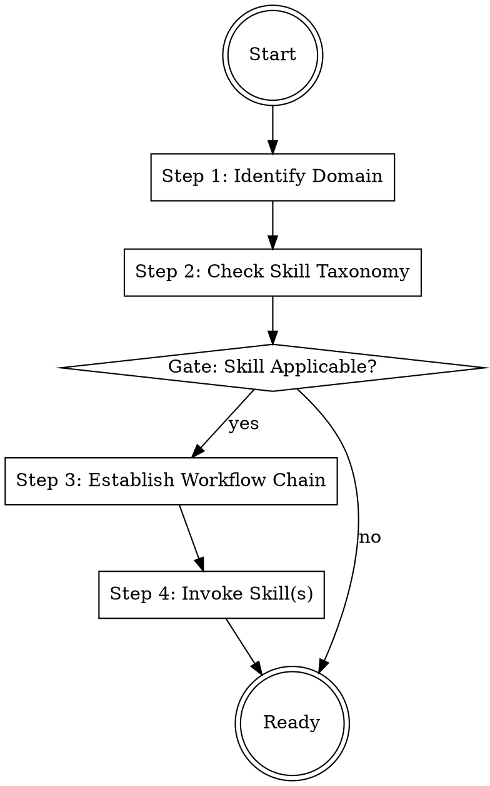

## Overview
This skill bootstraps the session, identifying the user's domain, routing to the correct skill family, and establishing the workflow context. It prevents "unstructured thinking" by ensuring every task is approached with the appropriate skill framework.

## Iron Law
`NO RESPONSE TO A TASK WITHOUT CHECKING FOR APPLICABLE SKILLS FIRST`
Jumping directly into a task without identifying the relevant skill framework results in generic, unverified, and low-value output.

## State Machine

## When to Use This Skill
- Start of a new chat session.
- When the user introduces a new project or topic.
- When you are unsure how to approach a request.

## When NOT to Use This Skill
- During an ongoing task that already has a skill invoked.
- Simple, one-off clarifications.

## Core Process

### Step 1: Identify Domain
Ask yourself: Is this request strategic, analytical, narrative, rhetorical, or interpersonal? (Source: GEMINI.md, §2)

### Step 2: Check Skill Taxonomy
Consult the 6 families and 41 skills below. Use the 1% rule: if there is even a 1% chance a skill applies, you MUST mention it.

#### The 6 Skill Families

**meta (6 skills)** — Foundation & process enforcement
- `getting-started` — Session bootstrap & routing (you are here)
- `using-skills` — Skill invocation discipline & 1% rule enforcement
- `writing-skills` — TDD for documentation & skill authoring
- `prompt-optimizer` — Structured prompt refinement methodology
- `mental-model-library` — Cross-domain reasoning reference
- `learning-accelerator` — Meta-learning & knowledge synthesis

**workflow (12 skills)** — Strategic & analytical workflows
- `problem-framing` — Discovery gate & problem definition
- `stakeholder-discovery` — Audience & stakeholder mapping
- `market-context` — Competitive landscape context
- `competitive-analysis` — Structured competitor teardown
- `buyer-persona` — JTBD-driven persona builder
- `business-case` — ROI & investment thesis
- `prd-writing` — Product requirements (PR/FAQ method)
- `pitch-deck` — Investor & internal pitch
- `one-pager` — Executive summary document
- `executive-briefing` — Board-level communication
- `assumption-audit` — Evidence validation gate
- `stakeholder-review` — Structured feedback collection

**executive (9 skills)** — Leadership & decision-making
- `strategy-clarity` — Strategic positioning & competitive advantage
- `devils-advocate` — Adversarial stress testing
- `operational-excellence` — Execution systems & OKRs
- `platform-strategist` — Platform vs aggregator analysis
- `ownership-coach` — Leadership accountability
- `first-90-days` — New role transition playbook
- `hiring-talent` — Talent assessment & recruitment
- `team-builder` — Culture & psychological safety
- `decision-frameworks` — Structured decision methodology

**narrative (4 skills)** — Storytelling & creative writing
- `fiction-architect` — Plot structure & causality
- `character-vulnerability` — Character depth testing
- `world-building-logic` — Internal consistency engine
- `dialogue-craft` — Voice & subtext

**rhetorician (5 skills)** — Communication & persuasion
- `non-fiction-precision` — Structural clarity
- `copy-editor` — Line-level prose quality
- `resonance-engine` — Emotional & persuasive impact
- `memo-stress-tester` — Business writing stress test
- `scientific-advertising` — Evidence-based persuasion

**dealmaker (5 skills)** — Negotiation & influence
- `negotiation-tactician` — Deal & contract negotiation
- `influence-architect` — Persuasion & power dynamics
- `rapport-builder` — Relationship & trust building
- `feedback-coach` — Giving & receiving feedback
- `difficult-conversations` — High-stakes dialogue

### Step 3: Establish Workflow Chain
If the task is strategic or analytical, determine which phase of the workflow chain (Discovery, Analysis, Deliverable, Review) applies. (Source: GEMINI.md, §4)

### Step 4: Invoke Skill(s)
Confirm the relevant skills with the user and request permission to proceed using those frameworks. (Source: GEMINI.md architecture)

## Cross-Skill Invocations
REQUIRED SUB-SKILL: using-skills — to enforce invocation discipline.
RECOMMENDED SUB-SKILL: problem-framing — to begin the Discovery phase.

## Rationalization Table
| Thought | Reality |
|---------|---------|
| "The user just asked a simple question, I don't need to check skills." | Simple questions are often the tip of a complex strategic iceberg. |
| "Checking skills will slow down the conversation." | Spending 10 seconds to find the right skill saves 10 minutes of rework. |
| "I already know how to handle this without a skill." | You are falling into confirmation bias; the skills are there to catch what you missed. |
| "None of the skills seem to perfectly match." | Use the closest skill or combine multiple skills rather than using none. |

## Red Flags
These thoughts mean STOP — you are about to shortcut:
- "I'll just answer this first and then see about skills later" → This violates the Iron Law.
- "I'm sure no skill applies here" → You probably haven't looked at the taxonomy lately.
- "This task is too urgent for bootstrapping" → Urgency increases the risk of error, making bootstrapping more important.

## Diagnostic Checklist
- [ ] Have I identified the user's primary domain?
- [ ] Have I checked all 6 families for applicable skills?
- [ ] Have I informed the user which skills I am invoking?
- [ ] Does the proposed plan follow the workflow chain (if applicable)?
- [ ] Have I confirmed there are no hidden prerequisites (e.g., stakeholder mapping before PRD)?

## Sources
- GEMINI.md, §2 — Skill Family Directory.
- GEMINI.md, §4 — Workflow Chain Architecture.
- GEMINI.md, §6 — Iron Laws.
