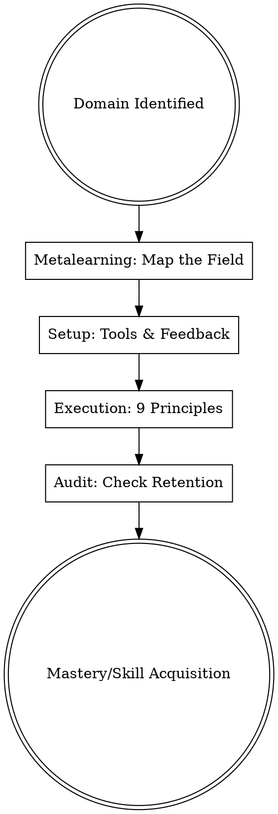

## Overview

Learning is the meta-skill that powers all others. This skill applies the principles of **Ultralearning** and **Metacognition** to compress years of traditional study into months of high-intensity practice. It moves learning from passive consumption to active production.

## Iron Law

`NO LEARNING PLAN WITHOUT A RETRIEVAL AND SPACING STRATEGY`

Reading and highlighting create an "illusion of competence." True mastery requires active retrieval (testing) and a spacing strategy to prevent the "Leaky Bucket" of memory decay.

## State Machine

## When to Use This Skill

- When onboarding into a complex new industry or technical role.
- When preparing for a professional certification or competitive exam.
- When you need to pick up a new language or software tool in under 90 days.
- When traditional study methods feel slow, boring, or ineffective.

## When NOT to Use This Skill

- For leisure reading or hobbies where the goal is relaxation rather than performance.
- When the skill is purely physical and requires a physical coach for safety (e.g., heavy weightlifting).

## Core Process

### Step 1: Metalearning (The 10% Rule)
Before starting, spend 10% of your estimated study time researching *how* the best in the field learned the skill. Map out:
- **Concepts:** What do I need to understand?
- **Facts:** What do I need to memorize?
- **Procedures:** What do I need to *do*? (Source: Young, Ultralearning).

### Step 2: Directness (The Transfer Fix)
Identify the environment where you will actually use the skill. Practice *there*. If you want to learn to code, build a project immediately. If you want to learn a language, speak to a person. Avoid "proxy" apps that offer a fake sense of progress (Source: Young, Ultralearning).

### Step 3: Implement Spaced Retrieval
Do not review notes. Instead, use **Active Recall**:
- **The Feynman Technique:** Explain a concept out loud as if to a child. Identify gaps in your explanation and go back to the source (Source: Oakley, A Mind For Numbers).
- **Spaced Repetition:** Use an SRS (like Anki) to review facts at increasing intervals (Source: Matuschak).

### Step 4: The Zettelkasten Method
Treat notes as a web of ideas, not a list.
- **Fleeting Notes:** Quick captures of ideas.
- **Permanent Notes:** Atomic, self-contained ideas written in your own words.
- **Linking:** Connect new notes to existing ones to build a "Slip-box" of knowledge (Source: Ahrens, How to Take Smart Notes).

### Step 5: Focused vs. Diffuse Mode
Switch between **Focused Mode** (intense concentration) and **Diffuse Mode** (letting the subconscious work while walking, showering, or sleeping). Problem-solving happens in the diffuse mode after the focused mode has "loaded" the data (Source: Oakley, A Mind For Numbers).

## Cross-Skill Invocations

- **REQUIRED SUB-SKILL: writing-skills** — To create the "failing tests" or challenges for your retrieval sessions.
- **RECOMMENDED SUB-SKILL: mental-model-library** — To find analogies and structures that make new information easier to "chunk."

## Rationalization Table

| Thought | Reality |
|---------|---------|
| "I'll read the book first, then practice." | Direct practice is the only way to identify what you actually need to learn. |
| "Highlighting the important parts helps me remember." | Highlighting is passive and is statistically the least effective study method. |
| "I don't have time for a full plan." | 1 hour of planning saves 10 hours of wandering through irrelevant material. |
| "I'm just not a [Subject] person." | This is a fixed identity trap. Skills are acquired through iterative drills. |

## Red Flags

- **"Illusion of Competence"** → You recognize the information when you see it, but can't recall it from memory. (Action: Test yourself).
- **"The Leaky Bucket"** → You learn 10 things today but forget them by next week. (Action: Implement Spaced Repetition).
- **"Procrastination via Research"** → You are spending 50% of your time looking for better tools instead of studying. (Action: Limit research to the 10% rule).

## Diagnostic Checklist

- [ ] Have I spent **10% of my time** on Metalearning (researching the "how")?
- [ ] Is my primary practice **Direct** (using the skill in its real context)?
- [ ] Am I using **Active Recall** (testing) instead of passive review?
- [ ] Have I scheduled **Spaced Repetition** sessions for key facts?
- [ ] Can I explain the core concept using the **Feynman Technique**?

## Sources

- Young, Scott. *Ultralearning*, Ch. 4 (Metalearning), Ch. 6 (Directness).
- Ahrens, Sönke. *How to Take Smart Notes*, Ch. 2 (The Slip-box).
- Oakley, Barbara. *A Mind For Numbers*, Ch. 3 (Chunking), Ch. 4 (Diffuse Mode).
- Waitzkin, Josh. *The Art of Learning*, Ch. 11 (Making Smaller Circles).
