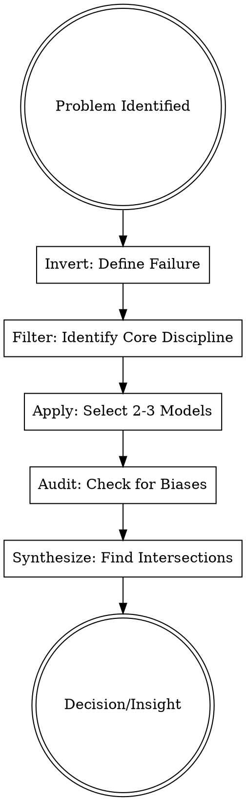

## Overview

A "Mental Model" is a representation of how something works—a simplified map of reality. This skill provides a "Latticework of Mental Models" from major disciplines (Physics, Biology, Psychology, Math) to prevent "Man with a Hammer" syndrome—the tendency to treat every problem as a nail because you only have one tool.

## Iron Law

`NO COMPLEX ANALYSIS WITHOUT CHECKING FOR APPLICABLE MENTAL MODELS`

Relying on intuition alone ensures that you will fall victim to predictable cognitive biases. Systematic model application is the only defense against human misjudgment.

## State Machine

## When to Use This Skill

- When a problem seems "stuck" or repetitive.
- Before making an irreversible decision (e.g., product pivot, major hiring, market entry).
- When analyzing why a competitor is succeeding or why a project failed.
- During a "Pre-Mortem" to identify hidden risks.

## When NOT to Use This Skill

- For routine, low-stakes operational tasks where speed is more valuable than depth.
- When the goal is creative expression rather than objective analysis.

## Core Process

### Step 1: Invert, Always Invert
Instead of asking "How do I succeed?", ask "How could this fail spectacularly?" Define the conditions for failure and work backward to avoid them (Source: Munger).

### Step 2: Traverse the Latticework
Apply models from at least three different disciplines to the problem:
- **Physics:** Is there **Entropy** (disorder) increasing? Is there a **Leverage** point?
- **Biology:** Are **Incentives** driving behavior? Is there a **Red Queen Effect** (running to stay in place)?
- **Chemistry:** Is there enough **Activation Energy** to start this change? (Source: Parrish).

### Step 3: Identify the Lollapalooza
Look for points where multiple biases or models act in the same direction. When 3+ models align, the outcome will be non-linear and massive (Source: Munger).

### Step 4: Run the Misjudgment Checklist
Audit your conclusion against the **25 Psychological Tendencies** (e.g., Social Proof, Reciprocation, Availability Bias) to ensure you aren't fooling yourself (Source: Munger).

## The Model Registry (High-Leverage Only)

| Discipline | Model | Principle (Source: Parrish/Munger/Bevelin) |
|---|---|---|
| **Thinking** | **Inversion** | Turn the problem upside down to see what to avoid. |
| **Thinking** | **First Principles** | Strip a system down to its fundamental truths and build up. |
| **Physics** | **Entropy** | Disorder increases naturally; order requires energy. |
| **Physics** | **Leverage** | Small inputs at the right point produce massive outputs. |
| **Biology** | **Evolution** | Individuals and organizations that don't adapt go extinct. |
| **Biology** | **Incentives** | "Show me the incentive, and I'll show you the outcome." |
| **Systems** | **Feedback Loops** | Outputs that circle back to inputs (vicious or virtuous). |
| **Psychology** | **Social Proof** | We look to others to determine correct behavior. |
| **Psychology** | **Loss Aversion** | The pain of losing is 2x stronger than the joy of winning. |

## Cross-Skill Invocations

- **REQUIRED SUB-SKILL: getting-started** — To route the problem to the correct family before applying models.
- **RECOMMENDED SUB-SKILL: decision-frameworks** — For formalizing the output of the mental model analysis.
- **RECOMMENDED SUB-SKILL: devils-advocate** — To use Inversion as a tool for stress-testing.

## Rationalization Table

| Thought | Reality |
|---------|---------|
| "I don't have time to go through 100 models." | You only need the 5-10 "big ideas" to catch 90% of errors. |
| "This is a business problem, I don't need Physics." | Economic systems are subject to the same laws of scale and limits. |
| "I already know why this is happening." | Your "knowledge" is often a story masking a cognitive bias. |
| "Mental models are just fancy names for common sense." | Common sense is not common; models make it systematic and repeatable. |

## Red Flags

- **"Man with a Hammer"** → You are forcing the problem to fit your favorite model (e.g., only seeing incentives).
- **"Confirmation Bias"** → You are only looking for models that support your current plan.
- **"Ignoring Scale"** → You assume a model that works at small scale (Start-up) works at large scale (Enterprise).

## Diagnostic Checklist

- [ ] Have I **Inverted** the problem to identify "how to fail"?
- [ ] Have I applied models from **at least three** different disciplines?
- [ ] Have I checked for **Lollapalooza effects** (confluence of forces)?
- [ ] Have I audited for the **Social Proof** or **Incentive** biases?
- [ ] Am I working within my **Circle of Competence**?

## Sources

- Munger, Charles. *Poor Charlie's Almanack*, Talk Eleven (Psychology of Human Misjudgment).
- Parrish, Shane. *The Great Mental Models*, Vol 1 (General Thinking), Vol 2 (Science).
- Bevelin, Peter. *Seeking Wisdom*, Ch. 2 (Psychology), Ch. 3 (Physics/Math).
