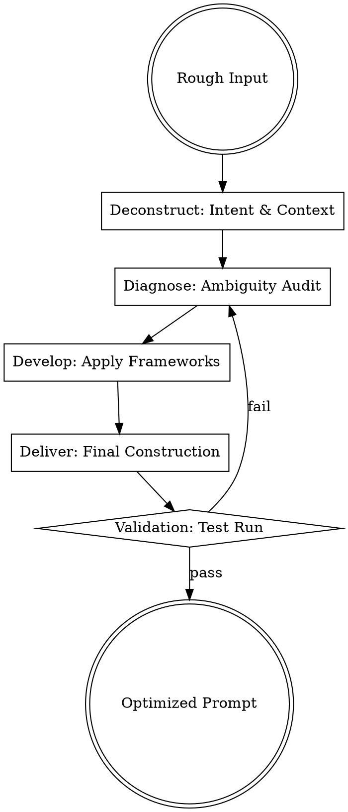

## Overview

Prompt optimization is the engineering of intent into machine-executable instructions. This skill applies the 4-D Methodology (Deconstruct, Diagnose, Develop, Deliver) to ensure that prompts are clear, structured, and optimized for specific model architectures (e.g., Claude's XML tagging vs. OpenAI's Markdown preference).

## Iron Law

`NO PROMPT SHIPS WITHOUT RUNNING THE 4-D AUDIT`

Failing to audit a prompt leads to "drift"—where the AI's output gradually diverges from the user's intent due to ambiguity or structural weakness.

## State Machine

## When to Use This Skill

- When an AI provides "hallucinated" or irrelevant answers.
- When creating a new system prompt or "SKILL.md" file.
- When a complex task needs to be broken down for a model.
- When you need to force a model to follow a specific output format (JSON, XML, Markdown).

## When NOT to Use This Skill

- For simple, conversational queries where high precision is unnecessary.
- When the bottleneck is the model's knowledge cutoff rather than the instruction set.

## Core Process

### Step 1: Deconstruct (Extract Core Intent)
Strip the prompt to its atomic parts. Identify:
- **Role:** Who is the AI supposed to be? (Source: Anthropic).
- **Goal:** What is the specific, measurable outcome?
- **Constraints:** What MUST NOT happen? (Source: OpenAI).

### Step 2: Diagnose (Audit for "Leaks")
Look for structural weaknesses:
- **Ambiguity:** Are words like "better," "fast," or "creative" left undefined?
- **Cognitive Load:** Is the prompt trying to do too many things at once?
- **Format Gaps:** Is the desired output structure clearly defined? (Source: Anthropic).

### Step 3: Develop (Apply Optimization Frameworks)
Select the appropriate technique based on task complexity:
- **Chain of Thought (CoT):** Force the model to "think" in `<thinking>` tags before answering (Source: Anthropic).
- **Few-Shot Learning:** Provide 2-3 high-quality examples of input/output pairs.
- **XML Structuring:** Use tags (e.g., `<context>`, `<task>`, `<example>`) to separate instructions from data (Source: Anthropic).
- **Reference Text:** Provide the exact text the model should use to minimize hallucinations (Source: OpenAI).

### Step 4: Deliver (Final Construction)
Assemble the optimized prompt using a "Bottom-Up" assembly:
1. Role Definition.
2. Context/Background.
3. Task/Instructions (broken into steps).
4. Output Format Specifications.
5. Examples (if applicable).

## Cross-Skill Invocations

- **REQUIRED SUB-SKILL: writing-skills** — To ensure the prompt adheres to TDD principles (testable outcomes).
- **RECOMMENDED SUB-SKILL: non-fiction-precision** — For clarity and concision in instruction wording.

## Rationalization Table

| Thought | Reality |
|---------|---------|
| "It's just a simple request, no need for tags." | Simple requests are where models "lazy-reply" most often. |
| "The model is smart enough to figure it out." | Intelligence is not a substitute for clear intent engineering. |
| "I'll just add more words to make it clearer." | Wordiness often dilutes the model's attention; use structure instead. |
| "I don't have time for the 4-D audit." | A bad prompt wastes more time in revisions than an audit takes. |

## Red Flags

- **"The model isn't listening"** → You likely have conflicting constraints or a weak Role definition.
- **"Output is too generic"** → You lack specific constraints or "Few-Shot" examples.
- **"Wall of Text"** → You haven't used delimiters (Markdown or XML) to help the model parse intent.

## Diagnostic Checklist

- [ ] Does the prompt define a specific **Role**?
- [ ] Are instructions separated from data using **XML tags** or delimiters?
- [ ] Is there a **Chain of Thought** instruction (e.g., "Think step-by-step")?
- [ ] Are the **Output Format** requirements (e.g., JSON, length, tone) explicit?
- [ ] Does the prompt include at least one **Negative Constraint** (what to avoid)?

## Sources

- OpenAI, *Prompt Engineering Guide* (Strategies for Task Decomposition).
- Anthropic, *Prompt Engineering Documentation* (Use of XML tags and Role Prompting).
- Anthropic, *Prompt Engineering Documentation* (4-D Methodology).
