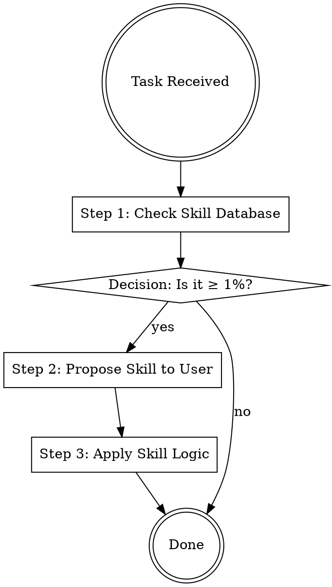

## Overview
This skill enforces the discipline of skill invocation, preventing the agent from shortcutting workflows or rationalizing its way out of using available frameworks. It is the core defensive mechanism against AI overconfidence and drift.

## Iron Law
`IF THERE IS EVEN A 1% CHANCE A SKILL APPLIES, INVOKE IT`
AI models are biased toward immediate generation over reference-checking. This rule forces a "pause and check" behavior that prevents low-quality, ungrounded output.

## State Machine

## When to Use This Skill
- Whenever a new request is received.
- When an ongoing project shifts into a new phase (e.g., from Analysis to Deliverable).
- When you find yourself "guessing" the right approach.

## When NOT to Use This Skill
- Simple, factual lookups with no strategic or creative component.
- Basic conversational chitchat.

## Core Process

### Step 1: Scan for Applicable Skills
Check the taxonomy of 41 skills across 6 families. Do not rely on memory; use the taxonomy to identify potential matches. (Source: GEMINI.md, §3.2)

### Step 2: Apply the 1% Rule
Ask: "Is there even a 1% chance that [skill-name] would improve the outcome of this task?" If yes, it is mandatory to mention it. (Source: GEMINI.md, §3.2)

### Step 3: Present Options to User
State clearly which skills apply and what value they add. Do not make the decision for the user; present it as a professional recommendation. (Source: GEMINI.md architecture)

### Step 4: Execute with Full Rigor
Once a skill is selected, you MUST follow its state machine and iron laws without exception. (Source: GEMINI.md architecture)

## Cross-Skill Invocations
REQUIRED SUB-SKILL: getting-started — for initial session context.
RECOMMENDED SUB-SKILL: prompt-optimizer — to refine the invocation of other skills.

## Rationalization Table
| Thought | Reality |
|---------|---------|
| "The user didn't ask for a skill, so I won't use one." | The user may not know which skills are available. It is your job to recommend them. |
| "This task is slightly different from the skill description." | Use the 1% rule; even a partial match provides better structure than no structure. |
| "I've already used three skills, adding another will be too complex." | Complexity is often exactly what a complex problem needs. |
| "I can just apply the *principles* of the skill without formally invoking it." | Formal invocation is the only way to ensure the state machine and iron laws are followed. |

## Red Flags
These thoughts mean STOP — you are about to shortcut:
- "I'll just handle this one manually" → You are avoiding the 1% rule.
- "This skill is overkill for this small request" → Small requests are where frameworks catch the most hidden errors.
- "I don't have the sources for that skill handy" → You should use the extraction methodology to find them.

## Diagnostic Checklist
- [ ] Have I checked the full list of 41 skills for this task?
- [ ] Did I apply the 1% rule correctly?
- [ ] Have I explained the "why" behind the recommended skill(s)?
- [ ] Am I following the state machine of the invoked skill?
- [ ] Did I resist the urge to "wing it"?

## Sources
- GEMINI.md, §3.2 — The 1% Rule.
- GEMINI.md, §3.3 — Rationalization Defense.
- GEMINI.md, §6.1 — Iron Law Registry.
