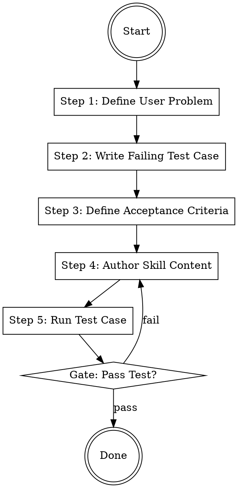

## Overview
This skill enforces a Test-Driven Development (TDD) approach to documentation and skill authoring. By defining what a skill must achieve before writing its content, we ensure functional clarity and prevent "hallucinated utility" or generic, ungrounded advice.

## Iron Law
`NO SKILL WITHOUT A FAILING TEST FIRST`
Skills written without a prior test case often drift into generic filler that doesn't solve a specific user problem. The test case grounds the skill in reality.

## State Machine

## When to Use This Skill
- Creating a new agent skill from scratch.
- Refactoring an existing skill to add new capabilities.
- Upgrading a rough draft to a production-ready skill.
- Debugging a skill that is producing poor-quality output.

## When NOT to Use This Skill
- Simple task execution that does not require a persistent skill instruction.
- General conversational responses.

## Core Process

### Step 1: Define User Problem
Identify the specific failure mode or knowledge gap the user is facing. What happens when the user *doesn't* have this skill? (Source: GEMINI.md architecture)

### Step 2: Write Failing Test Case
Draft a sample prompt or scenario where a generic LLM (or the current skill) would fail. This is the "Red" phase of TDD. (Source: GEMINI.md architecture)

### Step 3: Define Acceptance Criteria
List 3-5 specific, testable behaviors the skill MUST exhibit to be considered successful. (Source: GEMINI.md architecture)

### Step 4: Author Skill Content
Write the skill following the appropriate rigor template (§8.3 or §8.4 of GEMINI.md). Every principle must directly address the failure mode identified in Step 1. (Source: GEMINI.md architecture)

### Step 5: Run Test Case
Execute the failing test case from Step 2 against the newly authored skill. If the output meets the acceptance criteria, the skill passes. (Source: GEMINI.md architecture)

## Cross-Skill Invocations
REQUIRED SUB-SKILL: None
RECOMMENDED SUB-SKILL: prompt-optimizer — to refine the test case and skill instructions.

## Rationalization Table
| Thought | Reality |
|---------|---------|
| "I know what I want to say, I don't need a test case." | Without a test, you won't know if the skill actually changes the LLM's behavior. |
| "Writing the test takes too much time." | Fixing a broken skill after deployment takes 10x more time. |
| "This skill is too simple for TDD." | Simple skills are where generic filler is most likely to hide. |
| "I'll write the test after I finish the skill." | This defeats the purpose; you will subconsciously write a test the skill can already pass. |

## Red Flags
These thoughts mean STOP — you are about to shortcut:
- "Let me just start writing and see where it goes" → You are skipping Step 1 and Step 2.
- "The test case passed even without the skill" → Your test case is too weak; it doesn't represent a true failure mode.
- "I'll just assume this works because it looks comprehensive" → You are skipping Step 5.

## Diagnostic Checklist
- [ ] Is there a documented failing test case (prompt/scenario)?
- [ ] Do the acceptance criteria explicitly reference the failing test case?
- [ ] Does every principle in the skill map to a required behavior?
- [ ] Has the skill been tested against the scenario and passed?
- [ ] Is the skill free of generic, non-actionable advice?

## Sources
- GEMINI.md, §3.1 — Pattern Lineage and writing-skills definition.
- GEMINI.md, §8.3 — Full Rigor format requirements.
