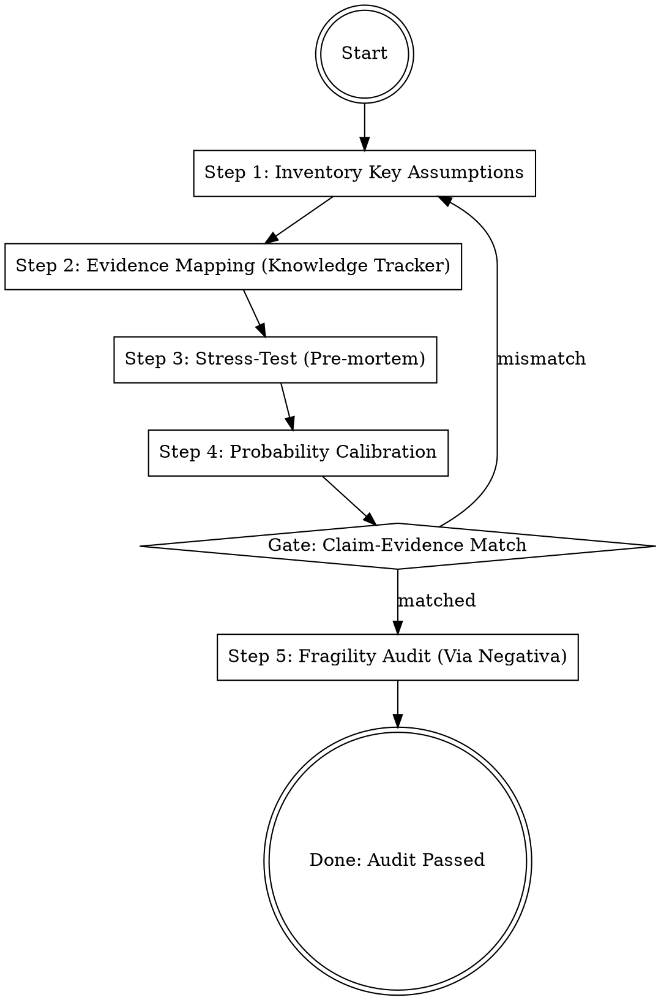

## Overview
Assumption-audit is the "evidence gate" that prevents Resulting (evaluating decisions by outcomes) and Hindsight Bias (feeling something was predictable after it happened). It forces an honest accounting of what is known versus what is guessed.

## Iron Law
`NO SIGN-OFF WITHOUT VALIDATION EVIDENCE FOR EVERY KEY CLAIM`
Assertions without evidence are vulnerabilities. Unaudited assumptions create fragile strategies that collapse under the first sign of volatility.

## State Machine

## When to Use This Skill
- Before finalized a PRD, strategy memo, or business case.
- When a recommendation relies on future forecasts or market "certainties."
- When you find yourself saying "I just have a feeling" or "It's obvious that..."
- Before any high-stakes decision where the downside of being wrong is significant.

## When NOT to Use This Skill
- For low-stakes, reversible decisions (Type 2 decisions) where the cost of auditing exceeds the cost of failure.
- For purely creative tasks (e.g., brainstorming) where audit-culture might stifle ideation (use *after* ideation, before selection).

## Core Process

### Step 1: Inventory Key Assumptions
- **Identify Every Major Claim:** List the foundations upon which the proposal stands.
- **Check for Misjudgments:** Run the checklist of 28 reasons for misjudgment (e.g., Anchoring, Social Proof, Incentive bias). (Source: Bevelin, Seeking Wisdom)
- **Distinguish Facts from Beliefs:** Explicitly label what is a verified fact versus what is an educated guess. (Source: Duke, How to Decide)

### Step 2: Evidence Mapping (Knowledge Tracker)
- **Apply the Knowledge Tracker:** Record exactly *what* was known and *when* it was known. This prevents "Hindsight Bias" from making you think you knew more than you did. (Source: Duke, How to Decide)
- **Darwin’s Golden Rule:** Actively seek out and record disconfirming evidence—the facts that oppose your desired conclusion. (Source: Bevelin/Darwin, Seeking Wisdom)
- **Audit Incentives:** Ask: "What incentives make this belief useful for me or my team right now?" (Source: Sivers, Useful Not True)

### Step 3: Stress-Test (Pre-mortem & Backcasting)
- **Conduct a Pre-mortem:** Imagine it is one year from now and this project has failed catastrophically. Work backward to identify the most likely causes of that failure. (Source: Duke, Thinking in Bets)
- **Execute Backcasting:** Imagine the project is a massive success. What *must* have happened for this success to be true? Does our current plan cover those necessities? (Source: Duke, Thinking in Bets)

### Step 4: Probability Calibration
- **Eliminate Vague Terms:** Replace words like "likely," "probably," or "maybe" with exact confidence percentages (e.g., "70% confident"). (Source: Duke, How to Decide)
- **Calculate the Expected Value:** If possible, multiply the probability of success by the potential payoff to see if the bet is worth the risk. (Source: Duke, Thinking in Bets)

### Step 5: Fragility Audit (Via Negativa)
- **Apply Via Negativa:** Identify what can be *removed* or *simplified* to reduce the number of ways the plan can fail. (Source: Taleb, Antifragile)
- **Check for Skin in the Game:** Are the people making the assumptions the ones who will bear the cost if they are wrong? (Source: Taleb, Antifragile)
- **Build a Barbell:** Ensure the core of the plan is robust/safe, while allowing for small, high-upside "options" to capture volatility. (Source: Taleb, Antifragile)

## Cross-Skill Invocations
REQUIRED SUB-SKILL: `using-skills` — To maintain audit discipline.
RECOMMENDED SUB-SKILL: `devils-advocate` — To provide adversarial pressure on the assumptions.
RECOMMENDED SUB-SKILL: `decision-frameworks` — To structure the final sign-off.

## Rationalization Table

| Thought | Reality |
|---------|---------|
| "We've done our research, we know this will work." | This is "definite optimism" and ignores the role of luck and hidden volatility. |
| "I don't need a knowledge tracker; I remember why I chose this." | Memory is a "hindsight bias" machine that rewrites history to make you look right. |
| "A pre-mortem is too negative; it will demoralize the team." | Unchecked fragility is what actually demoralizes teams when they inevitably fail. |
| "The upside is so high it doesn't matter if we're slightly wrong." | Fragile systems have a "concave" downside—being "slightly wrong" can lead to total ruin. |

## Red Flags
These thoughts mean STOP — you are about to shortcut:
- "Trust me, I have a gut feeling about this." → Gut feelings are often just un-audited biases.
- "Everyone else is doing it this way." → Social Proof bias is masking a lack of evidence.
- "We'll cross that bridge when we come to it." → You are avoiding a necessary pre-mortem.

## Diagnostic Checklist
- [ ] Is every "likely" outcome assigned an explicit probability percentage?
- [ ] Has a pre-mortem been conducted to identify failure modes?
- [ ] Is there documented evidence for the top three most critical assumptions?
- [ ] Has the "Via Negativa" check identified at least one thing to remove for safety?
- [ ] Does the "Knowledge Tracker" separate what we knew then from what we know now?

## Sources
- Duke, Thinking in Bets, Ch. 1 (Resulting), Ch. 6 (Future-tenting)
- Duke, How to Decide, Ch. 3 (Hindsight Bias), Ch. 4 (Probabilities), Ch. 5 (Pre-mortem)
- Taleb, Antifragile, Ch. 11 (Barbell Strategy), Ch. 20 (Lindy Effect), Ch. 23 (Skin in the Game)
- Bevelin, Seeking Wisdom, Part 2 (Psychology of Misjudgments), App. 4 (Checklists)
- Sivers, Useful Not True, (Useful vs True)
