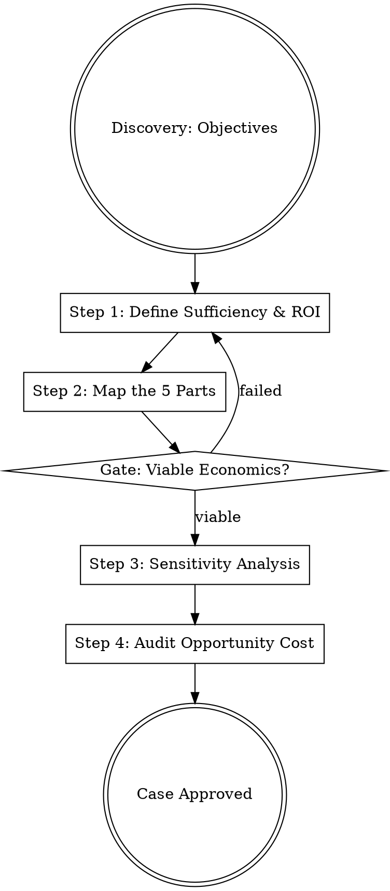

## Overview
This skill provides a rigorous framework for building an investment thesis. It forces the identification of explicit assumptions, calculation of ROI, and the simulation of worst-case scenarios to ensure that capital and resources are allocated only to initiatives with a clear path to "Sufficiency."

## Iron Law

`NO BUSINESS CASE WITHOUT EXPLICIT ASSUMPTIONS AND SENSITIVITY ANALYSIS`
Uncertainty is inherent in business, but failing to model it is a choice. A business case that assumes a single linear outcome is a fantasy. You must simulate "The Plan Not Going According to Plan."

## State Machine

## When to Use This Skill
- When requesting additional budget or headcount.
- When evaluating a potential new market entry.
- When deciding between two competing strategic paths.
- When an existing project is underperforming and needs a "worthwhile to continue" check.

## When NOT to Use This Skill
- For minor tactical experiments (use A/B testing).
- For pure brand awareness tasks where direct ROI cannot be measured.

## Core Process

### Step 1: Define Sufficiency & ROI
Define the exact revenue, user, or outcome level at which the initiative becomes "worthwhile to continue."
- **Projected ROI:** Ratio of Net Profit to Total Investment.
- **Runway & Burn:** Calculate the monthly cash consumption and the time remaining until the next capital event. (Source: Kaufman, Ch. 5; Feld, Ch. 3)

### Step 2: Map the 5 Parts of Business
Justify how the initiative addresses:
1. **Value Creation:** Which Economic Values (Speed, Efficacy, Status) are we satisfying?
2. **Marketing:** How will we reach the 95% mainstream market, not just early adopters?
3. **Sales:** What is the Allowable Acquisition Cost (AAC)?
4. **Value Delivery:** How will we satisfy customer expectations predictably?
5. **Finance:** Is the Lifetime Value (LTV) greater than the AAC? (Source: Kaufman, Ch. 1; Gil, Andreessen interview)

### Step 3: Sensitivity Analysis & Doomsday Scenario
Apply a "Margin of Safety."
- **Sensitivity:** How does ROI change if growth is 50% lower?
- **Doomsday:** Simulate the failure of your most critical assumption. If the company collapses because this one project fails, the risk is too high. (Source: Housel, Ch. 5; Kaufman, Ch. 7)

### Step 4: Audit Opportunity Cost & Interaction
- **Opportunity Cost:** Explicitly list the projects that are *not* being done to make room for this one.
- **Interaction:** How does this initiative impact existing business units? (e.g., Will it cannibalize our core product?) (Source: Kaufman, Ch. 5; Bacon, Ch. 6)

### Step 5: Define OKRs
Set one Objective (WHAT) and 3-5 Key Results (HOW).
- **Quality Safeguard:** Pair every quantitative KR (e.g., "$50M Revenue") with a quality KR (e.g., "<5% Churn") to prevent short-term reckless behavior. (Source: Doerr, Ch. 4)

## Cross-Skill Invocations
REQUIRED SUB-SKILL: problem-framing — to ensure you are solving the right problem before investing.
RECOMMENDED SUB-SKILL: decision-frameworks — to help weigh the subjective trade-offs identified in the audit.

## Rationalization Table
| Thought | Reality |
|---------|---------|
| "The numbers speak for themselves." | Numbers are projections based on assumptions. The assumptions speak; the numbers just listen. |
| "We've already spent $1M, we can't stop now." | Sunk cost fallacy. Only future ROI matters for the decision to continue. |
| "We'll figure out the economics after we scale." | Scale without unit economics is just a faster way to go broke. |
| "Our competitor is doing it, so we must too." | Social comparison leads to copying outlier behavior that may not be repeatable for you. |

## Red Flags
These thoughts mean STOP — you are about to shortcut:
- "This project is 'too big to fail'" → It's actually a fragile, high-risk bet with no margin of safety.
- "We don't need unit economics yet" → You are planning a "mercenary" crash, not a "missionary" success.
- "The plan is 100% solid" → You have ignored "The Plan Not Going According to Plan."

## Diagnostic Checklist
- [ ] Has a "Sufficiency" point been defined (when to stop vs. when to double down)?
- [ ] Is every output goal paired with a quality/counter-effect goal?
- [ ] Does the case include a worst-case sensitivity simulation?
- [ ] Has the opportunity cost (deferred projects) been explicitly named?
- [ ] Is the "Main Job" of the customer clearly identified as the value driver?

## Sources
- Kaufman, Josh. *The Personal MBA*. Ch. 1, 5, 7, 11.
- Gil, Elad. *High Growth Handbook*. Marc Andreessen & Claire Hughes Johnson interviews.
- Doerr, John. *Measure What Matters*. Ch. 1, 4.
- Feld, Brad. *Venture Deals*. Ch. 1, 3, 4.
- Housel, Morgan. *The Psychology of Money*. Ch. 2, 3, 5.
- Bacon, Carl R. *Practical Portfolio Performance*. Ch. 1, 4, 5, 6.
