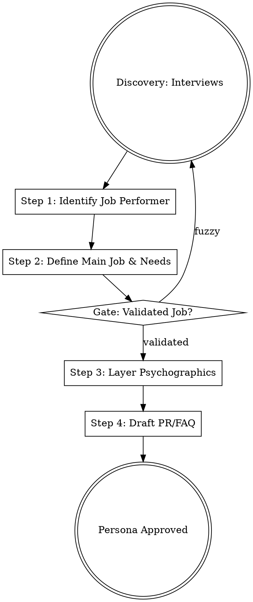

## Overview
This skill forces the creation of personas grounded in functional objectives (Jobs-to-be-Done) rather than superficial demographics. By focusing on the *Job Performer* and their *Struggling Moments*, it ensures that product and marketing efforts address actual customer needs.

## Iron Law

`NO PERSONA WITHOUT A VALIDATED JOB-TO-BE-DONE`
Personas built on demographics alone (e.g., "Millennial Mark") lead to "fluffy" marketing and products that fail to solve real problems. A persona must be anchored to a specific job someone is trying to "hire" a solution for.

## State Machine

## When to Use This Skill
- When starting a new product or feature.
- When existing marketing messages are not resonating.
- When the team is confused about who the "ideal customer" really is.
- When user research identifies a recurring "struggling moment."

## When NOT to Use This Skill
- For purely technical internal optimizations.
- When the "who" is a legal entity (use `market-context` or `stakeholder-discovery`).

## Core Process

### Step 1: Identify the Job Performer
Distinguish between the *Job Performer* (the person doing the work) and the *Buyer* (the person with the budget). A successful persona prioritizes the needs of the performer first to ensure product-market fit. (Source: Kalbach, Ch. 2)

### Step 2: Define the Main Job & Needs
Use the standard syntax: `verb + object + clarifier`.
- **Main Job:** The overarching functional objective (e.g., *Visit family on special occasions*).
- **Needs:** Desired outcomes expressed as `Direction + Measure + Object + Clarifier` (e.g., *Minimize the time it takes to share learnings*).
- **Iron Law Check:** Ensure the job is solution-agnostic. Can they do this job without your product? (Source: Kalbach, Ch. 2)

### Step 3: Layer Psychographics & Circumstances
Identify the *Circumstances* (time, manner, place) that trigger the job.
- **Pushes/Pulls:** What is pushing them away from their current solution? What is pulling them toward a new one?
- **Anxieties/Habits:** What worries them about changing? What old habits keep them stuck? (Source: Lenny's Newsletter / Bob Moesta)
- **Proudly Exclude:** Identify who the persona is *not*. Confidently exclude 99% of the market to win the "Hell Yeah!" 1%. (Source: Sivers, Ch. 16)

### Step 4: Validate with Stories (The Truth Curve)
Use the STAR method (Situation, Task, Action, Result) to drill into past behaviors. Do not ask for future preferences; ask for the *last time* they struggled with the job. (Source: Constable, Bryar)

### Step 5: Draft the PR/FAQ
Write a customer-facing press release and a set of internal/external FAQs for this persona. If the "Press Release" doesn't excite the defined persona, the persona or the product is wrong. (Source: Bryar, Ch. 5)

## Cross-Skill Invocations
REQUIRED SUB-SKILL: stakeholder-discovery — to identify all actors in the ecosystem (approvers, technicians).
RECOMMENDED SUB-SKILL: prd-writing — to turn the persona's needs into a formal requirements document.

## Rationalization Table
| Thought | Reality |
|---------|---------|
| "We already know our audience is 25-35 year old men." | Demographics don't predict behavior; struggling moments do. |
| "Writing a PR/FAQ is too much work for a simple persona." | If you can't write a compelling PR, you don't understand the persona's pain. |
| "Let's just ask them what features they want." | It's the customer's job to explain the problem; it's yours to design the solution. |
| "This persona is for 'everyone'." | A product for everyone is a product for no one. Proudly exclude. |

## Red Flags
These thoughts mean STOP — you are about to shortcut:
- "The persona is 'The Enterprise Buyer'" → You've ignored the *Performer*.
- "Our job is 'Use [Product Name] to...'" → You've embedded the solution into the job.
- "We'll build it first and find the persona later" → This is the #1 cause of product failure.

## Diagnostic Checklist
- [ ] Is the "Main Job" defined using `verb + object + clarifier` syntax?
- [ ] Is the "Job Performer" distinct from the "Buyer"?
- [ ] Have we identified the "Struggling Moment" that triggers the job?
- [ ] Does the persona confidently exclude a large portion of the market?
- [ ] Is every claim in the persona backed by a past-behavior story (STAR method)?

## Sources
- Kalbach, Jim. *The Jobs to Be Done Playbook*. Ch. 2, 4.
- Constable, Giff. *Talking to Humans*. "How To," "The Truth Curve."
- Bryar, Colin. *Working Backwards*. Ch. 5 (PR/FAQ).
- Sivers, Derek. *Anything You Want*. Ch. 16.
- Richardson, Bailey. *Get Together*. "Spark the Flame."
- *Lenny's Newsletter*. "Persona Methodology with Bob Moesta."
