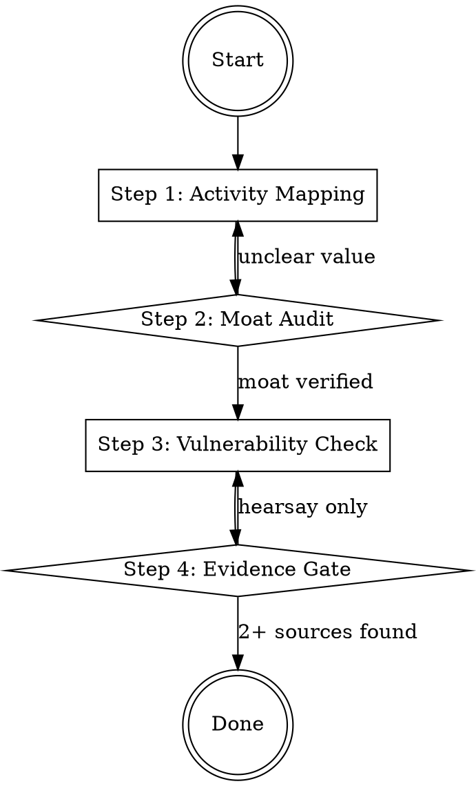

## Overview

Competitive analysis is not a list of features; it is a forensic audit of a rival's "Activity System" to find where their internal logic is brittle. This skill prevents the "Arrogance Trap" identified in the GE and Boeing collapses by forcing an evidence-based assessment of moats and vulnerabilities.

## Iron Law

`NO COMPETITIVE CLAIM WITHOUT EVIDENCE FROM AT LEAST TWO INDEPENDENT SOURCES`

Unverified claims about being "10x better" or having "no competitors" are the primary signals of impending strategic failure.

## State Machine

## When to Use This Skill

- When drafting a PRD or Business Case that claims a "unique advantage."
- When a new rival enters the market with a "modular" or "platform" approach.
- When an incumbent appears "invincible" but shows signs of arrogance or bloat.
- During a "Devil's Advocate" stress test of a proposed strategy.

## When NOT to Use This Skill

- For pure internal process optimization that does not affect the customer.
- In a "Zero-to-One" phase where no direct competitors exist (use `problem-framing` instead).

## Core Process

### Step 1: Map the Activity System
Do not compare features. Compare the *system* of reinforcing activities. (Source: Lafley, Playing to Win, Ch. 5)
1. **Identify the "Winning Aspiration":** Are they playing to win or playing to play?
2. **Deconstruct the Reinforcing Loop:** How do their activities (e.g., low cost + high volume + limited SKUs) make it harder for you to copy them without breaking your own model?
3. **Identify the "Limiting Step":** What is the one thing they cannot change without destroying their current profitability?

### Step 2: Perform the Monopoly Audit
Verify if the competitor (or you) has the four characteristics of a true moat. (Source: Thiel, Zero to One, Ch. 5)
1. **Proprietary Technology:** Is it 10x better in a way that is *unmeasurable* (e.g., UX/Ease of Use) or just a specs war? (Source: Stratechery, "What Christensen Got Wrong")
2. **Network Effects:** Does the product get more valuable with every user?
3. **Economies of Scale:** Does the cost per unit drop significantly with volume?
4. **Branding:** Is the brand an "integrated" experience or just a logo?

### Step 3: Audit the "Operating System"
Assess the rival's execution discipline. (Source: Davis, Lessons from the Titans, Ch. 12)
1. **The Arrogance Check:** Is the rival focused on "Big Ideas" and "Celebrity CEOs" (Immelt-era GE) or "Continuous Improvement" (Welch-era GE)?
2. **The 1% Trap:** Have they defined the market so broadly (e.g., "1% of $100B") that they have no actual foothold?
3. **The Capital Allocation Test:** Are they overpaying for "hot" assets or investing in the core? (Source: Gramm, Dear Chairman)

### Step 4: Verify with Independent Evidence (The Iron Law)
For every claim (e.g., "We are faster"), you must cite:
1. **Source A:** External data (e.g., user reviews, teardowns, financial filings).
2. **Source B:** Independent verification (e.g., customer interviews, third-party benchmarks).

## Cross-Skill Invocations

- **REQUIRED SUB-SKILL:** `problem-framing` — You cannot analyze competitors without knowing the "Job-to-be-Done."
- **RECOMMENDED SUB-SKILL:** `devils-advocate` — Use this to find the flaws in your own competitive claims.
- **RECOMMENDED SUB-SKILL:** `strategy-clarity` — To ensure your "How to Win" is distinct from the rival's activity system.

## Rationalization Table

| Thought | Reality |
|---------|---------|
| "We have no competitors." | You are defining the market too narrowly. Anything the customer uses to solve the problem is a competitor. |
| "Our tech is 10x better." | Unless it's 10x better on an *unmeasurable* consumer attribute (UX), it's a "modular" target. |
| "They are just a copycat." | "Me-too" competitors with lower overhead or a "modular" stack often win on price (Modular Disruption). |
| "We don't need evidence for common knowledge." | Common knowledge is often "arrogance in disguise." Verification is the only defense. |

## Red Flags

These thoughts mean STOP — you are about to shortcut:

- "They are too old/slow to catch us." → Arrogance (Source: Boeing 737MAX failure).
- "We have 1% of a massive market." → The 1% Trap (Source: Thiel).
- "Our brand is our moat." → Branding is a *result* of a system, not a standalone moat (Source: Lafley).

## Diagnostic Checklist

- [ ] Have we mapped the competitor's reinforcing activities, not just their features?
- [ ] Is our "10x" advantage verified by two independent, non-internal sources?
- [ ] Have we identified the "Job-to-be-Done" that the competitor is solving?
- [ ] Did we check for "Modular Disruption" (Modular vs. Integrated moats)?
- [ ] Have we identified the "Limiting Step" in the competitor's system?

## Sources

- Lafley, *Playing to Win*, Ch. 5 — Activity Systems and Capability Gaps.
- Thiel, *Zero to One*, Ch. 5 — Monopoly Characteristics and Power Law.
- Kaufman, *The Personal MBA*, Ch. 3 — Competitive Forces and Substitutes.
- Davis, *Lessons from the Titans*, Ch. 12 — Industrial Business Systems and Arrogance.
- Gramm, *Dear Chairman*, Ch. 1 & 5 — Intrinsic Value and Ownership Boards.
- Stratechery, "Aggregation Theory" — Demand aggregation vs. Supply control.
