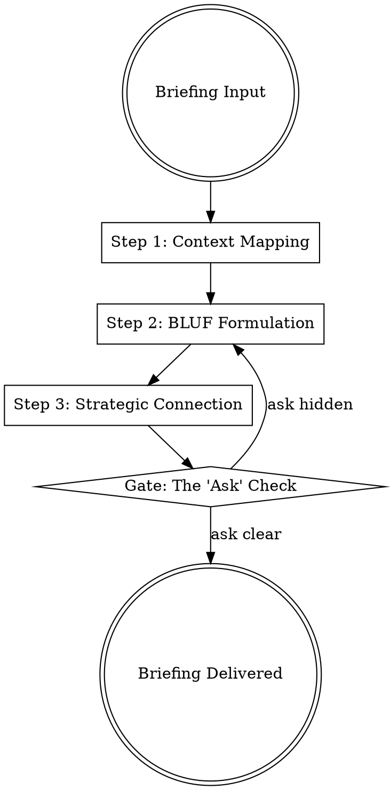

## Overview

Executive-briefing is the high-stakes discipline of managing senior leadership's most limited resource: attention. It shifts the focus from "reporting activity" to "delivering judgment," ensuring that every communication connect directly to organizational strategy and results in a clear decision or action.

## Iron Law

`NO EXECUTIVE COMMUNICATION WITHOUT BOTTOM-LINE-UP-FRONT`

Buried recommendations lead to wasted executive time, tangential discussions, and "decision fatigue." If the "ask" isn't clear in the first 10 seconds, the briefing has failed.

## State Machine

## When to Use This Skill

- During Board of Directors meetings or C-suite reviews.
- When sending a "State of the Project" email to senior leadership.
- When requesting emergency resources or strategic pivots.
- During any 10-20 minute "window" with a busy executive.

## When NOT to Use This Skill

- For line-level technical troubleshooting.
- For peer-to-peer collaboration where detailed background is necessary.
- During brainstorming sessions (use `problem-framing` instead).

## Core Process

### Step 1: Map Audience Context & Priorities
- **Enterprise View:** Identify how this topic affects the wider organization, not just your team. Executives care about Strategy, Risk, and ROI. (Source: HBR)
- **Acknowledge the Pre-read:** Build upon, don't restate, the materials provided earlier. (Source: HBR; Grove)

### Step 2: Formulate the BLUF
- **The 10-Second Rule:** Deliver the core message, recommendation, or "ask" in the very first sentence. (Source: Minto; Drucker)
- **Avoid "The Detective Story":** Do not start with the evidence and end with the conclusion. Start with the conclusion and use the evidence to defend it only if questioned. (Source: Minto)

### Step 3: Connect to Strategic Instincts
- **Judgment Over Data:** Executives pay for your judgment, not your ability to read a chart. Bring solutions, not just problems. (Source: Drucker; HBR)
- **Transparency on Risk:** Set appropriate expectations by mentioning risks and learnings alongside accomplishments to build trust. (Source: HBR)

### Step 4: Close with a "Clear Ask"
- **Commitment Capture:** Restate the required action or decision from the leadership team. Ensure there is no ambiguity on who owns the next step. (Source: HBR; Grove)

## Cross-Skill Invocations

REQUIRED SUB-SKILL: `one-pager` — To ensure the core narrative is distilled before the live briefing.
RECOMMENDED SUB-SKILL: `resonance-engine` — To increase the persuasive impact of the strategic connection.
RECOMMENDED SUB-SKILL: `mental-model-library` — To apply cross-domain reasoning to complex executive decisions.

## Rationalization Table

| Thought | Reality |
|---------|---------|
| "I need to give them the history so they understand." | Executives already have the context; they want your judgment on the *future*, not a history lesson on the *past*. |
| "The results are bad, I should soften the blow." | Softening the blow obscures the risk. Executives trust those who provide "the thing you think you cannot say" (Source: Johnson) with level-headedness. |
| "This is too complex for a single sentence." | Complexity is a sign you haven't mastered the material. If you can't summarize it, you aren't ready to brief leadership. |
| "I'll let them look at the data and decide." | This is a failure of leadership. Your job is to analyze the data and provide a *recommendation*. |

## Red Flags

These thoughts mean STOP — you are about to shortcut:

- "The recommendation is on slide 15." → You are burying the lede.
- "I'm using tentative language like 'I feel' or 'Maybe'." → Executives need confident, data-backed assertions.
- "I'm restating exactly what was in the pre-read." → You are wasting high-value meeting time.

## Diagnostic Checklist

- [ ] Is the primary "ask" or recommendation in the first 30 seconds of the briefing?
- [ ] Does the briefing connect the topic to at least one organizational goal?
- [ ] Have all "activity" metrics been replaced with "output" metrics? (Source: Grove)
- [ ] Is there a clear decision or action identified for the close?
- [ ] Are risks and negative learnings presented with the same clarity as wins?

## Sources

- Barbara Minto, The Pyramid Principle — BLUF and inductive logic.
- Peter Drucker, The Effective Executive, Ch. 1 & 3 — Focus on contribution and enterprise view.
- Andrew Grove, High Output Management, Ch. 3 & 4 — Managerial leverage and meeting efficiency.
- HBR, "Executive Communication Principles" and "Briefing the Board."
