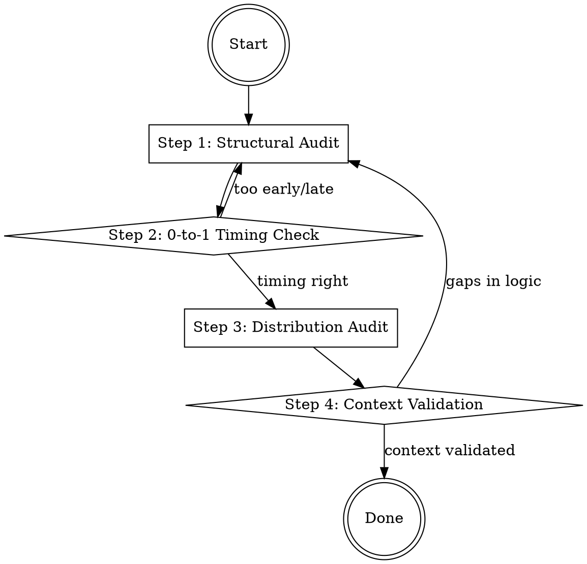

## Overview

Market context is the forensic analysis of structural forces—timing, distribution moats, and demand aggregation—that determine whether a product can capture long-term value. This skill prevents "Strategy Blindness" by forcing an audit of the "Where to Play" domains before any resources are allocated.

## Iron Law

`NO STRATEGIC RECOMMENDATION WITHOUT VALIDATED MARKET CONTEXT`

Assumed market dynamics are the primary cause of high-growth failures. Every claim must be validated against current structural shifts (e.g., Aggregation Theory or Unbundling).

## State Machine

## When to Use This Skill

- When drafting a "Winning Aspiration" for a new category.
- When an existing market is being "unbundled" by modular competitors.
- When evaluating a high-growth "Scaling Signal" or inflection point.
- Before committing to a specific "Where to Play" geography or segment.

## When NOT to Use This Skill

- For narrow internal operational improvements.
- For pure 1-to-n incremental feature releases within a stable context.

## Core Process

### Step 1: Perform the Structural Audit
Evaluate if the industry is structurally attractive. (Source: Lafley, Playing to Win, Ch. 3)
1. **Analyze Five Forces:** Are barriers to entry high? Is supplier/buyer power concentrated?
2. **Identify Value Migration:** Is value moving to the ends of the "Smiling Curve" (Creation/Customer) or toward the center (Manufacturing)? (Source: Stratechery)
3. **Map the Aggregation Dynamic:** Is the market shifting from supply control to demand aggregation? (Source: Stratechery, "Aggregation Theory")

### Step 2: The Seven Questions Test
Validate the context against Thiel's fundamental laws. (Source: Thiel, Zero to One, Ch. 13)
1. **The Engineering Question:** Can we create 10x tech, or just incremental?
2. **The Timing Question:** Is now the right time to start this specific business?
3. **The Monopoly Question:** Are we starting with a big share of a small market?
4. **The People Question:** Do we have the right team for this specific context?
5. **The Distribution Question:** Do we have a way to not just create, but deliver?
6. **The Durability Question:** Will our market position be defensible in 10 years?
7. **The Secret Question:** Have we identified a unique insight that others miss?

### Step 3: Audit the Distribution Mindset
Shift from product-centricity to distribution-centricity. (Source: Gil, High Growth Handbook, Intro)
1. **Identify Inflection Points:** Are early adopters transitioning to the 95% mainstream market?
2. **Assess Distribution Moats:** Can we own the user relationship directly, or are we dependent on an aggregator?
3. **The Dunbar Check:** Is our organization structured to handle the impersonality of a mass-market context (50-150+ people)?

### Step 4: Validate the Context (The Iron Law)
State what *must* be true about the market for the strategy to work. (Source: Lafley, Ch. 7)
1. **Evidence Check:** Prove the "Timing" and "Distribution" claims with external data.
2. **Counter-Trend Check:** What if the "Great Unbundling" reverses? How does that affect our "Where to Play"?

## Cross-Skill Invocations

- **REQUIRED SUB-SKILL:** `problem-framing` — You cannot define a market without defining the problem first.
- **RECOMMENDED SUB-SKILL:** `competitive-analysis` — To identify if you are competing in a "Red Ocean."
- **RECOMMENDED SUB-SKILL:** `strategy-clarity` — To ensure the context matches the winning aspiration.

## Rationalization Table

| Thought | Reality |
|---------|---------|
| "The market is so big, we only need 1%." | The 1% Trap leads to zero share. Successful firms start small and monopolize. |
| "Our product is so good, it sells itself." | Distribution is at least as important as product. (Source: Gil/Thiel). |
| "We are first to market." | First mover is a tactic; Last Mover is the goal (Far-future profts). |
| "The industry is too old to change." | Old industries are prime for "Unbundling" or "Aggregation." (Source: Stratechery). |

## Red Flags

These thoughts mean STOP — you are about to shortcut:

- "We'll build it and they will come." → Neglecting the Distribution Question.
- "We are copying a successful global model." → 1-to-n globalization is not 0-to-1 technology.
- "The TAM is our primary justification." → High TAM often hides high competition.

## Diagnostic Checklist

- [ ] Have we answered the Seven Questions for this strategic recommendation?
- [ ] Is the "Where to Play" choice grounded in a structurally attractive segment?
- [ ] Have we identified the "Inflection Point" or "Scaling Signal" for this market?
- [ ] Is our strategy defensible against "Aggregation Theory" shifts?
- [ ] Have we identified the "Secret" (contrarian truth) about this market?

## Sources

- Thiel, *Zero to One*, Ch. 1, 3, 5, 13 — 0-to-1, Monopoly, Seven Questions.
- Gil, *High Growth Handbook*, Intro & Ch. 3 — Distribution and Scaling.
- Lafley, *Playing to Win*, Ch. 3 & 7 — Industry structure and reverse engineering.
- Stratechery, "Aggregation Theory" — Demand aggregation dynamics.
- Stratechery, "The Great Unbundling" — Breaking and re-bundling around attention.
