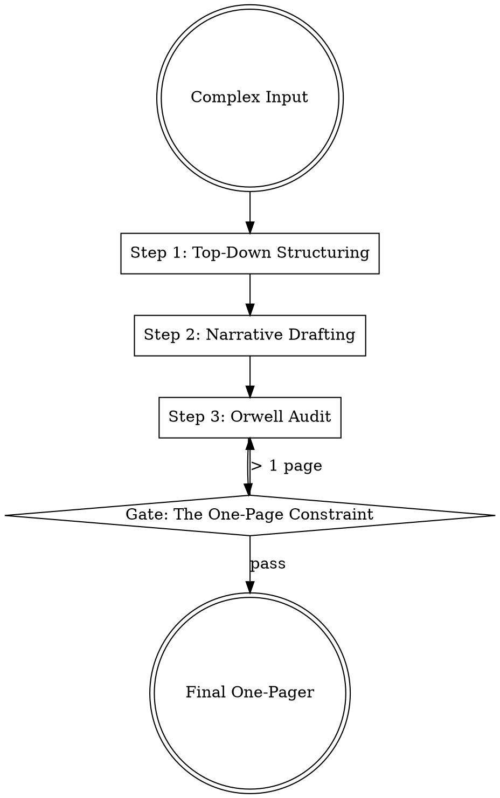

## Overview

The one-pager is a high-leverage distillation tool designed to respect executive attention by providing maximum insight per word. It enforces strategic discipline by forcing the author to prioritize the "answer" over the "activity," applying structural logic and linguistic precision to a single-page constraint.

## Iron Law

`NO ONE-PAGER LONGER THAN ONE PAGE — EVERY WORD MUST EARN ITS PLACE`

Violating this law signals a failure to prioritize. If you cannot fit your strategy on one page, you have not yet achieved clarity of thought. "First things first, and second things not at all." (Source: Drucker)

## State Machine

## When to Use This Skill

- When requesting a high-stakes decision from leadership.
- To align a team on a complex strategy or "Winning Aspiration."
- As a pre-read for an executive meeting.
- When you need to "state the obvious" to resolve cross-functional ambiguity.

## When NOT to Use This Skill

- For technical manuals or detailed implementation specs (use `prd-writing` instead).
- For pure brainstorming (use `problem-framing` instead).
- When the audience requires an exhaustive legal or financial audit.

## Core Process

### Step 1: Apply Top-Down Structuring (Pyramid)
- **Start with the Conclusion:** The very first sentence must contain the "Bottom Line Up Front" (BLUF). Respect the reader's scarcest resource: time. (Source: Minto; Drucker)
- **Frame with S-C-Q:** Use the Situation-Complication-Question framework for the introduction. 
    - **Situation:** The known context.
    - **Complication:** The change or problem that makes the status quo untenable.
    - **Question:** The core problem the memo answers. (Source: Minto)

### Step 2: Write in Coherent Narrative
- **Full Sentences Only:** Avoid bullet-point lists for core logic. Narrative forces you to find gaps in reasoning that bullet points can hide. (Source: Bryar, Working Backwards)
- **Focus on Contribution:** Answer: "What can I contribute that will significantly affect the performance and results of this project?" (Source: Drucker)

### Step 3: Execute the "Orwell Audit"
- **Strip Non-Essentials:** If it is possible to cut a word out, always cut it out.
- **Active Voice:** Never use the passive where you can use the active ("We decided" vs. "It was decided").
- **Plain English:** Never use a long word where a short one will do. Eliminate jargon, scientific words, or "corporate-speak." (Source: Orwell)

### Step 4: Enforce the One-Page Constraint
- **Zero-Based Budgeting:** If the draft is too long, do not reduce font size. Cut the least important ideas entirely. "Concentrate on the few major areas where superior performance will produce outstanding results." (Source: Drucker)

## Cross-Skill Invocations

REQUIRED SUB-SKILL: `problem-framing` — To ensure the "Question" in the S-C-Q is correct.
RECOMMENDED SUB-SKILL: `memo-stress-tester` — To validate the internal logic of the narrative.
RECOMMENDED SUB-SKILL: `copy-editor` — For final line-level prose refinement.

## Rationalization Table

| Thought | Reality |
|---------|---------|
| "The topic is too complex for one page." | Complexity is often a symptom of muddy thinking. One page forces you to identify the 20% of facts that drive 80% of the value. |
| "I'll just use 0.5" margins and 9pt font." | You are prioritizing "fitting words" over "respecting the reader." This makes the document unreadable and signals lack of discipline. |
| "Bullet points are faster to read." | Bullet points allow you to skip logical connectors. Narrative forces you to prove how your ideas link together. |
| "I'll attach a 5-page appendix." | An appendix is often a hiding place for ideas you weren't brave enough to cut. If it's not critical for the one-page logic, delete it. |

## Red Flags

These thoughts mean STOP — you are about to shortcut:

- "I'll describe the process first, then the recommendation." (Wrong structure; Top-down required).
- "I'm using words like 'synergy,' 'leveraging,' or 'ecosystem.'" (Jargon alert; run the Orwell Audit).
- "The main 'ask' is at the bottom of the page." (The reader should know the ask in the first 10 seconds).

## Diagnostic Checklist

- [ ] Is the primary recommendation/answer in the first paragraph?
- [ ] Does the intro follow the S-C-Q (Situation-Complication-Question) structure?
- [ ] Have all "needless words" been omitted (Orwell Audit)?
- [ ] Is it strictly one page with standard margins and legible font (11pt+)?
- [ ] Does every paragraph answer a question raised by the level above it?

## Sources

- Barbara Minto, The Pyramid Principle — SCQ and Top-down structuring.
- Peter Drucker, The Effective Executive, Ch. 1, 2 & 5 — Focus on contribution and "first things first."
- Bryar & Carr, Working Backwards, Ch. 4 — Narrative culture and the six-pager (adapted for one-pagers).
- George Orwell, "Politics and the English Language" — The 6 rules for clarity and concision.
