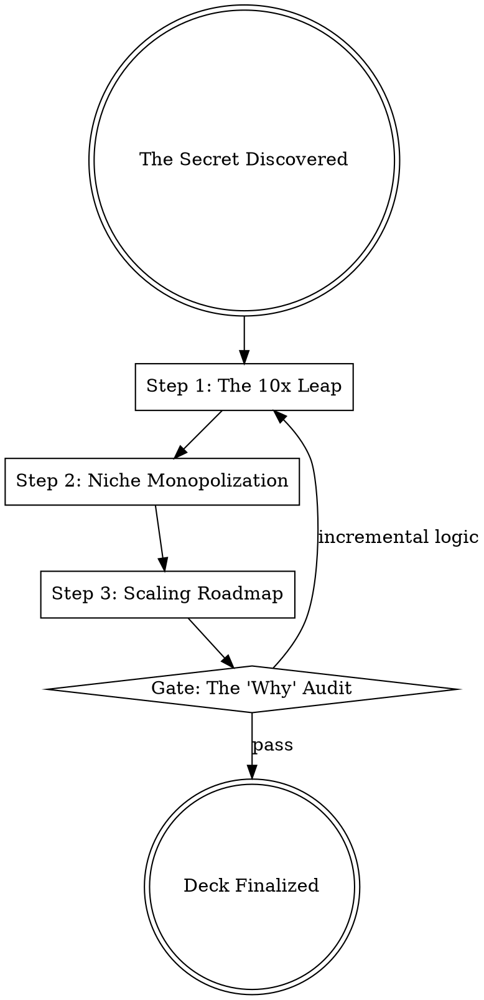

## Overview

Pitch-deck creation is the narrative art of proving a "secret" through data and design. It transforms a vague idea into a definite plan for monopoly, focusing on the vertical leap from 0 to 1. It forces the author to answer the two most critical questions in venture: "Why Now?" (Market Timing) and "Why Us?" (Unique Capability).

## Iron Law

`NO PITCH WITHOUT A CLEAR "WHY NOW" AND "WHY US" ANSWER`

Without a compelling reason for market timing and a unique team mission, a pitch is merely an observation of a trend. This leads to being "one of many" in a competitive market where profits are competed to zero. (Source: Thiel)

## State Machine

## When to Use This Skill

- When raising external venture capital (Seed through Series C).
- When pitching a "big bet" or new product line to internal leadership.
- When applying for startup accelerators (e.g., YC).
- When a strategic pivot requires re-alignment of investors or the board.

## When NOT to Use This Skill

- For routine project status updates (use `executive-briefing` instead).
- For detailed technical documentation (use `prd-writing` instead).
- When the objective is collaborative brainstorming (use `problem-framing` instead).

## Core Process

### Step 1: Articulate "The Secret" (Why Now?)
- **Contrarian Truth:** Identify an important truth that very few people agree with you on. Explain why the world looks different tomorrow because of a breakthrough today. (Source: Thiel, Zero to One)
- **Market Timing:** What has changed in the last 12-24 months (technology, regulation, or social behavior) that makes this possible today, but impossible before? (Source: Sequoia)

### Step 2: Define the 10x Leap (Why Us?)
- **Order of Magnitude:** Prove that your solution is at least 10x better than the closest substitute. Marginal 10% or 20% improvements invite cutthroat competition. (Source: Thiel, Zero to One)
- **Missionary Team:** Demonstrate that the team is a small, dedicated group bound by a sense of mission, not just a "mercenary" collection of resumes. (Source: Bryar, Working Backwards)

### Step 3: Plan for Monopoly
- **Start Small:** Identify the tiny, specific niche market you will monopolize first. Dominate it, then scale to adjacent markets. (Source: Thiel, Zero to One)
- **Moat Drivers:** Identify which of the 4 monopoly drivers you will capture:
    - **Proprietary Technology** (Hard to replicate)
    - **Network Effects** (More useful as more people use it)
    - **Economies of Scale** (Stronger as it gets bigger)
    - **Branding** (Specific aesthetic/experiential monopoly). (Source: Thiel, Zero to One)

### Step 4: Pitch Distribution as a Moat
- **Distribution-First:** Explain how you will reach customers at scale. Great products are not enough; companies that become "distribution-centric" are the ones that endure. (Source: Gil, High Growth Handbook)

## Cross-Skill Invocations

REQUIRED SUB-SKILL: `market-context` — To validate the "Why Now" timing.
RECOMMENDED SUB-SKILL: `fiction-architect` — To structure the "Problem-Solution" arc as a compelling narrative.
RECOMMENDED SUB-SKILL: `resonance-engine` — To increase the emotional and persuasive force of the pitch.

## Rationalization Table

| Thought | Reality |
|---------|---------|
| "I'll just use the standard Sequoia template." | Templates provide structure, but they often mask a lack of substantive "Zero to One" thinking. Substance trumps format. |
| "The market is $100B, we only need 1%." | This is a red flag for "horizontal" copying. High-value startups monopolize 100% of a small market first. |
| "We'll build the product now and find users later." | Distribution is as critical as product. A pitch without a distribution plan is a pitch for a hobby, not a business. |
| "Being a first-mover ensures we win." | First-moving is a tactic. Being the *last-mover* (the final great breakthrough) is what creates durable value. |

## Red Flags

These thoughts mean STOP — you are about to shortcut:

- "Our product is 20% cheaper than the incumbent." → This is a price war, not a 10x technological leap.
- "We are targeting 'everyone' as our first market." → You will be spread too thin to achieve a monopoly.
- "The 'Team' slide is just a list of schools and big-company logos." → This signals mercenaries, not a missionary team with a secret.

## Diagnostic Checklist

- [ ] Does the pitch explicitly answer "Why Now?" (Timing)?
- [ ] Is there a clear "Secret" or contrarian insight identified?
- [ ] Does the product offer a 10x improvement over existing solutions?
- [ ] Is the initial target market small enough to be completely monopolized?
- [ ] Is there a credible plan for distribution and scaling?

## Sources

- Peter Thiel, Zero to One — Monopoly drivers, 10x improvement, and "The Secret."
- Elad Gil, High Growth Handbook — Distribution-centricity and executive roles.
- Claude Hopkins, Scientific Advertising — Evidence-based claims and "Reason-Why" copy.
- Sequoia Pitch Deck Template & YC Application Guide.
