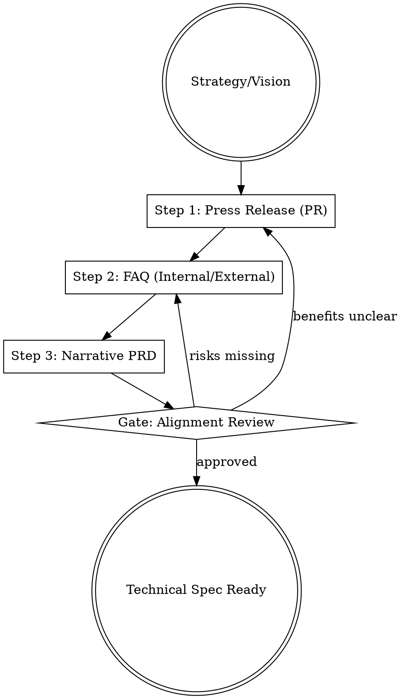

## Overview

PRD-writing is the process of translating a strategic vision into actionable engineering requirements using the "Working Backwards" methodology. It enforces clarity by requiring a customer-facing narrative (Press Release) and an exhaustive risk audit (FAQ) before any technical specifications are finalized.

## Iron Law

`NO PRD WITHOUT A CUSTOMER-FACING PRESS RELEASE DRAFT FIRST`

Writing requirements before the customer benefit is articulated leads to "feature bloat," misaligned engineering efforts, and products that solve technical problems rather than customer ones.

## State Machine

## When to Use This Skill

- When starting a new product or major feature development.
- When existing requirements are fragmented or unclear.
- To align cross-functional teams (Engineering, Design, Marketing) on a single source of truth.
- When preparing for a product funding or resource allocation meeting.

## When NOT to Use This Skill

- For simple bug fixes or maintenance tasks.
- For exploratory R&D where the objective is learning rather than shipping.
- When the problem hasn't been defined yet (use `problem-framing` instead).

## Core Process

### Step 1: Write the Press Release (PR) First
- **One Page Only:** Distill the product value into a single page of customer-facing language. (Source: Bryar, Working Backwards)
- **Essential Components:**
    - **Heading:** Name the product in a way that is understandable to customers.
    - **Subheading:** Identify the target customer and the one main benefit.
    - **Summary:** Summarize the product and the benefit in 1-2 sentences.
    - **Problem:** Describe the customer problem in detail (e.g., "It's hard to X...").
    - **Solution:** Explain how the product solves that problem simply.
    - **Leader Quote:** A quote from you or a leader explaining why this is a priority.
    - **Customer Quote:** A hypothetical quote describing the specific impact on their life/work.
    - **Call to Action:** How the customer gets started. (Source: Bryar, Working Backwards)

### Step 2: Draft the FAQs
- **External FAQ:** Anticipate and answer the 5-10 most common questions a customer will have (Price, availability, compatibility). (Source: Bryar, Working Backwards)
- **Internal FAQ:** Address the "tough" questions from stakeholders: technical feasibility, dependencies, ROI, and risks. (Source: Bryar, Working Backwards)

### Step 3: Apply the Pyramid Principle to the PRD
- **Top-Down Logic:** Start with the "Bottom Line Up Front" (BLUF). The conclusion/recommendation must come first. (Source: Minto, Pyramid Principle)
- **MECE Structuring:** Ensure your requirement groupings are Mutually Exclusive and Collectively Exhaustive. No overlaps, no gaps. (Source: Minto, Pyramid Principle)
- **Inductive Reasoning:** Group supporting data/facts below the main requirements to make the narrative easier to absorb. (Source: Minto, Pyramid Principle)

### Step 4: Identify the "Limiting Step"
- **Backward Planning:** Identify the "limiting step" (the longest, most sensitive, or most expensive part of the build). Work backwards from that date to set the delivery cadence. (Source: Grove, High Output Management)
- **Output-Oriented:** Focus the PRD on the *output* (the delivered value) rather than just the *activity* (the features). (Source: Grove, High Output Management)

## Cross-Skill Invocations

REQUIRED SUB-SKILL: `buyer-persona` — To ground the "Customer Quote" in reality.
RECOMMENDED SUB-SKILL: `stakeholder-review` — To stress-test the PR/FAQ before finalizing.
RECOMMENDED SUB-SKILL: `memo-stress-tester` — To ensure the structural integrity of the final PRD narrative.

## Rationalization Table

| Thought | Reality |
|---------|---------|
| "The project is too small for a PR/FAQ." | Feature creep thrives in small projects. The PR/FAQ is the only way to maintain scope discipline. |
| "Engineering already knows what to build." | Engineering knows *how* to build; the PR/FAQ aligns them on *why* they are building it. |
| "Writing a PR is a waste of time; let's code." | Rewriting code is 10x more expensive than rewriting a one-page narrative. |
| "We'll write the press release at launch." | A launch-day PR is marketing; a day-zero PR is a strategy tool. Skipping it ensures misalignment. |

## Red Flags

These thoughts mean STOP — you are about to shortcut:

- "The PR is three pages long." → You haven't distilled the value yet.
- "I'll start with the technical specs and fill in the PR later." → You are building from technology, not backwards from customers.
- "There are no 'hard' questions in the FAQ." → You are avoiding the technical and organizational risks that will derail the project later.

## Diagnostic Checklist

- [ ] Is there a 1-page customer-facing Press Release?
- [ ] Does the PR include a customer quote describing a specific outcome?
- [ ] Are the internal FAQs addressing technical debt and dependencies?
- [ ] Is the PRD structured top-down using the Pyramid Principle?
- [ ] Has the "limiting step" of implementation been identified?

## Sources

- Bryar & Carr, Working Backwards, Ch. 5 — PR/FAQ methodology.
- Barbara Minto, The Pyramid Principle — MECE and top-down structuring.
- Andrew Grove, High Output Management, Ch. 1 & 3 — Limiting steps and managerial leverage.
- Amazon PR/FAQ Methodology articles.
