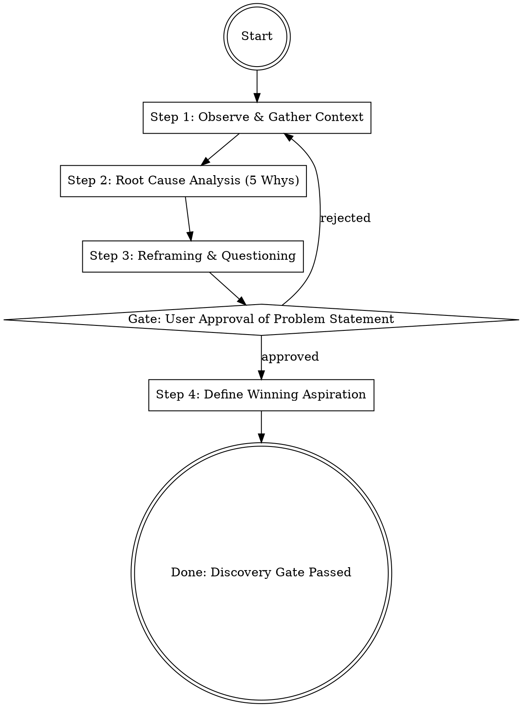

## Overview
Problem-framing is the "discovery gate" that ensures you are solving the right problem before investing resources in solutions. It uses human-centered design principles and strategic cascades to move from symptoms to root causes.

## Iron Law

`NO ANALYSIS WITHOUT APPROVED PROBLEM FRAMING FIRST`
Premature analysis leads to solving the wrong problem, wasting resources on elegant solutions to low-value or non-existent issues.

## State Machine

## When to Use This Skill
- At the start of any new project, strategy, or analytical task.
- When a project feels "stuck" or directionless.
- When stakeholders have conflicting definitions of success.
- When you find yourself jumping straight to "how" before fully understanding "what" or "why."

## When NOT to Use This Skill
- For routine, well-understood tasks with established, validated procedures.
- For trivial tasks where the cost of framing exceeds the potential value (e.g., fixing a typo).
- When the problem has already been rigorously framed and approved in a prior step.

## Core Process

### Step 1: Observe & Gather Context
- **Apply Applied Ethnography:** Observe users in their natural environment to understand motives, interests, and true needs. Focus on *activities* performed rather than just demographics. (Source: Norman, The Design of Everyday Things)
- **Describe the Problem:** Aim to describe the problem better than anyone else. "Whoever best describes the problem is the one most likely to solve it." (Source: Kaufman, The Personal MBA)
- **Gather SPIN Context:** (1) Understand the current situation, (2) Identify the perceived problem, (3) Clarify short-term and long-term implications. (Source: Kaufman, The Personal MBA)

### Step 2: Root Cause Analysis (5 Whys)
- **Execute The Five Whys:** Ask "Why?" at least five times to move past symptoms and find the ultimate, fundamental cause. (Source: Norman, The Design of Everyday Things)
- **Avoid the "Human Error" Trap:** Do not stop the analysis at "human error." Investigate the system, design, or environment that allowed the error to occur. (Source: Norman, The Design of Everyday Things)

### Step 3: Reframing & Questioning
- **Challenge Dysfunctional Beliefs:** Identify beliefs that prevent progress (e.g., "we've always done it this way" or "this is impossible"). Reframe these into design challenges. (Source: Burnett, Designing Your Life)
- **Frame Good Questions:** Avoid framing questions that already contain a solution (e.g., "How can we build a better ladder?" vs. "How might we reach high places?"). (Source: Burnett, Designing Your Life)
- **Identify Anchor Problems:** Recognize problems that are not solvable in their current state and reframe them into actionable challenges. (Source: Burnett, Designing Your Life)
- **Contrast Perception:** Use framing to emphasize critically important details while de-emphasizing irrelevant ones to focus attention. (Source: Kaufman, The Personal MBA)

### Step 4: Define Winning Aspiration
- **Set the Winning Aspiration:** Define what success looks like. This sets the context for all subsequent strategic choices in the cascade (Where-to-Play, How-to-Win). (Source: Lafley, Playing to Win)
- **Quantify the Need-Payoff:** Articulate the financial and emotional benefits the customer/user will experience after the problem is resolved. (Source: Kaufman, The Personal MBA)

## Cross-Skill Invocations
REQUIRED SUB-SKILL: `using-skills` — To ensure proper skill invocation discipline.
RECOMMENDED SUB-SKILL: `stakeholder-discovery` — To map who needs to approve the problem framing.

## Rationalization Table

| Thought | Reality |
|---------|---------|
| "The problem is obvious, let's just start." | Obvious problems are usually just symptoms of a deeper root cause. |
| "We don't have time for a framing workshop." | Solving the wrong problem takes infinitely longer than framing it correctly. |
| "The client already told us what the problem is." | Clients often describe the solution they *think* they need, not the actual problem. |
| "I'll frame it as I go while I'm doing the analysis." | Analysis without framing is aimless and prone to confirmation bias. |

## Red Flags
These thoughts mean STOP — you are about to shortcut:
- "I've seen this exact problem before, I know the answer." → You are falling for Pattern Matching without validation.
- "We need to build [Specific Solution]." → You have framed a solution, not a problem.
- "Why? Because [Name] said so." → You are stopping at authority rather than root cause.

## Diagnostic Checklist
- [ ] Is the problem stated in terms of human needs or goals, not technical requirements?
- [ ] Have you asked "Why?" at least five times to reach a fundamental cause?
- [ ] Does the problem statement avoid mentioning any specific solution?
- [ ] Is there a clear "Winning Aspiration" that defines what success looks like?
- [ ] Has the problem statement been validated by observing users in their natural environment?

## Sources
- Kaufman, The Personal MBA, Ch. 3 (Value Creation), Ch. 6 (Sales/SPIN)
- Lafley, Playing to Win, Ch. 2 (Winning Aspiration), Ch. 5 (Strategy Cascade)
- Norman, The Design of Everyday Things, Ch. 1 (Affordances/Signifiers), Ch. 6 (Design Thinking/HCD)
- Burnett, Designing Your Life, Ch. 1 (Reframing/Dysfunctional Beliefs)
- Kuang, User Friendly, Ch. 5 (Observation vs Creation)
- Berkun, Making Things Happen, Ch. 5 (Problem Definition)
