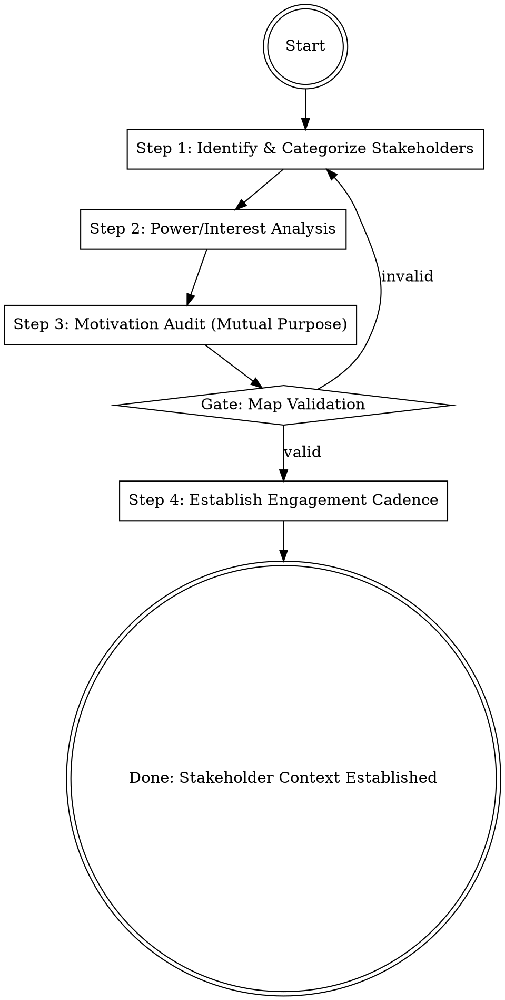

## Overview
Stakeholder-discovery is the process of mapping the "organizational ecosystem" to ensure you have the necessary alignment and safety to proceed. It distinguishes between those who have opinions and those who have "veto power," ensuring that critical relationships are cultivated early.

## Iron Law
`NO DELIVERABLE WITHOUT A VALIDATED STAKEHOLDER MAP`
Late-stage "vetoes" are a failure of discovery. Mapping power and interests early is the difference between a smooth launch and an organizational roadblock.

## State Machine

## When to Use This Skill
- At the start of any cross-functional project.
- When you are new to a role or organization (mapping the "two and two").
- When a project requires approval from multiple departments (Finance, Legal, HR, etc.).
- When you feel "sideways management" is lacking or obstacles are appearing unexpectedly.

## When NOT to Use This Skill
- For independent tasks that have no impact on others and require no external approval.
- For small, routine tasks within a single, already-aligned team.

## Core Process

### Step 1: Identify & Categorize Stakeholders
- **Identify "True" Stakeholders:** Distinguish between those who offer opinions and those with **veto power**—the ability to prevent a product or project from launching. (Source: SVPG/Cagan)
- **Map the "Two and Two":** Identify the people and roles two levels below you and two levels above you. Understand what drives them. (Source: Johnson, Scaling People)
- **Sideways Identification:** Actively look for peers and other leaders who might create or prevent obstacles. (Source: Johnson, Scaling People)

### Step 2: Power/Interest Analysis
- **Plot the Power/Interest Grid:**
  - **High Power, High Interest (Key Players):** Manage closely and engage deeply.
  - **High Power, Low Interest (Keep Satisfied):** Consult and keep content without excessive detail.
  - **Low Power, High Interest (Keep Informed):** Regular updates, as they are invested but lack authority.
  - **Low Power, Low Interest (Monitor):** Minimum effort, primarily monitoring for changes in status. (Source: SVPG/Cagan)
- **Contextual Awareness:** Remember that "Context always matters." Ramp up quickly by understanding the history and current pressures of each stakeholder. (Source: Zhuo, The Making of a Manager)

### Step 3: Motivation Audit (Mutual Purpose)
- **Identify Mutual Purpose:** Find a shared goal. "Mutual Purpose is the entrance condition of dialogue." (Source: Grenny, Crucial Conversations)
- **Understand "Stresses and Strains":** Put yourself in the shoes of other parts of the system. What are their personalities and current pressures? (Source: Johnson, Scaling People)
- **CRIB for Alignment:**
  - **C**ommit to seek Mutual Purpose.
  - **R**ecognize the purpose behind their strategy.
  - **I**nvent a Mutual Purpose if one isn't obvious.
  - **B**rainstorm new strategies together. (Source: Grenny, Crucial Conversations)

### Step 4: Establish Engagement Cadence
- **Leverage 1:1 Meetings:** Use one-on-ones as the primary medium for information exchange and "nudging" stakeholders in the right direction. (Source: Grove, High Output Management)
- **Staff Meeting Observation:** Sit in on key stakeholders' meetings to understand their team's objectives and how you can best work together. (Source: Johnson, Scaling People)
- **Managerial Leverage:** Focus on high-leverage activities—actions that affect many people or provide long-term output improvement for the stakeholders. (Source: Grove, High Output Management)

## Cross-Skill Invocations
REQUIRED SUB-SKILL: `problem-framing` — To ensure the problem being solved is actually what stakeholders care about.
RECOMMENDED SUB-SKILL: `using-skills` — To maintain discipline in stakeholder engagement.
RECOMMENDED SUB-SKILL: `rapport-builder` — For cultivating the informal connections mentioned in Scaling People.

## Rationalization Table

| Thought | Reality |
|---------|---------|
| "I'll talk to the stakeholders once the draft is ready." | This is too late. Early engagement identifies constraints before they become "vetoes." |
| "Legal/Finance are just 'check-the-box' steps." | If they have veto power, they are Key Players. Treating them as an afterthought creates friction. |
| "I already know what the CEO wants." | Assumptions about leadership goals often miss the "Two and Two" context. |
| "Meetings are a waste of time; I'll just email them." | Meetings are the medium of management. 1:1s allow for the "nudges" that email misses. |

## Red Flags
These thoughts mean STOP — you are about to shortcut:
- "We'll deal with [Department] after we launch the pilot." → You are ignoring a potential veto-holder.
- "They don't understand the technical details, so they don't need to be involved." → Power does not always equal technical knowledge.
- "I'm sure they'll be fine with this." → You are substituting your own "Mutual Purpose" for theirs.

## Diagnostic Checklist
- [ ] Have all individuals with "veto power" been identified and engaged?
- [ ] Is there a clear "Mutual Purpose" established for each Key Player?
- [ ] Are 1:1s or regular syncs scheduled with all High Power/High Interest stakeholders?
- [ ] Have you mapped the "two levels up" and "two levels down" context?
- [ ] Does the map include cross-functional partners, not just the direct reporting line?

## Sources
- Johnson, Scaling People, Ch. 4 (Team Development), Ch. 5 (Management Relationships)
- Grove, High Output Management, Ch. 3 (Leverage), Ch. 4 (Meetings)
- Grenny, Crucial Conversations, Ch. 5 (Mutual Purpose/CRIB)
- Zhuo, The Making of a Manager, Ch. 1 (Context), Ch. 8 (Managing Up)
- SVPG Articles: "Managing Stakeholders" and "Stakeholder Identification"
