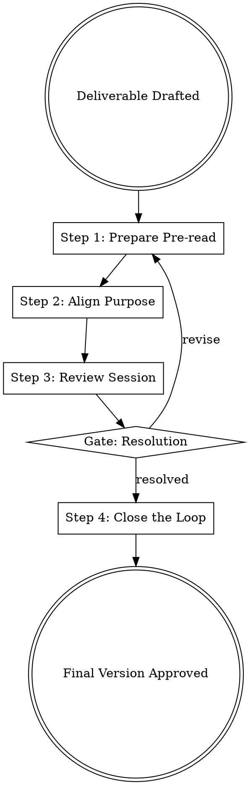

## Overview

Stakeholder-review is the "Group IQ" gate that ensures deliverables are stress-tested by the organizational ecosystem before finalization. It moves feedback from a friction-filled "push" (giving) to a high-value "pull" (seeking), focusing on alignment, safety, and clear resolution of conflicting inputs.

## Iron Law

`NO FINAL VERSION WITHOUT DOCUMENTED STAKEHOLDER FEEDBACK AND RESOLUTION`

Violating this law leads to "shadow vetoes" later in the process, misalignment on success metrics, and the exclusion of critical cross-functional insights that improve the Group IQ.

## State Machine

## When to Use This Skill

- Before finalizing high-stakes documents (PRDs, Strategy Memos, Pitch Decks).
- When a project involves multiple cross-functional dependencies.
- During Quarterly Business Reviews (QBRs) or project post-mortems.
- When you notice "silence" or "violence" in response to a proposal.

## When NOT to Use This Skill

- For low-stakes, iterative internal team updates.
- For pure brainstorming sessions (use `problem-framing` instead).
- When seeking emotional support rather than technical or strategic critique.

## Core Process

### Step 1: Prepare the Pre-read
- **Distill the Narrative:** Draft a concise (roughly 5-page) document or presentation that covers both backward-looking metrics and forward-looking goals. (Source: Johnson, Scaling People)
- **Advance Distribution:** Share the document 24-48 hours before the meeting. If no pre-read occurred, dedicate the first 15-20 minutes of the session to silent reading. (Source: Johnson, Scaling People)

### Step 2: Align the Purpose
- **Label the Feedback Type:** Explicitly state whether you are seeking **Appreciation** (acknowledgment), **Coaching** (advice to improve), or **Evaluation** (assessment against standards). (Source: Stone, Thanks for the Feedback)
- **Negotiate Expectations:** Check in: "I'm looking for coaching on the strategy. Is that what you prepared to give?" This prevents "cross-transactions" where one party gives evaluation when the other wants coaching. (Source: Stone, Thanks for the Feedback)

### Step 3: Conduct the Review Session
- **Swap "Feedback" for "Advice":** Ask "What advice do you have?" rather than "Do you have feedback?" This lowers social friction and attracts more actionable input. (Source: First Round Review, Berry)
- **Look Together, Not Oppositional:** Stand "next to" the stakeholder to look at the work together. Use "Go Meta" tactics: "It feels like we're not talking about the big issue. Is there a challenge here we're avoiding?" (Source: Johnson, Scaling People)
- **Maintain Safety:** If stakeholders move to silence or violence, step out of the content and restore safety using Mutual Purpose and Mutual Respect. (Source: Grenny, Crucial Conversations)

### Step 4: Close the Loop
- **Document Decisions:** Record notes with explicit decisions and next steps. (Source: Johnson, Scaling People)
- **Share the Action Plan:** Distribute a summary of the feedback received and how it will be resolved. "Closing the loop" gets stakeholders invested in the final outcome. (Source: First Round Review, Berry)

## Cross-Skill Invocations

REQUIRED SUB-SKILL: `stakeholder-discovery` — To ensure the right people are in the room.
RECOMMENDED SUB-SKILL: `assumption-audit` — To validate claims raised during the review.
RECOMMENDED SUB-SKILL: `feedback-coach` — To manage difficult interpersonal dynamics during the session.

## Rationalization Table

| Thought | Reality |
|---------|---------|
| "I'll just get approval over Slack/email." | Asynchronous feedback lacks the "Group IQ" and nuance of a live, structured review. |
| "The stakeholders are too busy for a meeting." | Skipping the gate now leads to expensive rework or late-stage "shadow vetoes." |
| "I'll talk to them once the version is finished." | This is too late. The iron law requires feedback *before* finalization to be effective. |
| "I already know what they're going to say." | Confirmation bias blinds you to the 10% of feedback that is often critical for success. |

## Red Flags

These thoughts mean STOP — you are about to shortcut:

- "This is just a formality to check a box." → You are ignoring the "Group IQ" value.
- "I'll filter their feedback before the team hears it." → You are compromising transparency and trust.
- "I'm preparing my defense while they are still talking." → You have triggered a "Truth Trigger" and are no longer listening.

## Diagnostic Checklist

- [ ] Has a pre-read been distributed at least 24 hours in advance?
- [ ] Have we explicitly agreed on the *type* of feedback (Appreciation, Coaching, Evaluation) being sought?
- [ ] Are we using "Advice" language to lower friction?
- [ ] Is there a dedicated scribe recording decisions and next steps?
- [ ] Has the "elephant in the room" (the thing you think you cannot say) been named?

## Sources

- Johnson, Scaling People, Ch. 2 & 5 — QBRs, pre-read culture, and internal comms.
- Stone & Heen, Thanks for the Feedback, Ch. 2 & 3 — Feedback triad and purpose alignment.
- Grenny et al., Crucial Conversations, Ch. 5 — Safety and Mutual Purpose.
- First Round Review, "The Best Leaders are Feedback Magnets" — Advice vs. Feedback and closing the loop.
